# 5.7. Laravel Events, Listeners, and Notifications

> [!abstract] What this note teaches you
> V2 uses Laravel's event system to decouple cross-module side effects. When `ScheduleGenerated` fires, the Analytics module updates KPIs, the Validation module creates pending validation rows, the Audit module logs, and notifications go out — all without the Scheduling module knowing. This note shows the full event flow.

## The 4 V2 domain events

```mermaid
flowchart TD
    Gen[ScheduleGenerated] --> L1[NotifyAdminsOnScheduleGenerated]
    Gen --> L2[CreatePendingValidations]
    Gen --> L3[InvalidateKpiCache]
    Gen --> L4[AuditLogListener]
    
    Val[DepartmentValidated] --> L5[CheckAllDepartmentsValidated]
    Val --> L6[NotifyViceDoyen]
    Val --> L7[AuditLogListener]
    
    App[ScheduleApproved] --> L8[AutoPublishOnApproval]
    App --> L9[NotifyStudentsAndProfs]
    App --> L10[AuditLogListener]
    
    Conf[ConflictDetected] --> L11[NotifyAdminPlanification]
    Conf --> L12[AuditLogListener]
```



## The event class

```php
// app/Modules/Scheduling/Events/ScheduleGenerated.php
class ScheduleGenerated
{
    use Dispatchable, InteractsWithSockets, SerializesModels;

    public function __construct(
        public readonly ScheduleRun $run
    ) {}
}
```

A readonly DTO carrying the `ScheduleRun` that was just generated.

## Firing the event

In `GenerateScheduleJob::handle`, after the solver succeeds and the solution is persisted:

```php
event(new ScheduleGenerated($run));
```

One line. All side effects are decoupled.

## The listeners

Each listener implements `ShouldQueue` (async) and lives in its module:

### `NotifyAdminsOnScheduleGenerated` (Scheduling module)

```php
class NotifyAdminsOnScheduleGenerated implements ShouldQueue
{
    public function handle(ScheduleGenerated $event): void
    {
        User::permission('scheduling.view')->chunk(100, function ($users) use ($event) {
            Notification::send($users, new ScheduleGeneratedNotification($event->run));
        });
    }
}
```

### `CreatePendingValidations` (Validation module)

```php
class CreatePendingValidations implements ShouldQueue
{
    public function handle(ScheduleGenerated $event): void
    {
        $session = $event->run->session;
        $departments = Departement::where('university_id', $session->university_id)->get();
        
        foreach ($departments as $dept) {
            SessionValidation::firstOrCreate([
                'session_id' => $session->id,
                'departement_id' => $dept->id,
            ], ['statut' => 'en_attente']);
        }
    }
}
```

### `InvalidateKpiCache` (Analytics module)

```php
class InvalidateKpiCache implements ShouldQueue
{
    public function handle(ScheduleGenerated $event): void
    {
        Cache::forget("session.{$event->run->session_id}.kpis");
    }
}
```

### `AutoPublishOnApproval` (Scheduling module)

Listens to `ScheduleApproved` (fired when all departments validate):

```php
class AutoPublishOnApproval implements ShouldQueue
{
    public function handle(ScheduleApproved $event): void
    {
        if (config('scheduling.auto_publish')) {
            $event->session->update(['statut' => 'publie']);
            event(new SchedulePublished($event->session));
        }
    }
}
```

## The notification

```php
// app/Modules/Scheduling/Notifications/ScheduleGeneratedNotification.php
class ScheduleGeneratedNotification extends Notification implements ShouldQueue
{
    use Queueable;

    public function __construct(public ScheduleRun $run) {}

    public function via($notifiable): array
    {
        return ['mail', 'database', 'broadcast'];
    }

    public function toMail($notifiable): MailMessage
    {
        return (new MailMessage)
            ->subject("Planning généré — {$this->run->session->nom}")
            ->line("{$this->run->scheduled_count} modules planifiés sur {$this->run->total_modules}.")
            ->line("{$this->run->unscheduled_count} non planifiés.")
            ->action('Voir le planning', url("/sessions/{$this->run->session_id}"));
    }

    public function toDatabase($notifiable): array
    {
        return [
            'session_id' => $this->run->session_id,
            'run_id' => $this->run->id,
            'scheduled_count' => $this->run->scheduled_count,
            'unscheduled_count' => $this->run->unscheduled_count,
        ];
    }
}
```

Three channels: email, in-app database notification, broadcast (for live UI updates).

## Event registration

Listeners are registered in `app/Providers/EventServiceProvider.php`:

```php
protected $listen = [
    ScheduleGenerated::class => [
        NotifyAdminsOnScheduleGenerated::class,
        CreatePendingValidations::class,
        InvalidateKpiCache::class,
        AuditLogListener::class,
    ],
    DepartmentValidated::class => [
        CheckAllDepartmentsValidated::class,
        NotifyViceDoyen::class,
        AuditLogListener::class,
    ],
    ScheduleApproved::class => [
        AutoPublishOnApproval::class,
        NotifyStudentsAndProfs::class,
        AuditLogListener::class,
    ],
    ConflictDetected::class => [
        NotifyAdminPlanification::class,
        AuditLogListener::class,
    ],
];
```

## Why this beats V1's tight coupling

V1's `generate_schedule.sql` did everything inline: schedule, log, return. No events, no notifications, no side effects. If you wanted to add "email the admin when done", you'd have to modify the SQL function — and SQL functions can't send emails.

V2's event-driven approach:
- The Scheduling module doesn't know who depends on it.
- Adding a new consumer (e.g. "post to Slack when done") = adding a new listener, no changes to existing code.
- Listeners are async (`ShouldQueue`), so the main flow returns immediately.
- Each listener is independently testable.

## Common junior developer mistakes

- **Calling side effects inline.** `$user->notify(...)` inside a controller blocks the response. Use events + queued listeners.
- **Listeners without `ShouldQueue`.** Synchronous listeners block the event dispatcher. Mark them `ShouldQueue` unless they must be sync.
- **Passing Eloquent models to queued listeners.** Use `SerializesModels` (it's automatic if you `use Queueable`). Otherwise the model is serialized fully, which can be huge.
- **No event for important state changes.** If something happens that other modules might care about (session validated, conflict detected, schedule published), fire an event. Don't make other modules poll.
- **God listeners.** A listener that does 5 things should be 5 listeners. Single responsibility.

## What to read next

- [[5.1. The Modular Monolith Pattern]] — why modules communicate via events.
- [[5.8. Exception Handling and Centralized Error Strategy]] — what happens when a listener throws.
- [[7.1. Laravel Horizon and Redis Queues]] — how listeners are dispatched.
