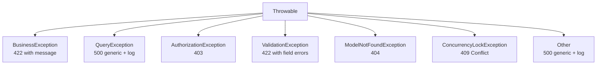

# 5.8. Exception Handling and Centralized Error Strategy

> [!abstract] What this note teaches you
> V1's `st.error(str(e))` leaked SQL errors (including table names and constraint names) to users — a free schema map for attackers. V2 centralizes exception handling in `app/Exceptions/Handler.php`: business errors return 422 with a message, database errors return 500 with a generic message and a server-side log. This note is the V2 error strategy.

## The V2 exception hierarchy



## The centralized handler

```php
// app/Exceptions/Handler.php
public function render($request, Throwable $e)
{
    // Business errors: 422 with the exception's message
    if ($e instanceof BusinessException) {
        return response()->json([
            'message' => $e->getMessage(),
            'code' => $e->getCode(),
        ], 422);
    }

    // Concurrency conflicts: 409
    if ($e instanceof ConcurrencyLockException) {
        return response()->json([
            'message' => $e->getMessage(),
            'code' => 'CONCURRENCY_CONFLICT',
        ], 409);
    }

    // Database errors: 500 with generic message, log the real error
    if ($e instanceof QueryException) {
        Log::error('DB error', [
            'exception' => $e,
            'sql' => $e->getSql(),
            'bindings' => $e->getBindings(),
            'user_id' => Auth::id(),
            'url' => request()->url(),
        ]);
        return response()->json([
            'message' => 'Erreur de base de données. L\'équipe a été notifiée.'
        ], 500);
    }

    // Laravel's built-in exceptions (auth, validation, not found)
    return parent::render($request, $e);
}
```

## The `BusinessException` base class

```php
// app/Shared/Exceptions/BusinessException.php
class BusinessException extends Exception
{
    public function __construct(string $message, string $code = 'BUSINESS_ERROR')
    {
        parent::__construct($message);
        $this->code = $code;
    }
}
```

Subclasses for specific business rules:

```php
class SessionNotInPlanificationException extends BusinessException
{
    public function __construct()
    {
        parent::__construct(
            'La session doit être en statut "planification".',
            'SESSION_NOT_PLANIFICATION'
        );
    }
}

class ScheduleAlreadyRunningException extends BusinessException
{
    public function __construct()
    {
        parent::__construct(
            'Une génération est déjà en cours pour cette session.',
            'SCHEDULE_ALREADY_RUNNING'
        );
    }
}
```

## What the user sees

### Business error (422)

```json
{
  "message": "La session doit être en statut \"planification\".",
  "code": "SESSION_NOT_PLANIFICATION"
}
```

The user sees a French message explaining what went wrong and a code they can quote to support.

### Database error (500)

```json
{
  "message": "Erreur de base de données. L'équipe a été notifiée."
}
```

The user sees a generic message. The real SQL error is logged server-side with full context (SQL, bindings, user, URL) for debugging.

### V1 comparison

V1 showed the user:

```
Constraint Violation: Student overlap detected for date 2025-01-15 
at IN_RELATIONSHIP_FK_72199...
```

This exposes:
- The constraint name (`IN_RELATIONSHIP_FK_72199` — a hashed FK name).
- The date format (`2025-01-15` — Postgres-style).
- The fact that it's a "Constraint Violation" — telling the attacker this is a DB error.

A sophisticated attacker can use this to:
- Map the schema (which FKs exist).
- Probe for valid dates.
- Identify the database type and version.

## Logging the real error

The handler logs database errors with full context:

```php
Log::error('DB error', [
    'exception' => $e,
    'sql' => $e->getSql(),
    'bindings' => $e->getBindings(),
    'user_id' => Auth::id(),
    'url' => request()->url(),
    'ip' => request()->ip(),
    'user_agent' => request()->userAgent(),
]);
```

This log entry goes to:
- The `laravel.log` file (Monolog JSON formatter — see [[9.1. Structured JSON Logging with PII Redaction]]).
- Sentry (for alerting — see [[9.2. Laravel Pulse Horizon Telescope Sentry]]).

The log includes everything an engineer needs to reproduce the error, but the user sees nothing sensitive.

## PII redaction in logs

The handler does not log request bodies by default (they may contain passwords). For specific endpoints that need request logging, a middleware redacts PII:

```php
// app/Http/Middleware/LogRequest.php
public function handle(Request $request, Closure $next): Response
{
    $response = $next($request);
    
    Log::info('HTTP request', [
        'method' => $request->method(),
        'url' => $request->url(),
        'status' => $response->status(),
        'duration_ms' => $this->duration($request),
        'body' => $request->except(['password', 'password_confirmation', 'token', 'api_key']),
        'user_id' => $request->user()?->id,
    ]);
    
    return $response;
}
```

The `$request->except(...)` strips sensitive fields before logging. See [[6.5. PII Redaction and GDPR FERPA Compliance]].

## Common junior developer mistakes

- **`st.error(str(e))` or `return response()->json(['error' => $e->getMessage()], 500)`.** This leaks internal details. Use the centralized handler.
- **Catching exceptions too broadly.** `catch (\Exception $e)` swallows everything including programming errors. Catch specific types.
- **No logging on error.** If a 500 happens and nobody logs it, you can't fix it.
- **Generic error messages.** "Something went wrong" is useless. Either give the user actionable info (422) or log the real error (500).
- **Logging passwords.** Always `$request->except(['password', ...])` before logging.
- **No Sentry integration.** Errors that happen in production must reach the engineering team. Email is not enough.

## What to read next

- [[2.8. Missing Security and Multi-Tenancy]] — the V1 anti-pattern this fixes.
- [[6.5. PII Redaction and GDPR FERPA Compliance]] — the broader PII strategy.
- [[9.1. Structured JSON Logging with PII Redaction]] — the logging format.
- [[9.2. Laravel pulse Horizon Telescope Sentry]] — Sentry integration.
