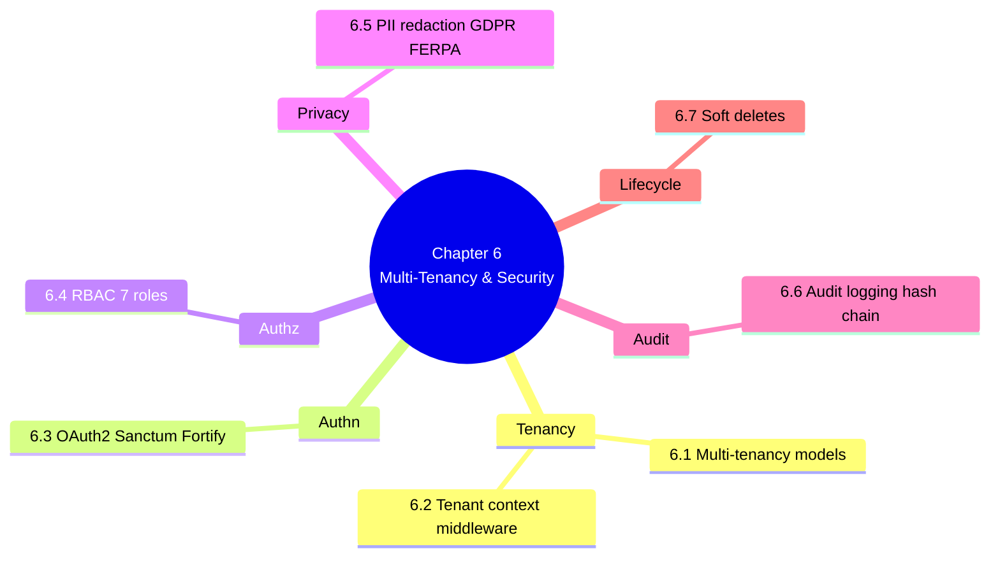

# 6. MOC — Multi-Tenancy and Security

> [!abstract] Chapter goal
> V1 had no authentication, no authorization, no tenant separation, and exposed student PII to anyone with the URL. V2 fixes all four with RLS, OAuth2 via Sanctum/Fortify, RBAC with 7 roles, GDPR/FERPA-compliant PII redaction, and an immutable audit log. This chapter teaches you each layer in defense-in-depth order.

## Notes in this chapter

| Note | Title | What you learn |
|---|---|---|
| 6.1 | [[6.1. Multi-Tenancy Models Compared]] | Shared-DB-with-RLS vs schema-per-tenant vs DB-per-tenant. Why V2 picks shared-DB+RLS for 100+ universities. |
| 6.2 | [[6.2. Tenant Context Middleware]] | `SetTenantContext` middleware that calls `SET app.current_university_id = ?` so RLS policies see the right tenant. |
| 6.3 | [[6.3. OAuth2 with Sanctum Fortify Socialite]] | Sanctum for SPA/API tokens, Fortify for login/2FA/password reset, Socialite for SSO with Google/Microsoft/LDAP. |
| 6.4 | [[6.4. RBAC with spatie laravel-permission]] | The 7 roles (`super_admin`, `vice_doyen`, `admin_planification`, `chef_dept`, `professeur`, `etudiant`, `invigilateur`) and the permissions matrix. |
| 6.5 | [[6.5. PII Redaction and GDPR FERPA Compliance]] | Never `select("*")`. Redact emails, matricules, IPs in logs. Right-to-erasure via soft delete. Data retention policy. |
| 6.6 | [[6.6. Audit Logging and Hash Chaining]] | `audit_log` table partitioned by year, generic trigger `audit_trigger_fn`, `spatie/laravel-activitylog`, hash chaining for tamper-evidence. |
| 6.7 | [[6.7. Soft Deletes and Data Lifecycle]] | Every V2 table has `deleted_at TIMESTAMPTZ`. All FKs are `ON DELETE RESTRICT`. Eloquent `SoftDeletes` trait. Retention policy. |

## Why this chapter is non-negotiable

V1's security posture alone disqualifies it from production. If you don't internalize the lessons here, you will ship a V2 that has the same holes — just hidden behind better-looking UI.

> [!danger] The single most important pattern in this chapter
> **Defense in depth.** RLS at the DB layer. RBAC at the framework layer. Token scopes at the API layer. PII redaction at the logging layer. Audit at the persistence layer. No single layer is sufficient. V1 trusted its (nonexistent) app layer alone.

## Where to go next

After mastering security, proceed to [[7. MOC|Asynchronous Processing and Reliability]] to see how V2 keeps the scheduler from corrupting data under concurrent load.
