# 6.1. Multi-Tenancy Models Compared

> [!abstract] What this note teaches you
> There are three classic multi-tenancy models: shared-database-with-RLS, schema-per-tenant, and database-per-tenant. V2 picks shared-database-with-RLS. This note compares all three and explains why RLS is the right choice for V2's scale (100+ universities, 100k+ students).

## The three models

```mermaid
flowchart TD
    subgraph M1[Model 1: Shared DB + RLS]
        T1[All tenants in one DB]
        T1 --> T1a[tenant_id column on every table]
        T1a --> T1b[RLS policies enforce isolation]
    end
    subgraph M2[Model 2: Schema-per-tenant]
        T2[One DB, multiple schemas]
        T2 --> T2a[tenant_1.etudiants, tenant_2.etudiants, ...]
        T2a --> T2b[Schema search path per connection]
    end
    subgraph M3[Model 3: DB-per-tenant]
        T3[One DB per tenant]
        T3 --> T3a[Full physical isolation]
        T3a --> T3b[Connection routing per tenant]
    end
```

## Comparison

| Criterion | Shared DB + RLS | Schema-per-tenant | DB-per-tenant |
|---|---|---|---|
| Isolation strength | Logical (RLS policy) | Logical (schema) | Physical |
| Cost at 10 tenants | Low | Low | Medium |
| Cost at 100 tenants | Low | Medium | High |
| Cost at 1000 tenants | Medium | High | Very high |
| Migration complexity | Low (one schema) | Medium (per-tenant migrations) | High (per-tenant migrations) |
| Cross-tenant queries | Easy (just don't filter) | Hard (UNION across schemas) | Very hard (FDW) |
| Backup granularity | All-or-nothing | Per-schema | Per-DB |
| Connection pooling | Easy (PgBouncer) | Hard (search_path per connection) | Hard (one pool per tenant) |
| Per-tenant customization | Hard | Easy | Easy |
| V2 choice | ✅ | ❌ | ❌ |

## Why V2 picks shared-DB + RLS

V2 serves 100+ universities, each with 1,000–10,000 students. The total dataset is 100k–1M students, 800k–8M inscriptions. At this scale:

### 1. Operational simplicity

One database to back up, monitor, vacuum, upgrade. With 100+ databases (DB-per-tenant), you'd need 100 backup jobs, 100 monitoring dashboards, 100 upgrade windows. With shared-DB + RLS, it's one of each.

### 2. Cross-tenant analytics

V2's `super_admin` role needs to see aggregate metrics across all tenants ("how many exams did we schedule this month across all universities?"). With shared-DB, this is `SELECT COUNT(*) FROM examens`. With schema-per-tenant, it's `UNION SELECT FROM tenant_1.examens UNION SELECT FROM tenant_2.examens ...`. With DB-per-tenant, it requires foreign data wrappers.

### 3. Connection pooling

PgBouncer multiplexes thousands of Laravel connections onto a small Postgres backend pool. With shared-DB, this works directly. With schema-per-tenant, each connection needs its own `search_path` set, which conflicts with PgBouncer's transaction pooling. With DB-per-tenant, you need one PgBouncer per database.

### 4. Migration simplicity

A schema change (e.g. adding a column) requires one migration on shared-DB. With schema-per-tenant, you need to loop over 100 schemas. With DB-per-tenant, 100 databases.

### 5. RLS is defense-in-depth

The app layer already filters by `university_id` (Laravel Policies + service-layer queries). RLS is the *second* layer — if the app forgets to filter, the database refuses to return cross-tenant rows. This is defense-in-depth, not the only security layer.

## When schema-per-tenant or DB-per-tenant is better

### Schema-per-tenant

- You need per-tenant schema customization (extra columns for tenant X).
- You have < 50 tenants.
- You don't need cross-tenant queries.

### DB-per-tenant

- You have strict regulatory requirements for physical isolation (e.g. healthcare, finance).
- Tenants are in different regions and you need data residency.
- You have < 20 tenants.
- Each tenant has its own DBA team.

V2's university scheduling use case doesn't meet any of these. Shared-DB + RLS is correct.

## The hybrid V2 actually uses

V2 is primarily shared-DB + RLS, with one exception: **partitioning by year**. The `inscriptions` and `examens` tables are `PARTITION BY LIST (annee_universitaire)`, not by `tenant_id`. This is because:

- Queries always filter by year (scheduling runs against the current year).
- Old years can be archived by detaching partitions.
- RLS handles tenant isolation independently.

See [[3.5. Table Partitioning LIST and RANGE]] for the partitioning strategy and [[3.7. Row-Level Security for Multi-Tenancy]] for the RLS setup.

## Common junior developer mistakes

- **Picking DB-per-tenant "for security" without quantifying the cost.** 100 databases is a 10× operations overhead. Make sure the security gain is worth it.
- **Forgetting to enable RLS.** `ALTER TABLE etudiants ENABLE ROW LEVEL SECURITY` is required; without it, the policy is ignored.
- **Trusting RLS alone.** RLS is defense-in-depth. The app layer must also filter by `tenant_id`.
- **Not testing cross-tenant queries.** A bug in `SetTenantContext` (e.g. forgetting to call it) should result in zero rows returned, not the wrong tenant's rows.
- **Mixing models.** Some tables shared, some per-tenant — this is the worst of both worlds. Pick one model and stick to it.

## What to read next

- [[3.7. Row-Level Security for Multi-Tenancy]] — the RLS policies.
- [[6.2. Tenant Context Middleware]] — the middleware that sets the session variable.
- [[3.5. Table Partitioning LIST and RANGE]] — the orthogonal partitioning strategy.
