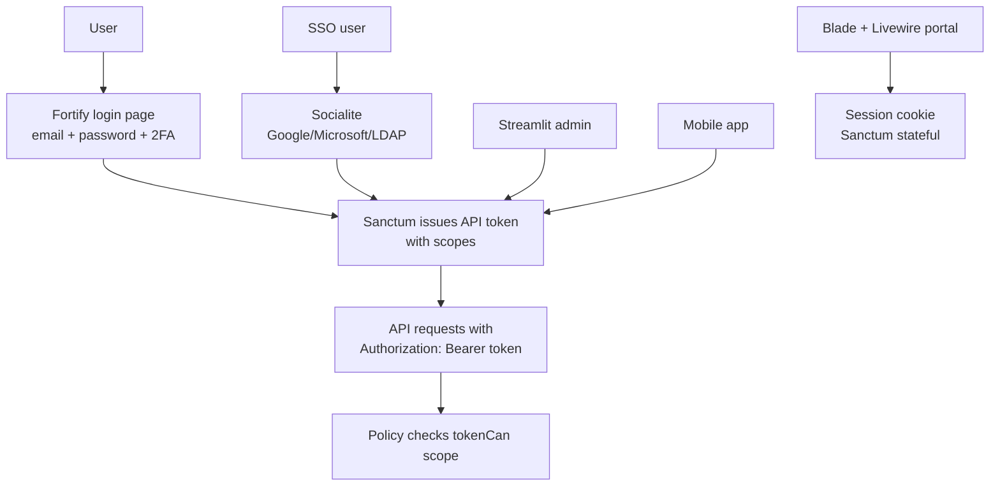

# 6.3. OAuth2 with Sanctum, Fortify, Socialite

> [!abstract] What this note teaches you
> V1 had no authentication — anyone with the URL could wipe schedules. V2 uses three Laravel packages together: Sanctum (API tokens for Streamlit/mobile), Fortify (login, 2FA, password reset), and Socialite (SSO with Google/Microsoft/LDAP). This note explains each and how they compose.

## The three packages



## Laravel Sanctum (API tokens)

Sanctum issues API tokens to authenticated users. Each token has **scopes** — fine-grained permissions like `schedule:read`, `schedule:write`.

```php
// Issue a token with scopes
$token = $user->createToken('streamlit-admin', ['schedule:read', 'schedule:write']);

// The token string is returned once:
return ['token' => $token->plainTextToken];

// Subsequent requests include:
// Authorization: Bearer 1|abcdef123456...
```

In Form Requests, the `authorize()` method checks the scope:

```php
public function authorize(): bool
{
    return $this->user()->tokenCan('schedule:write');
}
```

V2's scopes:

| Scope | What it allows |
|---|---|
| `schedule:read` | View sessions, schedules, KPIs |
| `schedule:write` | Generate, clear, override schedules |
| `validation:read` | View validation status |
| `validation:write` | Validate/reject departments |
| `catalog:read` | View departments, formations, modules, rooms |
| `catalog:write` | CRUD on catalog entities |
| `enrollment:read` | View students, inscriptions |
| `enrollment:write` | Import, update enrollments |
| `audit:read` | View audit log |

## Laravel Fortify (login, 2FA, password reset)

Fortify is a headless authentication scaffold. It provides:

- Login (email + password).
- Two-factor authentication (TOTP, backup codes).
- Password reset (email link).
- Email verification.
- Password confirmation (re-prompt for sensitive actions).
- Session management (logout other devices).

V2's `config/fortify.php`:

```php
'features' => [
    Features::registration(),
    Features::resetPasswords(),
    Features::emailVerification(),
    Features::updateProfileInformation(),
    Features::updatePasswords(),
    Features::twoFactorAuthentication([
        'confirm' => true,
        'confirmPassword' => true,
    ]),
],
```

### Password policy

V2 enforces:

- 12+ characters.
- At least 1 uppercase, 1 lowercase, 1 digit, 1 symbol.
- Not in the HaveIBeenPwned database (via the `Hibp` rule).
- Changed every 90 days (configurable).

```php
// app/Rules/StrongPassword.php
class StrongPassword implements ValidationRule
{
    public function validate(string $attribute, mixed $value, Closure $fail): void
    {
        if (strlen($value) < 12) {
            $fail('Le mot de passe doit faire au moins 12 caractères.');
        }
        if (!preg_match('/[A-Z]/', $value)) $fail('Manque une majuscule.');
        if (!preg_match('/[a-z]/', $value)) $fail('Manque une minuscule.');
        if (!preg_match('/[0-9]/', $value)) $fail('Manque un chiffre.');
        if (!preg_match('/[^A-Za-z0-9]/', $value)) $fail('Manque un caractère spécial.');
    }
}
```

### Session timeout

30 minutes idle. Configured in `config/session.php`:

```php
'lifetime' => 30,  // minutes
'expire_on_close' => false,
```

## Laravel Socialite (SSO)

Socialite provides OAuth2 login with external providers. V2 supports:

- **Google** — for universities using Google Workspace.
- **Microsoft** — for universities using Office 365.
- **LDAP** — for universities with on-prem Active Directory (via `adldap2/adldap2-laravel`).

```php
// routes/web.php
Route::get('/auth/google', [GoogleController::class, 'redirect']);
Route::get('/auth/google/callback', [GoogleController::class, 'callback']);

// GoogleController
public function redirect()
{
    return Socialite::driver('google')->redirect();
}

public function callback()
{
    $googleUser = Socialite::driver('google')->user();
    
    $user = User::firstOrCreate(
        ['email' => $googleUser->email],
        [
            'name' => $googleUser->name,
            'university_id' => $this->resolveUniversity($googleUser->email),
            'email_verified_at' => now(),
        ]
    );
    
    Auth::login($user);
    return redirect('/dashboard');
}
```

The `resolveUniversity` method maps the email domain to a `university_id` (e.g. `@usthb.dz` → university 1, `@ens.dz` → university 2).

## How the three compose

1. **First login:** User goes to `/login`, enters email + password (Fortify). Fortify authenticates, issues a session cookie.
2. **API access:** User generates an API token in their profile. Sanctum issues a token with scopes.
3. **Streamlit:** Streamlit uses the API token in `Authorization: Bearer ...` header.
4. **Blade portal:** Uses the session cookie (Sanctum stateful mode).
5. **SSO:** User clicks "Sign in with Google" (Socialite). Socialite authenticates, creates/links the user, issues a session cookie.

## Common junior developer mistakes

- **No scopes on tokens.** A token without scopes can do everything. Always specify scopes when creating tokens.
- **Plain-text passwords.** Use `bcrypt` or `argon2` (Laravel default). Never MD5.
- **No 2FA for admins.** `admin_planification` and `vice_doyen` roles must have 2FA enforced.
- **Storing tokens in localStorage.** XSS attacks can steal them. Use HttpOnly cookies for web; secure storage for mobile.
- **Not rotating tokens.** Tokens should expire (30 days default) and be rotated.
- **Trusting SSO emails without domain verification.** An attacker can create a Google account with any email. Verify the domain matches a known university.

## What to read next

- [[6.4. RBAC with spatie laravel-permission]] — the role/permission system on top of auth.
- [[6.5. PII Redaction and GDPR FERPA Compliance]] — what to do with user data.
- [[2.8. Missing Security and Multi-Tenancy]] — the V1 anti-patterns this fixes.
