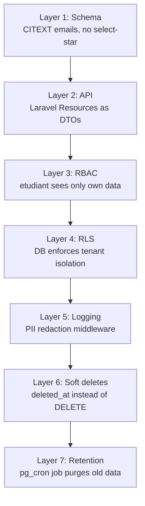

# 6.5. PII Redaction and GDPR/FERPA Compliance

> [!abstract] What this note teaches you
> V1 exposed student emails to anyone with the URL — a clear GDPR (EU) and FERPA (US) violation. V2 redacts PII at every layer: never `select("*")`, redact in logs, soft-delete instead of hard-delete, right-to-erasure support, and data retention policies. This note is the V2 privacy strategy.

## What counts as PII

Personally Identifiable Information, in the V2 context:

| Field | PII? | Why |
|---|---|---|
| `etudiants.email` | Yes | Direct identifier |
| `etudiants.matricule` | Yes | Direct identifier (university-issued) |
| `etudiants.nom`, `prenom` | Yes | Direct identifiers |
| `etudiants.date_naissance` | Yes | Combined with name, identifies a person |
| `etudiants.ine` | Yes | National student ID (France) |
| `etudiants.telephone` | Yes | Direct contact |
| `professeurs.email` | Yes | Direct identifier |
| `audit_log.ip_address` | Yes (under GDPR) | Can identify a person |
| `audit_log.user_agent` | Indirect | Combined with IP, can fingerprint |
| `audit_log.payload_after` | Maybe | Depends on what was written |

## GDPR vs FERPA

| Regulation | Jurisdiction | Key requirements |
|---|---|---|
| **GDPR** | EU | Right to access, right to erasure, data portability, consent management, breach notification within 72h |
| **FERPA** | US | Student educational records privacy, parental access for minors, annual notification |

V2 targets both. The overlap is large; the differences are mostly in notification timelines.

## The V2 PII strategy: 7 layers



### Layer 1: Schema

- `email CITEXT UNIQUE` — case-insensitive unique emails.
- `matricule TEXT UNIQUE` — university-issued IDs.
- No `select("*")` ever — always explicit column lists.

### Layer 2: API DTOs (Laravel Resources)

API responses go through Laravel Resources, which explicitly whitelist fields:

```php
// app/Http/Resources/EtudiantResource.php
class EtudiantResource extends JsonResource
{
    public function toArray($request): array
    {
        return [
            'id' => $this->public_uid,
            'matricule' => $this->matricule,
            'nom' => $this->nom,
            'prenom' => $this->prenom,
            'formation' => $this->formation->nom,
            // 'email' => $this->email,  // NOT included — internal only
            // 'date_naissance' => ...,  // NOT included
            // 'ine' => ...,             // NOT included
        ];
    }
}
```

The `etudiant` role sees only their own data via `/api/v1/etudiants/me`. The `chef_dept` role sees aggregated data (counts, not individual records) for their department.

### Layer 3: RBAC

The `etudiant` role can only call `/api/v1/etudiants/me` — not `/api/v1/etudiants/{id}`. The Policy enforces this:

```php
class EtudiantPolicy
{
    public function view(User $user, Etudiant $etudiant): bool
    {
        if ($user->hasRole('etudiant')) {
            return $user->etudiant_id === $etudiant->id;
        }
        // ...
    }
}
```

### Layer 4: RLS

Even if the Policy has a bug, RLS prevents cross-tenant data access. See [[3.7. Row-Level Security for Multi-Tenancy]].

### Layer 5: Logging with PII redaction

```php
// app/Http/Middleware/AuditTrailLogger.php
'payload_after' => json_encode($request->except([
    'password', 'password_confirmation', 'token', 'api_key',
    'email', 'matricule', 'ine', 'date_naissance', 'telephone',
])),
```

The middleware redacts PII fields before writing to the audit log. See [[5.7. Laravel Events Listeners and Notifications]] and [[6.6. Audit Logging and Hash Chaining]].

For application logs (Monolog), a custom processor redacts PII patterns:

```php
// app/Logging/PiiRedactionProcessor.php
class PiiRedactionProcessor
{
    public function __invoke(array $record): array
    {
        $record['message'] = $this->redactEmails($record['message']);
        $record['context'] = $this->redactContext($record['context']);
        return $record;
    }
    
    private function redactEmails(string $message): string
    {
        return preg_replace('/[\w.+-]+@[\w.-]+\.[a-z]+/', '[REDACTED_EMAIL]', $message);
    }
}
```

### Layer 6: Soft deletes

Every V2 table has `deleted_at TIMESTAMPTZ`. The Eloquent `SoftDeletes` trait:

```php
class Etudiant extends Model
{
    use SoftDeletes;
    
    // DELETE /etudiants/42 sets deleted_at = NOW() instead of removing the row
    // Subsequent queries automatically exclude soft-deleted rows
}
```

This supports:
- **Right to erasure (GDPR):** pseudonymize the record (replace PII with hashes) and set `deleted_at`. The row remains for historical schedules but is no longer identifiable.
- **Audit trail preservation:** historical exam schedules still reference a `etudiant_id`, which still exists (soft-deleted).
- **Recovery:** accidental deletes can be restored.

### Layer 7: Retention policy

```sql
-- pg_cron job: purge audit log older than 7 years
SELECT cron.schedule('purge_old_audit', '0 3 1 1 *', $$
    DELETE FROM audit_log WHERE created_at < NOW() - INTERVAL '7 years';
$$);

-- pg_cron job: purge soft-deleted etudiants older than 5 years
SELECT cron.schedule('purge_deleted_etudiants', '0 3 1 1 *', $$
    DELETE FROM etudiants WHERE deleted_at IS NOT NULL AND deleted_at < NOW() - INTERVAL '5 years';
$$);
```

See [[10.6. The pg-cron Scheduler for Background DB Jobs]].

## The right-to-erasure flow

When a student invokes their GDPR right to erasure:

1. Admin clicks "Erase student" in the UI.
2. `EtudiantService::erase($id)` runs:
   ```php
   public function erase(int $etudiantId): void
   {
       $etudiant = Etudiant::findOrFail($etudiantId);
       
       // Pseudonymize PII (keep the row for historical reference)
       $etudiant->update([
           'nom' => '[ERASED]',
           'prenom' => '[ERASED]',
           'email' => null,
           'matricule' => "ERASED_{$etudiant->id}_" . Str::random(16),
           'ine' => null,
           'date_naissance' => null,
           'telephone' => null,
           'deleted_at' => now(),
       ]);
       
       // Log the erasure
       AuditLog::create([
           'action' => 'gdpr_erasure',
           'entity_type' => 'etudiant',
           'entity_id' => $etudiantId,
           // ...
       ]);
   }
   ```
3. The student's historical exam records remain (referencing the pseudonymized row), but no PII is recoverable.

## Common junior developer mistakes

- **`select("*")` on PII tables.** Always list the columns. It documents the contract and prevents PII leaks.
- **Logging full request bodies.** They contain passwords, emails, matricules. Redact.
- **Hard deletes for GDPR erasure.** Hard-deleting a student breaks historical exam references. Pseudonymize + soft-delete instead.
- **No retention policy.** Data accumulates forever. Define retention per data type and automate purges.
- **Trusting the frontend to redact.** The frontend can be bypassed. Redact at the API and DB layers.
- **Email in URLs.** `?email=user@example.com` ends up in server logs, browser history, Referer headers. Use IDs, not emails.

## What to read next

- [[2.8. Missing Security and Multi-Tenancy]] — the V1 anti-patterns.
- [[6.6. Audit Logging and Hash Chaining]] — the audit trail.
- [[6.7. Soft Deletes and Data Lifecycle]] — soft-delete mechanics.
- [[9.1. Structured JSON Logging with PII Redaction]] — the logging layer.
