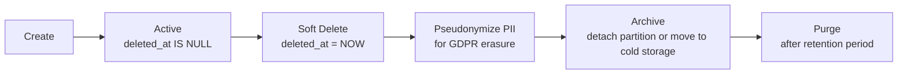

# 6.7. Soft Deletes and Data Lifecycle

> [!abstract] What this note teaches you
> V1 used `ON DELETE CASCADE` on most FKs — one accidental department delete wiped years of data. V2 uses `deleted_at TIMESTAMPTZ` soft deletes on every table, with `ON DELETE RESTRICT` on all FKs. This note explains the soft-delete pattern, the Eloquent trait, and the retention policy.

## What soft delete is

Instead of `DELETE FROM etudiants WHERE id = 42`, you `UPDATE etudiants SET deleted_at = NOW() WHERE id = 42`. The row remains in the table but is excluded from query results by default.

```sql
-- V2: every table has this column
deleted_at TIMESTAMPTZ,

-- Soft delete
UPDATE etudiants SET deleted_at = NOW() WHERE id = 42;

-- Default query (excludes soft-deleted)
SELECT * FROM etudiants WHERE matricule = 'ETU2024001' AND deleted_at IS NULL;

-- Query including soft-deleted (for admin/audit)
SELECT * FROM etudiants WHERE matricule = 'ETU2024001';
```

## Why V2 uses soft deletes everywhere

### 1. Accidental deletes are recoverable

V1's `ON DELETE CASCADE` meant: delete a department → cascades to formations → cascades to modules → cascades to inscriptions and examens. One SQL statement wipes years of data. Soft delete makes this impossible — `DELETE` becomes `UPDATE deleted_at`, which is reversible.

### 2. Historical references remain intact

If you hard-delete an etudiant, every historical `examens` row referencing `etudiant_id = 42` becomes an orphan (FK violation or dangling reference). Soft delete keeps the row, so historical schedules still resolve.

### 3. GDPR right-to-erasure is pseudonymization

Soft-delete + PII pseudonymization (replace name/email with `[ERASED]`) satisfies GDPR without breaking references. See [[6.5. PII Redaction and GDPR FERPA Compliance]].

### 4. Audit trail is preserved

The audit log records every state of every row, including the soft-delete. You can reconstruct the entity's history.

## The Eloquent `SoftDeletes` trait

```php
// app/Modules/Enrollment/Models/Etudiant.php
class Etudiant extends Model
{
    use SoftDeletes;
    
    protected $fillable = ['matricule', 'nom', 'prenom', 'email', 'formation_id', ...];
    
    // The trait automatically:
    // - Excludes deleted_at IS NOT NULL from default queries
    // - Provides restore() and forceDelete() methods
    // - Provides onlyTrashed() and withTrashed() query scopes
}

// Default: excludes soft-deleted
$etudiants = Etudiant::all();

// Include soft-deleted:
$etudiants = Etudiant::withTrashed()->get();

// Only soft-deleted:
$etudiants = Etudiant::onlyTrashed()->get();

// Restore a soft-deleted row:
$etudiant = Etudiant::withTrashed()->find(42);
$etudiant->restore();

// Permanently delete (use with caution):
$etudiant->forceDelete();
```

## The `ON DELETE RESTRICT` policy

V2 changes every FK from V1's `ON DELETE CASCADE` to `ON DELETE RESTRICT`:

```sql
-- V2: every FK
FOREIGN KEY (formation_id) REFERENCES formations(id) ON DELETE RESTRICT
```

This means you cannot delete a formation that still has students. You must:
1. Soft-delete all the students (or move them to another formation).
2. Then soft-delete the formation.

This prevents accidental cascading deletes. Soft-delete + RESTRICT is the safe default.

## The partial UNIQUE index pattern

V2's unique indexes are partial to allow soft-deleted rows to keep their unique values:

```sql
-- Without the WHERE clause, you can't re-create a soft-deleted matricule
CREATE UNIQUE INDEX uq_etudiants_matricule
    ON etudiants (university_id, matricule)
    WHERE deleted_at IS NULL;
```

This means: among *active* etudiants, matricule is unique. A soft-deleted etudiant's matricule can be reused (or kept, for historical reference).

## The data lifecycle



### Retention policy

| Data type | Retention | Action |
|---|---|---|
| `etudiants` (active) | While enrolled + 5 years | Soft-delete after 5 years inactive |
| `etudiants` (soft-deleted) | 7 years after deletion | Pseudonymize, then purge |
| `inscriptions` | 10 years | Partition by year, detach old partitions |
| `examens` | 10 years | Same |
| `audit_log` | 7 years (GDPR) | Partition by year, purge old |
| `schedule_runs` | 3 years | Soft-delete after 3 years |

`pg_cron` jobs automate the purges:

```sql
-- Purge audit log older than 7 years
SELECT cron.schedule('purge_old_audit', '0 3 1 1 *', $$
    DELETE FROM audit_log WHERE created_at < NOW() - INTERVAL '7 years';
$$);

-- Pseudonymize soft-deleted etudiants older than 1 year
SELECT cron.schedule('pseudonymize_deleted', '0 3 1 * *', $$
    UPDATE etudiants
    SET nom = '[ERASED]', prenom = '[ERASED]', email = NULL,
        matricule = 'ERASED_' || id::text, ine = NULL,
        date_naissance = NULL, telephone = NULL
    WHERE deleted_at IS NOT NULL
      AND deleted_at < NOW() - INTERVAL '1 year'
      AND nom != '[ERASED]';
$$);
```

See [[10.6. The pg-cron Scheduler for Background DB Jobs]].

## Why V1's `ON DELETE CASCADE` was a footgun

V1 had:

```sql
FOREIGN KEY (departement_id) REFERENCES departements(id) ON DELETE CASCADE
```

One accidental `DELETE FROM departements WHERE id = 3` would:
1. Delete the department.
2. Cascade to all formations in that department.
3. Cascade to all modules in those formations.
4. Cascade to all inscriptions and examens for those modules.

Years of scheduling data, gone in one query. There's no undo.

V2's `ON DELETE RESTRICT` rejects the delete if any child rows exist. You must explicitly handle the children first.

## Common junior developer mistakes

- **`ON DELETE CASCADE` for convenience.** It's convenient until it isn't. Use `RESTRICT` and handle children explicitly.
- **Forgetting the partial UNIQUE index.** Without `WHERE deleted_at IS NULL`, you can't re-create a unique value after soft-delete (the soft-deleted row still holds it).
- **No retention policy.** Soft-deleted rows accumulate forever. Define retention per data type and automate purges.
- **Hard-deleting for GDPR erasure.** Pseudonymize + soft-delete satisfies GDPR without breaking references.
- **Not restoring in tests.** `SoftDeletes` provides `restore()` — use it in test teardown to keep test data clean.
- **Forgetting to index `deleted_at`.** Every query has `WHERE deleted_at IS NULL`. Partial indexes make this fast.

## What to read next

- [[3.2. Schema Design Principles for SaaS]] — where `deleted_at` is on every table.
- [[6.5. PII Redaction and GDPR FERPA Compliance]] — pseudonymization for GDPR.
- [[6.6. Audit Logging and Hash Chaining]] — auditing soft-delete events.
- [[10.6. The pg-cron Scheduler for Background DB Jobs]] — automating retention purges.
