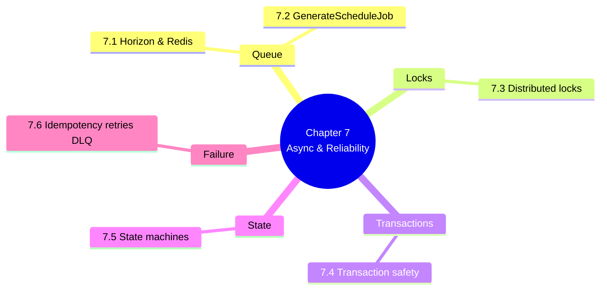

# 7. MOC — Asynchronous Processing and Reliability

> [!abstract] Chapter goal
> V1 ran the scheduler synchronously inside the Streamlit request, with a fake progress bar, no locks, and a destructive `DELETE` before each regenerate. V2 runs scheduling as a queued Laravel job with Redis locks, advisory locks, transactions, and a real state machine. This chapter teaches you the full reliability stack.

## Notes in this chapter

| Note | Title | What you learn |
|---|---|---|
| 7.1 | [[7.1. Laravel Horizon and Redis Queues]] | The 4 V2 queues (`default`, `scheduling`, `exports`, `audit`), Horizon supervisors, why the scheduler gets a dedicated worker pool. |
| 7.2 | [[7.2. The GenerateScheduleJob Lifecycle]] | End-to-end trace: HTTP request → handler acquires Redis lock → dispatches job → job acquires advisory lock → refreshes MV → calls Python solver → persists in DB::transaction → releases lock in `finally`. |
| 7.3 | [[7.3. Distributed Locks Redis vs Advisory]] | Three locking layers compared: Redis `SET NX EX` for cross-instance mutual exclusion, `pg_advisory_lock` for DB-level, `lockForUpdate()` for row-level dirty-read protection. Plus the Lua compare-and-delete fix. |
| 7.4 | [[7.4. Transaction Safety and Concurrency]] | Why V2 wraps the schedule-swap in a single transaction, soft-deletes previous exams instead of hard-delete, and never lets two RPCs compose a transaction. |
| 7.5 | [[7.5. State Machines for Session and Validation]] | `sessions_examen.statut` has 9 values with explicit transitions. `session_validations` table with `en_attente/valide/rejete/a_reviser` per department. |
| 7.6 | [[7.6. Idempotency Retries and Dead-Letter Handling]] | `tries=3`, `timeout=600`, exponential backoff, dead-letter queue, idempotency keys on the API. |

## Why this chapter matters

Reliability is what separates a demo from a product. V1 was a demo — it worked on the author's laptop with one user. V2 is a product — it works with 100 concurrent admins on 100 universities. The difference is entirely in this chapter.

## Where to go next

After mastering async processing, proceed to [[8. MOC|The Frontend Portals]] to see how the UI interacts with the async backend.
