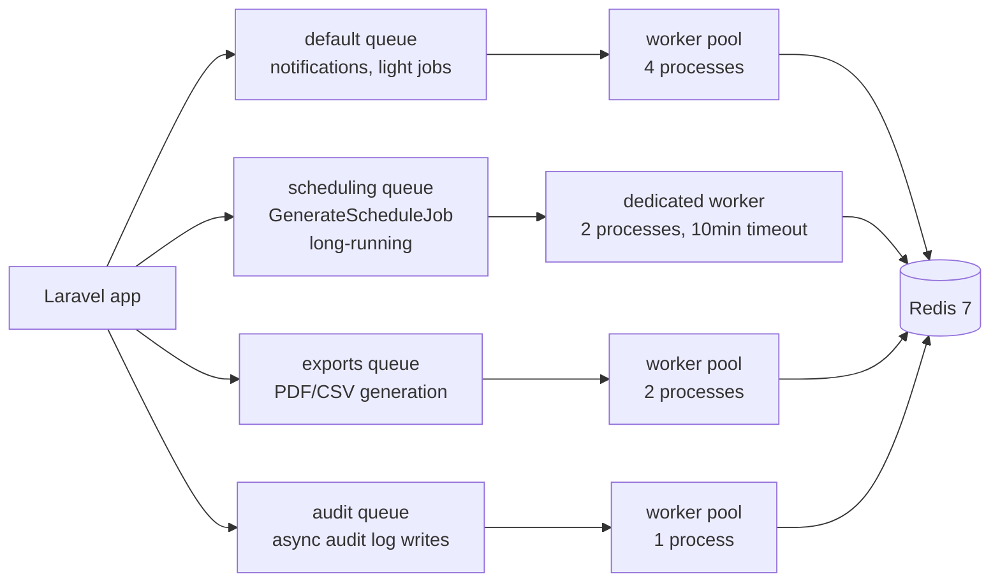

# 7.1. Laravel Horizon and Redis Queues

> [!abstract] What this note teaches you
> V1 ran the scheduler synchronously in the Streamlit request — the UI froze and work was lost if the tab closed. V2 uses Laravel Horizon on Redis with 4 dedicated queues. This note explains the queue topology, Horizon's role, and why the scheduler gets its own worker pool.

## The 4 V2 queues



| Queue | Purpose | Workers | Timeout | tries |
|---|---|---|---|---|
| `default` | Notifications, light jobs, cache warmups | 4 | 60s | 3 |
| `scheduling` | `GenerateScheduleJob` (CP-SAT solve) | 2 | 600s | 3 |
| `exports` | PDF/CSV/ICS generation | 2 | 120s | 1 |
| `audit` | Async audit log writes | 1 | 30s | 5 |

Separating queues by purpose means a slow scheduling job doesn't block notifications. The `scheduling` queue has a 10-minute timeout (matching the CP-SAT solver's 120s budget + MV refresh + persistence overhead).

## Why the scheduler gets a dedicated worker pool

The `GenerateScheduleJob` is:
- **Long-running** (30–600 seconds).
- **CPU-intensive** (the CP-SAT solver).
- **Memory-intensive** (loads all modules, rooms, conflicts into memory).
- **Stateful** (acquires advisory locks).

If it shared a queue with notifications, a single scheduling run would block all notifications for minutes. A dedicated pool with 2 workers means:
- Up to 2 concurrent scheduling runs per tenant (different sessions).
- Other queues keep flowing.

## Laravel Horizon

Horizon is Laravel's queue supervisor for Redis. It provides:

- **Dashboard** at `/horizon` — shows queue depth, throughput, failed jobs, job latency.
- **Auto-scaling** — adds workers when queue depth exceeds threshold.
- **Retry logic** — failed jobs auto-retry with exponential backoff.
- **Metrics** — per-queue, per-job-type statistics.
- **Tagging** — group jobs by tag (e.g. `tenant:42`, `session:13`).

### Horizon config

```php
// config/horizon.php
'environments' => [
    'production' => [
        'supervisor-1' => [
            'connection' => 'redis',
            'queue' => ['default', 'audit'],
            'balance' => 'auto',
            'minProcesses' => 1,
            'maxProcesses' => 4,
            'tries' => 3,
            'timeout' => 60,
        ],
        'supervisor-scheduling' => [
            'connection' => 'redis',
            'queue' => ['scheduling'],
            'balance' => 'auto',
            'minProcesses' => 1,
            'maxProcesses' => 2,
            'tries' => 3,
            'timeout' => 600,
        ],
        'supervisor-exports' => [
            'connection' => 'redis',
            'queue' => ['exports'],
            'balance' => 'auto',
            'minProcesses' => 1,
            'maxProcesses' => 2,
            'tries' => 1,
            'timeout' => 120,
        ],
    ],
    'staging' => [
        // ... lighter config
    ],
    'local' => [
        // ... single process per queue
    ],
],
```

## Redis as the queue backend

```php
// config/queue.php
'default' => env('QUEUE_CONNECTION', 'redis'),

'connections' => [
    'redis' => [
        'driver' => 'redis',
        'connection' => 'default',
        'queue' => env('REDIS_QUEUE', 'default'),
        'retry_after' => 600,
        'block_for' => null,
        'after_commit' => true,
    ],
],
```

Why Redis and not the database:
- **Throughput:** Redis is in-memory; DB queues involve disk writes.
- **Atomicity:** Redis `LPOP` is atomic; DB queues need `SELECT FOR UPDATE`.
- **Horizon requires Redis.** The dashboard, auto-scaling, and metrics only work with Redis.

## Dispatching jobs

```php
// Dispatch to the default queue
ProcessPayment::dispatch($invoice);

// Dispatch to a specific queue
GenerateScheduleJob::dispatch($tenantId, $periodId, $maxExams, $allowSplit)
    ->onQueue('scheduling');

// Dispatch with a delay
SendReminder::dispatch($user)->delay(now()->addHours(24));

// Dispatch synchronously (for tests)
GenerateScheduleJob::dispatchSync($tenantId, $periodId, $maxExams, $allowSplit);
```

## Job tagging

```php
class GenerateScheduleJob implements ShouldQueue
{
    public function tags(): array
    {
        return [
            "tenant:{$this->tenantId}",
            "session:{$this->periodId}",
            'scheduling',
        ];
    }
}
```

In the Horizon dashboard, you can filter jobs by tag — "show me all scheduling jobs for tenant 42" or "show me all jobs for session 13".

## Why V1 was wrong

V1's `02_Admin_Planification.py` called the scheduler synchronously:

```python
result = scheduling_service.generate(session_id, max_exams)
# UI blocks here for 30+ seconds
# If user closes the tab, work is lost
# If Supabase RPC times out, error
```

V2's `GenerateScheduleJob::dispatch()` returns immediately. The HTTP request returns 202 Accepted with a `ScheduleRun` ID. The frontend polls `/schedule-runs/{id}` for status.

## Common junior developer mistakes

- **One queue for everything.** A slow job blocks fast jobs. Separate by purpose.
- **No `timeout` on jobs.** A stuck job holds the worker forever. Always set `timeout`.
- **No `tries` on jobs.** A transient DB error shouldn't fail the job permanently. Set `tries = 3`.
- **Dispatching jobs inside `DB::transaction`.** If the transaction rolls back, the job is dispatched but the data it needs isn't there. Use `dispatch()->afterCommit()` (or set `'after_commit' => true` in the queue config, which V2 does).
- **Not monitoring Horizon.** The dashboard is there for a reason. Check it daily.

## What to read next

- [[7.2. The GenerateScheduleJob Lifecycle]] — the full pipeline.
- [[7.3. Distributed Locks Redis vs Advisory]] — the locking layers.
- [[9.2. Laravel pulse Horizon Telescope Sentry]] — the observability stack.
