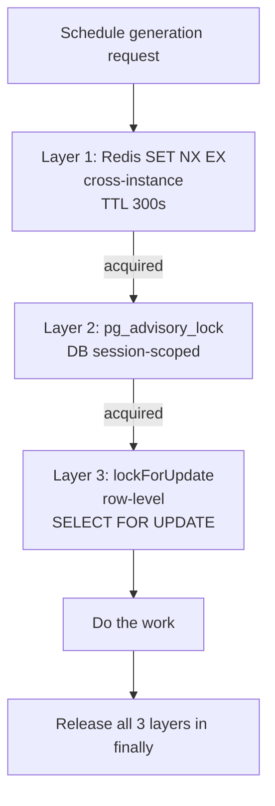

# 7.3. Distributed Locks: Redis vs Advisory

> [!abstract] What this note teaches you
> V2 uses three locking layers: Redis `SET NX EX` for cross-instance mutual exclusion, `pg_advisory_lock` for DB-level session locks, and `lockForUpdate()` for row-level dirty-read protection. This note compares the three and explains when each is appropriate.

## The three locking layers compared



| Layer | Scope | Cost | Use case |
|---|---|---|---|
| Redis `SET NX EX` | Cluster-wide | ~1ms | Cross-instance mutual exclusion before job dispatch |
| `pg_advisory_lock` | DB-wide | ~0.1ms | DB-session-scoped mutex during job execution |
| `lockForUpdate` | Single row | ~0.1ms | Dirty-read protection inside a transaction |

## Layer 1: Redis `SET NX EX`

```php
public function acquireLock(TenantId $tenantId, PeriodId $periodId, int $ttlSeconds): bool
{
    $lockKey = sprintf("lock:scheduling:%s:%s", $tenantId->toString(), $periodId->toString());
    $value = microtime(true) . gen_random_uuid();
    
    return (bool) Redis::set($lockKey, $value, 'EX', $ttlSeconds, 'NX');
}
```

The `NX` flag means "set only if not exists" — atomic. The `EX 300` flag sets a 300-second TTL.

**Why Redis for this layer:**
- The lock must be acquired *before* the job is dispatched, when we may not have a DB transaction open.
- Redis is faster than Postgres for lock acquisition (no WAL).
- Redis is shared across all Laravel instances; a Postgres advisory lock is per-connection.

**The Lua compare-and-delete fix:**

The naive release is unsafe:

```php
// UNSAFE — may release another worker's lock
Redis::del($lockKey);
```

If the lock's TTL expires while the worker is still running, another worker can acquire it. The first worker's `DEL` then releases the *second* worker's lock. The fix is a Lua compare-and-delete:

```php
public function releaseLock(TenantId $tenantId, PeriodId $periodId): void
{
    $lockKey = sprintf("lock:scheduling:%s:%s", $tenantId->toString(), $periodId->toString());
    $value = $this->lockValues[$lockKey];  // stored from acquireLock
    
    $luaScript = <<<'LUA'
        if redis.call("get", KEYS[1]) == ARGV[1] then
            return redis.call("del", KEYS[1])
        else
            return 0
        end
    LUA;
    
    Redis::eval($luaScript, 1, $lockKey, $value);
}
```

The Lua script executes atomically in Redis — it checks the value matches before deleting. If the lock has been acquired by another worker (different value), the script does nothing.

## Layer 2: `pg_advisory_lock`

```php
DB::statement("SELECT pg_advisory_lock(?)", [$this->sessionId]);
// ... do the work ...
DB::statement("SELECT pg_advisory_unlock(?)", [$this->sessionId]);
```

`pg_advisory_lock(key)` is a Postgres session-scoped lock identified by a BIGINT. Other sessions calling `pg_advisory_lock(same_key)` block until the first session releases.

**Why advisory lock for this layer:**
- The lock should persist for the entire job execution, across multiple transactions.
- It's DB-level — even a manual `psql` admin action would block on it.
- It doesn't lock any specific row or table, just a session-scoped mutex.

**Two flavors:**
- `pg_advisory_lock(key)` — blocks until acquired.
- `pg_try_advisory_lock(key)` — returns immediately with `true`/`false`.

V2 uses the blocking form inside the job (we've already acquired the Redis lock, so we know we should be able to get the advisory lock).

**Always release in `finally`:**

```php
DB::statement("SELECT pg_advisory_lock(?)", [$this->sessionId]);
try {
    // ... work ...
} finally {
    DB::statement("SELECT pg_advisory_unlock(?)", [$this->sessionId]);
}
```

If the job throws, the lock is still released. Without `finally`, the lock is held until the DB session closes (which may be never with connection pooling).

## Layer 3: `lockForUpdate`

```php
$exams = DB::table('exams')
    ->where('tenant_id', $tenantId->toString())
    ->where('academic_period_id', $periodId->toString())
    ->lockForUpdate()
    ->get();
```

This emits `SELECT ... FOR UPDATE`, which locks the returned rows for the duration of the transaction. Other transactions trying to UPDATE or DELETE those rows block until the transaction commits.

**Why `lockForUpdate` for this layer:**
- We're about to UPDATE the rows (soft-delete + insert). `FOR UPDATE` prevents another transaction from modifying them between our SELECT and our UPDATE.
- It's transaction-scoped — automatically released at COMMIT.
- It's row-level, not table-level — minimal contention.

**When NOT to use `lockForUpdate`:**
- For reads that don't precede a write. Use a regular `SELECT` (or `SELECT FOR SHARE`).
- For long-running operations. The lock is held for the entire transaction; long transactions hurt concurrency.

## When to use which

| Scenario | Use |
|---|---|
| Cross-instance mutual exclusion (job dispatch) | Redis `SET NX EX` |
| Long-running DB-scoped mutex (scheduling run) | `pg_advisory_lock` |
| Row-level dirty-read protection (transaction) | `lockForUpdate` |
| Concurrent UI edit detection | Optimistic locking (`version` column) |
| Short-lived cross-instance lock | Redis (no DB round-trip) |
| Lock that must survive connection pool recycling | Redis with TTL (advisory locks die with the session) |

## Common junior developer mistakes

- **Using `lockForUpdate` for everything.** It's a row lock, not a session lock. It doesn't prevent two jobs on the same session.
- **Forgetting to release advisory locks.** Use `try/finally`.
- **Releasing Redis locks with plain `DEL`.** Use Lua compare-and-delete.
- **No TTL on Redis locks.** A worker crash holds the lock forever. Always set TTL.
- **Setting TTL too short.** If the job legitimately takes 5 minutes and the TTL is 1 minute, the lock expires and another worker starts. Set TTL = expected max job duration + buffer.
- **Mixing the layers.** Each layer has a specific scope. Don't use Redis for row-level locking, don't use advisory locks for cross-instance coordination.

## What to read next

- [[7.2. The GenerateScheduleJob Lifecycle]] — the full pipeline with all 3 layers.
- [[3.9. Advisory Locks and Optimistic Locking]] — the database-side perspective.
- [[7.4. Transaction Safety and Concurrency]] — how `lockForUpdate` fits in transactions.
