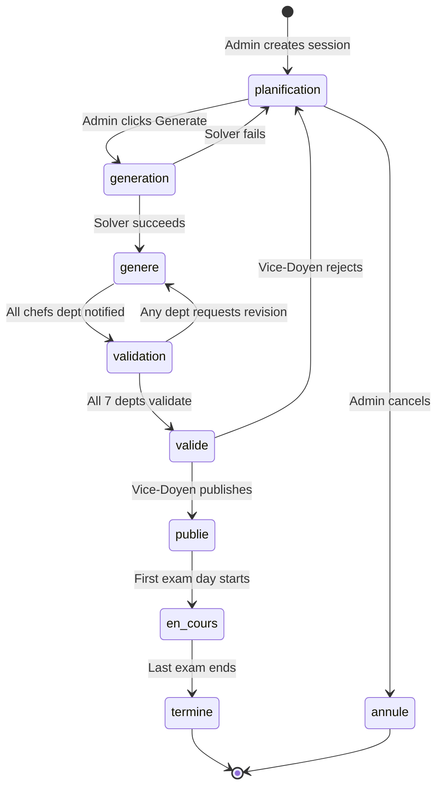
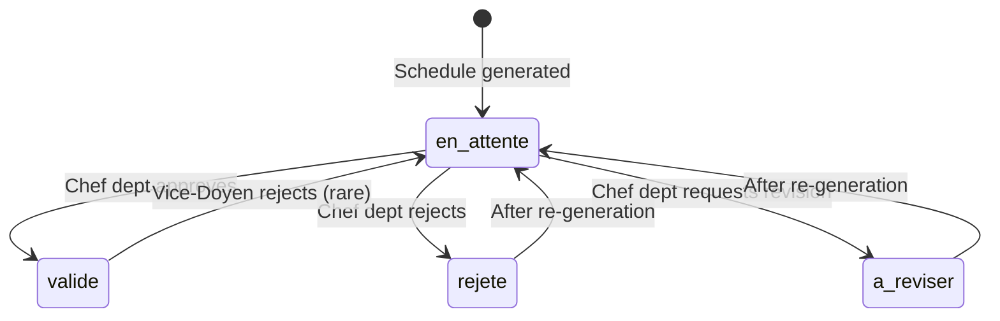

# 7.5. State Machines for Session and Validation

> [!abstract] What this note teaches you
> V1's `sessions_examen.statut` was a free-text enum with no transition guard — a stray UPDATE could send a `termine` session back to `planification`, corrupting audit history. V2 formalizes the 9 session states and 4 validation states as explicit state machines with transition rules. This note is the V2 state machine reference.

## The session state machine



The 9 states:

| State | Description | Who can transition out |
|---|---|---|
| `planification` | Initial state, before any generation | `admin_planification` (to `generation`) |
| `generation` | Solver is running | System auto-transitions to `genere` or `planification` |
| `genere` | Solver succeeded, awaiting validation | `chef_dept` (to `validation` via action) |
| `validation` | Departments are reviewing | `chef_dept` (per-dept decision) |
| `valide` | All departments validated | `vice_doyen` (to `publie`) |
| `publie` | Published, visible to students/profs | System auto-transitions to `en_cours` on first exam day |
| `en_cours` | Exams are happening | System auto-transitions to `termine` on last exam day |
| `termine` | Session complete | Terminal state |
| `annule` | Cancelled | Terminal state |

## The transition rules

```php
// app/Modules/Scheduling/States/SessionState.php
abstract class SessionState
{
    protected array $allowedTransitions = [];
    
    abstract public function canGenerate(): bool;
    abstract public function canValidate(): bool;
    abstract public function canPublish(): bool;
    abstract public function canCancel(): bool;
    
    public function transitionTo(Session $session, string $newStatus): void
    {
        if (!in_array($newStatus, $this->allowedTransitions)) {
            throw new InvalidStateTransitionException(
                "Cannot transition from {$session->statut} to {$newStatus}"
            );
        }
        
        $session->update(['statut' => $newStatus]);
    }
}

class PlanificationState extends SessionState
{
    protected array $allowedTransitions = ['generation', 'annule'];
    
    public function canGenerate(): bool { return true; }
    public function canValidate(): bool { return false; }
    public function canPublish(): bool { return false; }
    public function canCancel(): bool { return true; }
}

class GenerationState extends SessionState
{
    protected array $allowedTransitions = ['genere', 'planification'];
    
    public function canGenerate(): bool { return false; }  // already generating
    public function canValidate(): bool { return false; }
    public function canPublish(): bool { return false; }
    public function canCancel(): bool { return false; }  // can't cancel mid-solve
}

class GenereState extends SessionState
{
    protected array $allowedTransitions = ['validation', 'planification'];
    
    public function canGenerate(): bool { return true; }  // can regenerate
    public function canValidate(): bool { return false; }  // not yet in validation
    public function canPublish(): bool { return false; }
    public function canCancel(): bool { return true; }
}

class ValidationState extends SessionState
{
    protected array $allowedTransitions = ['valide', 'genere'];
    // `genere` allows re-generation if a dept requests revision
    
    public function canGenerate(): bool { return true; }
    public function canValidate(): bool { return true; }
    public function canPublish(): bool { return false; }
    public function canCancel(): bool { return true; }
}

class ValideState extends SessionState
{
    protected array $allowedTransitions = ['publie', 'planification'];
    
    public function canGenerate(): bool { return false; }
    public function canValidate(): bool { return false; }
    public function canPublish(): bool { return true; }
    public function canCancel(): bool { return true; }
}

// ... PublieState, EnCoursState, TermineState, AnnuleState
```

## The factory

```php
class SessionStateFactory
{
    public static function make(string $status): SessionState
    {
        return match ($status) {
            'planification' => new PlanificationState(),
            'generation' => new GenerationState(),
            'genere' => new GenereState(),
            'validation' => new ValidationState(),
            'valide' => new ValideState(),
            'publie' => new PublieState(),
            'en_cours' => new EnCoursState(),
            'termine' => new TermineState(),
            'annule' => new AnnuleState(),
            default => throw new InvalidArgumentException("Unknown session status: {$status}"),
        };
    }
}
```

## Usage in `ScheduleService`

```php
public function generate(int $sessionId, int $userId, array $params): ScheduleRun
{
    $session = Session::findOrFail($sessionId);
    $state = SessionStateFactory::make($session->statut);
    
    if (!$state->canGenerate()) {
        throw new BusinessException(
            "Cannot generate schedule for session in {$session->statut} status."
        );
    }
    
    $state->transitionTo($session, 'generation');
    
    // ... dispatch job, etc.
}
```

The state machine prevents:
- Generating a schedule for a `termine` session.
- Publishing a session that isn't `valide`.
- Cancelling a session mid-solve (`generation` state).

## The validation state machine

Each `(session, departement)` pair has a `session_validations` row with its own state:



The 4 validation states:

| State | Description |
|---|---|
| `en_attente` | Pending department head's decision |
| `valide` | Department head approved |
| `rejete` | Department head rejected |
| `a_reviser` | Department head requested revision (triggers re-generation) |

## The auto-transition to `valide`

When all 7 departments have `statut = 'valide'`, the session auto-transitions from `validation` to `valide`:

```php
class ValidationService
{
    public function validateDepartment(int $sessionId, int $deptId, int $userId, string $decision): void
    {
        DB::transaction(function () use ($sessionId, $deptId, $userId, $decision) {
            $validation = SessionValidation::firstOrCreate([
                'session_id' => $sessionId,
                'departement_id' => $deptId,
            ]);
            
            $validation->update([
                'statut' => $decision,
                'decided_by' => $userId,
                'decided_at' => now(),
            ]);
            
            event(new DepartmentValidated($validation));
            
            // Check if all departments validated
            $allValidated = SessionValidation::where('session_id', $sessionId)
                ->where('statut', '!=', 'valide')
                ->doesntExist();
            
            if ($allValidated) {
                $session = Session::find($sessionId);
                $state = SessionStateFactory::make($session->statut);
                $state->transitionTo($session, 'valide');
                event(new ScheduleApproved($session));
            }
        });
    }
}
```

## Why V1 was wrong

V1's `sessions_examen.statut` had 4 values (`planification`, `valide`, `en_cours`, `termine`) with no transition guard. Any UPDATE could change any status to any other:

```sql
-- V1 allowed this:
UPDATE sessions_examen SET statut = 'planification' WHERE id = 13;
-- Even if the session was 'termine', the UPDATE succeeds.
-- Audit history is corrupted; the dashboard shows wrong state.
```

V2's state machine rejects invalid transitions with a clear error.

## Common junior developer mistakes

- **No state machine.** A free-text `statut` column with no transition guard is a bug source. Always formalize.
- **State transitions in multiple places.** If `transitionTo` is implemented in 3 controllers, you'll miss one. Centralize in the state class.
- **No audit of transitions.** Every transition should be logged. V2 fires events that the audit listener catches.
- **Allowing transitions from any state to any state.** This defeats the purpose. Be strict about what's allowed.
- **Forgetting the terminal states.** `termine` and `annule` should not allow outgoing transitions (except maybe `termine → annule` for correction).

## What to read next

- [[5.5. Dependency Injection and SOLID]] — the State pattern in context.
- [[5.7. Laravel Events Listeners and Notifications]] — events fired on transitions.
- [[8.5. Validation State Machines in the UI]] — the UI side of the validation flow.
- [[6.6. Audit Logging and Hash Chaining]] — auditing transitions.
