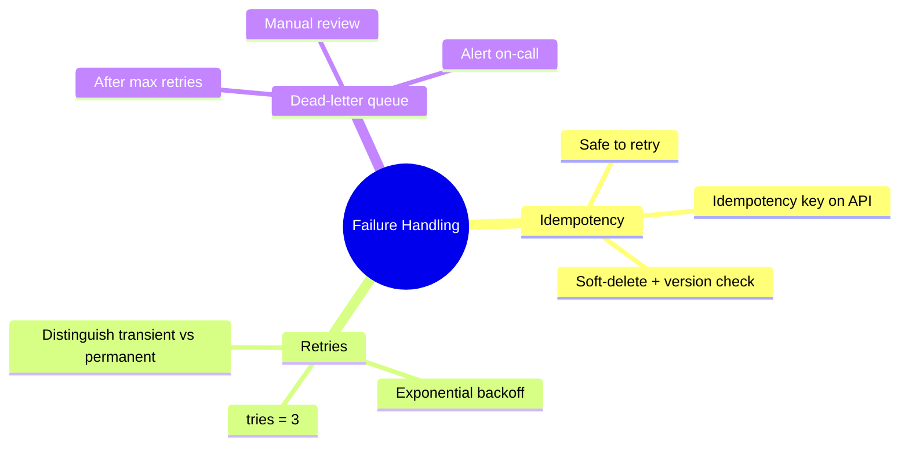

# 7.6. Idempotency, Retries, and Dead-Letter Handling

> [!abstract] What this note teaches you
> V1 had no retry logic — a transient DB error failed the entire scheduling run. V2 jobs are idempotent (safe to retry), have `tries=3` with exponential backoff, and dead-letter to a manual-review queue after 3 failures. This note is the V2 failure-handling strategy.

## The three failure-handling properties



## Idempotency: safe to retry

A job is **idempotent** if running it multiple times produces the same result as running it once. V2 jobs are idempotent by design.

### `GenerateScheduleJob` idempotency

```php
public function handle(PostgresSchedulingRepository $repository): void
{
    // 1. Acquire advisory lock — if another run is in progress, this blocks
    DB::statement("SELECT pg_advisory_lock(?)", [$this->sessionId]);
    
    try {
        // 2. Check if a previous run already completed for this session+algorithm
        $existingRun = ScheduleRun::where('session_id', $this->sessionId)
            ->where('algorithm', $this->algorithm)
            ->where('statut', 'succes')
            ->where('created_at', '>', now()->subMinutes(5))  // recent
            ->latest()
            ->first();
        
        if ($existingRun) {
            // A recent successful run exists — skip re-solving
            Log::info('Skipping re-solve; recent successful run exists', [
                'existing_run_id' => $existingRun->id,
            ]);
            return;
        }
        
        // 3. Do the actual work
        // ... solver call, persist, etc.
        
    } finally {
        DB::statement("SELECT pg_advisory_unlock(?)", [$this->sessionId]);
    }
}
```

If the job is retried (e.g. after a transient DB error), the idempotency check at step 2 prevents duplicate work.

### API idempotency keys

For user-initiated actions (not just jobs), V2 supports idempotency keys:

```php
// POST /api/v1/sessions/{id}/generate
// Header: Idempotency-Key: abc-123-def-456

class GenerateScheduleRequest extends FormRequest
{
    public function rules(): array
    {
        return [
            // ...
            'idempotency_key' => ['sometimes', 'string', 'uuid'],
        ];
    }
}

// In the handler:
$idempotencyKey = $request->header('Idempotency-Key');
if ($idempotencyKey) {
    $existing = ScheduleRun::where('idempotency_key', $idempotencyKey)->first();
    if ($existing) {
        return response()->json(['run_id' => $existing->id], 200);  // not 201
    }
}

$run = ScheduleRun::create([
    'idempotency_key' => $idempotencyKey,
    // ...
]);
```

If the client retries the same request (with the same `Idempotency-Key`), the server returns the original response instead of creating a duplicate.

## Retries with exponential backoff

```php
class GenerateScheduleJob implements ShouldQueue
{
    public int $tries = 3;
    public int $timeout = 600;
    public int $backoff = 30;  // 30s, 60s, 120s
    
    public function retryUntil(): DateTime
    {
        return now()->addHours(1);  // hard ceiling: 1 hour
    }
    
    public function failed(\Throwable $exception): void
    {
        // Called after all retries exhausted
        $this->scheduleRun->update([
            'statut' => 'echec',
            'error_message' => $exception->getMessage(),
            'finished_at' => now(),
        ]);
        
        // Dead-letter
        $this->release(0);  // re-release for dead-letter consumer
        
        Log::critical('Schedule generation failed after all retries', [
            'session_id' => $this->sessionId,
            'error' => $exception->getMessage(),
        ]);
        
        // Alert on-call
        Notification::route('slack', config('services.slack.oncall_webhook'))
            ->notify(new ScheduleGenerationFailed($this->scheduleRun, $exception));
    }
}
```

The `backoff = 30` means: 30s, 60s, 120s between retries (exponential). The `retryUntil` sets a 1-hour hard ceiling — even if `tries` allows more, the job won't retry after 1 hour.

## Distinguishing transient vs permanent errors

Not all errors should be retried:

```php
public function handle(): void
{
    try {
        // ... work
    } catch (QueryException $e) {
        if ($e->getCode() === '40001') {  // serialization failure
            throw $e;  // retry
        }
        if ($e->getCode() === '23505') {  // unique violation
            // Permanent — don't retry
            throw new \RuntimeException('Permanent error: ' . $e->getMessage(), 0, $e);
        }
        throw $e;  // default: retry
    } catch (BusinessException $e) {
        // Business rule violation — don't retry
        throw new \RuntimeException('Permanent: ' . $e->getMessage(), 0, $e);
    }
}
```

Laravel's queue worker respects the `tries` property unless the job throws a `PermanentException` (custom). V2 marks business-rule violations as permanent.

## The dead-letter queue

After `tries = 3` failures, the job goes to the dead-letter queue:

```php
// config/queue.php
'connections' => [
    'redis' => [
        // ...
        'failed' => [
            'driver' => 'redis',
            'queue' => 'failed-jobs',
        ],
    ],
],
```

Failed jobs are stored in Redis with their payload, exception, and failure timestamp. The Horizon dashboard shows them under "Failed Jobs".

An admin can:
- **Retry** the job (re-dispatches it).
- **Delete** the job (gives up permanently).
- **Inspect** the payload and exception for debugging.

```bash
# CLI retry
php artisan queue:retry <job-id>

# CLI retry all failed
php artisan queue:retry all

# CLI delete
php artisan queue:forget <job-id>
```

## Alerting on failures

```php
// app/Notifications/ScheduleGenerationFailed.php
class ScheduleGenerationFailed extends Notification
{
    public function toSlack($notifiable): SlackMessage
    {
        return (new SlackMessage)
            ->error()
            ->content('Schedule generation failed after all retries')
            ->attachment(function ($attachment) {
                $attachment
                    ->title('Session ' . $this->scheduleRun->session_id)
                    ->fields([
                        'Run ID' => $this->scheduleRun->id,
                        'Error' => $this->exception->getMessage(),
                        'Tenant' => $this->scheduleRun->tenant_id,
                        'Time' => now()->toIso8601String(),
                    ]);
            });
    }
}
```

Slack alerts the on-call engineer within seconds of a failed job.

## Common junior developer mistakes

- **Non-idempotent jobs.** If retrying the job produces duplicate data, retries are dangerous. Design for idempotency from day 1.
- **No backoff.** Retrying immediately after a transient error usually fails again (the underlying issue hasn't resolved). Use exponential backoff.
- **Retrying permanent errors.** A unique-constraint violation will fail every time. Don't retry — log and dead-letter.
- **No `retryUntil` ceiling.** Without it, a job with `tries = 3` and `backoff = 30` could keep retrying for hours if the worker keeps crashing.
- **No alerting on failed jobs.** A failed job that nobody notices is worse than no job.
- **No dead-letter inspection.** When a job fails, you need to know why. Store the exception in the failed-jobs table.

## What to read next

- [[7.1. Laravel Horizon and Redis Queues]] — the queue infrastructure.
- [[7.2. The GenerateScheduleJob Lifecycle]] — the job lifecycle.
- [[9.2. Laravel pulse Horizon Telescope Sentry]] — monitoring failed jobs.
- [[5.8. Exception Handling and Centralized Error Strategy]] — exception classification.
