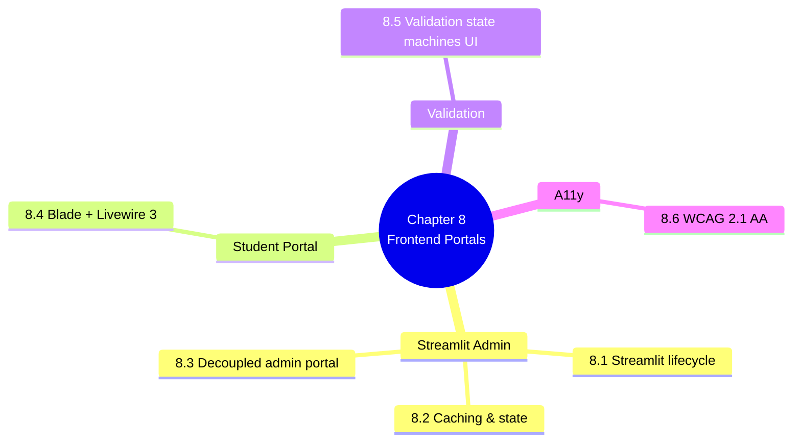

# 8. MOC — The Frontend Portals

> [!abstract] Chapter goal
> V2 has two frontends: a decoupled Streamlit admin portal that talks to the Laravel API over OAuth2, and a Laravel Blade + Livewire 3 student/professor portal that is server-rendered, accessible, and mobile-friendly. This chapter teaches you why this split is correct and how each piece works.

## Notes in this chapter

| Note | Title | What you learn |
|---|---|---|
| 8.1 | [[8.1. Streamlit Lifecycle and Top-to-Bottom Execution]] | Why Streamlit reruns the whole script on every interaction, and how to design around it without fighting the framework. |
| 8.2 | [[8.2. st cache data and Session State Patterns]] | `@st.cache_data(ttl=60)`, `SessionState.get_or_fetch(api, key, endpoint, ttl)`, cache invalidation on `ScheduleGenerated` events. |
| 8.3 | [[8.3. The Decoupled Streamlit Admin Portal]] | The 6 admin pages (Vice-Doyen, Planification, Chef Dept, Analytics, Audit, System Health), role-filtered navigation, OAuth2 bearer token in `st.session_state`. |
| 8.4 | [[8.4. Laravel Blade and Livewire 3 for Student Professor Portal]] | Server-rendered, mobile-friendly, accessible. Student self-service (schedule, conflict report, ICS export). Professor (availability, swap requests). |
| 8.5 | [[8.5. Validation State Machines in the UI]] | Replacing V1's fake "Valider le planning" button with real `POST /sessions/{id}/validate` calls, live status badges, audit-trail visible to chefs de département. |
| 8.6 | [[8.6. Accessibility WCAG 2.1 AA]] | ARIA labels, keyboard navigation, contrast ratios (V1's `#667eea` on white was 4.16:1, below AA), screen reader testing, RTL for Arabic. |

## Why this chapter matters

The frontend is where users actually feel the difference between V1 and V2. V1 had fake buttons, broken CSS, and no auth. V2 has real workflows, real state transitions, and real accessibility. If you skip this chapter you'll ship a backend that nobody can use.

## Where to go next

After mastering the frontend, proceed to [[9. MOC|Observability and Production Operations]] to see how V2 stays observable in production.
