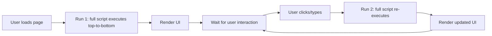

# 8.1. Streamlit Lifecycle and Top-to-Bottom Execution

> [!abstract] What this note teaches you
> Streamlit reruns the entire script from top to bottom on every user interaction (click, input change, etc.). This is fundamentally different from traditional web frameworks. V1's code was written as if Streamlit were stateful; V2's code is written to embrace reruns. This note explains the Streamlit model and how to design for it.

## The Streamlit execution model



Every interaction triggers a **full rerun** of the script. There is no event handler, no callback, no diff. The script reads input widgets at the top, computes results in the middle, and renders output at the bottom.

## Why this matters

Consider this V1 pattern:

```python
# V1 — BROKEN under reruns
selected_student = None  # initialized at module level

if st.button("Search"):
    selected_student = db.search(name_input)

if selected_student:
    st.write(f"Schedule for {selected_student['name']}")
```

What happens:
1. **Run 1:** User clicks "Search". `selected_student` is set. Schedule is displayed.
2. **Run 2** (user clicks something else): `selected_student` is reset to `None`. Schedule disappears.

The bug: `selected_student` is a local variable that doesn't survive reruns. You need `st.session_state`.

## The V2 pattern: `st.session_state`

```python
# V2 — correct
if 'selected_student' not in st.session_state:
    st.session_state.selected_student = None

if st.button("Search"):
    st.session_state.selected_student = api.search(name_input)

if st.session_state.selected_student:
    st.write(f"Schedule for {st.session_state.selected_student['name']}")
```

`st.session_state` persists across reruns. It's the Streamlit equivalent of a session cookie.

## The V2 `SessionState` helper

V2 wraps the pattern in a helper that handles TTL-based caching:

```python
# streamlit_app/utils/session.py
import streamlit as st
import time

class SessionState:
    @staticmethod
    def get_or_fetch(api, key, endpoint, ttl=60):
        """Get cached value or fetch from API, with TTL."""
        if key not in st.session_state:
            st.session_state[key] = {
                'data': api.get(endpoint),
                'fetched_at': time.time(),
            }
        elif time.time() - st.session_state[key]['fetched_at'] > ttl:
            # TTL expired — refetch
            st.session_state[key] = {
                'data': api.get(endpoint),
                'fetched_at': time.time(),
            }
        return st.session_state[key]['data']
    
    @staticmethod
    def clear(key):
        """Clear a session state key."""
        if key in st.session_state:
            del st.session_state[key]
    
    @staticmethod
    def clear_all():
        """Clear all session state (logout)."""
        for key in list(st.session_state.keys()):
            del st.session_state[key]
```

Usage:

```python
# Fetch KPIs with 60s TTL
kpis = SessionState.get_or_fetch(
    api,
    key='kpis',
    endpoint=f"/sessions/{session_id}/dashboard",
    ttl=60,
)
```

## The V1 state bugs

V1 had several state management bugs (see [[2.8. Missing Security and Multi-Tenancy]]):

1. `st.session_state['active_session']` not set if user deep-links to a page. The page shows "Veuillez sélectionner une session" even though a session exists.

2. `st.session_state['selected_student']` never cleared. If you search for student A then student B, you'll see A's schedule below B's search box.

3. `st.session_state['selected_prof']` — same issue.

V2 fixes these by explicitly clearing state on new searches:

```python
if st.button("Search"):
    SessionState.clear('selected_student')
    st.session_state.selected_student = api.search(name_input)
```

## Widget keys

Streamlit widgets can have explicit `key` parameters. The widget's value is automatically stored in `st.session_state[key]`:

```python
name = st.text_input("Name", key="name_input")
# st.session_state.name_input now holds the value
```

This is cleaner than reading the return value and storing it manually. V2 uses keys for all persistent widgets.

## `st.rerun()` and `st.stop()`

```python
# st.rerun() — manually trigger a rerun
if st.button("Refresh"):
    api.invalidate_cache(...)
    st.rerun()  # immediately reruns the script

# st.stop() — halt execution without rendering the rest
if not auth.is_authenticated():
    st.warning("Please log in.")
    st.stop()  # nothing below this line runs
st.write("Welcome!")  # only shown if authenticated
```

V2 uses `st.stop()` for auth gates and `st.rerun()` for cache invalidation.

## Common junior developer mistakes

- **Module-level mutable state.** `selected = None` at module level resets on every rerun. Use `st.session_state`.
- **Not clearing state when context changes.** Searching for student B should clear student A's selection. Use `SessionState.clear(key)`.
- **Reading widget values from local variables.** `name = st.text_input(...)` works, but `st.session_state.name` is more reliable across reruns.
- **Forgetting `st.stop()` after auth checks.** Without it, the page renders partially even when unauthenticated.
- **Long-running operations in the script body.** Streamlit reruns the script on every interaction. If the script does a 5-second DB call, every click takes 5 seconds. Cache it (`@st.cache_data`) or move it to a button click.

## What to read next

- [[8.2. st cache data and Session State Patterns]] — caching across reruns.
- [[8.3. The Decoupled Streamlit Admin Portal]] — the V2 admin UI.
- [[2.2. Streamlit to Database Coupling]] — the V1 anti-patterns.
