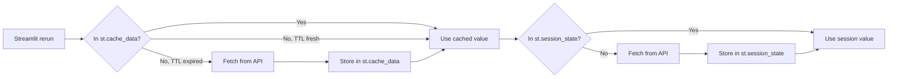

# 8.2. `@st.cache_data` and Session State Patterns

> [!abstract] What this note teaches you
> V1 didn't cache anything — every Streamlit rerun re-fetched all KPIs from Supabase. V2 uses `@st.cache_data(ttl=60)` for read-heavy endpoints and `SessionState.get_or_fetch` for per-user state. This note is the V2 caching strategy.

## The two caching layers



| Cache | Scope | TTL | When to use |
|---|---|---|---|
| `@st.cache_data` | All users on this Streamlit server | Explicit (e.g. 60s) | Public data (KPIs, dropdown options) |
| `st.session_state` | This user's session | Manual | Per-user data (selected session, auth token) |

## `@st.cache_data`

```python
@st.cache_data(ttl=60, show_spinner="Fetching KPIs...")
def fetch_kpis(api, session_id):
    return api.get(f"/sessions/{session_id}/dashboard")

# First call: fetches from API, caches for 60s
kpis = fetch_kpis(api, session_id)

# Within 60s: returns cached value instantly
kpis = fetch_kpis(api, session_id)

# After 60s: refetches
kpis = fetch_kpis(api, session_id)
```

Key features:
- **TTL** — cached values expire after the specified time.
- **Show spinner** — displays a loading spinner during fetch.
- **Hash-based** — the cache key is based on the function's arguments. Different `session_id` values have separate cache entries.
- **Per-server** — all users on the same Streamlit server share the cache. (If you need per-user caching, use `st.session_state`.)

## The V2 `api.get_cached` wrapper

V2 wraps `@st.cache_data` in the API client:

```python
# streamlit_app/api_client.py
import streamlit as st
import requests

class LaravelAPI:
    def __init__(self, auth):
        self.auth = auth
    
    def get_cached(self, endpoint, ttl=60):
        @st.cache_data(ttl=ttl, show_spinner=f"Fetching {endpoint}...")
        def _fetch(token, endpoint):
            response = requests.get(
                f"{self.auth.api_host}/{endpoint}",
                headers={"Authorization": f"Bearer {token}"},
                timeout=15,
            )
            return response.json() if response.status_code == 200 else {}
        
        return _fetch(self.auth.token, endpoint)
    
    def invalidate_cache(self, endpoint):
        """Clear cached data for an endpoint."""
        # st.cache_data doesn't have a direct invalidate-by-key,
        # so we use a hash of the endpoint to identify the cached function
        st.cache_data.clear()  # nuclear option — clears all cache
```

Usage:

```python
# Cached for 60s
data = api.get_cached(f"/sessions/{session_id}/dashboard", ttl=60)

# Force refresh
if st.button("🔄 Refresh"):
    api.invalidate_cache(f"/sessions/{session_id}/dashboard")
    st.rerun()
```

## `st.session_state` for per-user data

```python
# Authentication token
if 'oauth_token' not in st.session_state:
    st.session_state.oauth_token = None

if st.session_state.oauth_token is None:
    show_login_screen()
    st.stop()

# Selected session
if 'active_session' not in st.session_state:
    sessions = api.get('/sessions')
    st.session_state.active_session = sessions[0] if sessions else None

# Selected student (for consultation page)
if 'selected_student' not in st.session_state:
    st.session_state.selected_student = None
```

## Cache invalidation on events

When the backend fires `ScheduleGenerated`, the Streamlit cache for KPIs should be invalidated. V2 does this via a "last updated" check:

```python
# streamlit_app/views/vice_doyen.py
def render(api):
    session = require_session(api)
    
    # Check if the schedule has been regenerated since last fetch
    last_run = api.get(f"/sessions/{session['id']}/last-run")
    cache_key = f"kpis_{session['id']}_{last_run['id']}"
    
    data = SessionState.get_or_fetch(
        api,
        key=cache_key,
        endpoint=f"/sessions/{session['id']}/dashboard",
        ttl=300,  # 5 minutes
    )
    
    # If a new run happens, the cache_key changes (because last_run['id'] changes),
    # forcing a refetch.
```

This is a "stale-while-revalidate" pattern: the cache key includes a version identifier that changes when the underlying data changes.

## The V1 anti-pattern

V1's `01_Vice_Doyen_Dashboard.py`:

```python
# V1 — no caching, 5 sequential RPCs per rerun
dashboard_data = analytics_service.get_dashboard_data(session_id)
# This internally calls:
# - db.get_global_stats(session_id)
# - db.get_department_stats(session_id)
# - db.get_room_utilization(session_id)
# - db.get_professor_workload(session_id)
# - db.get_conflict_summary(session_id)
```

Every Streamlit rerun (every click, every input change) triggered 5 RPCs to Supabase. With 100ms latency each, that's 500ms per rerun — and the user clicked something every few seconds.

V2's single `get_dashboard_data` stored function (see [[3.2. Schema Design Principles for SaaS]]) plus `@st.cache_data(ttl=60)` reduces this to 1 RPC per 60 seconds.

## Common junior developer mistakes

- **No caching at all.** Every rerun hits the API. Slow and expensive.
- **Caching for too long.** `ttl=86400` (24 hours) on KPIs means the dashboard shows stale data after a schedule generation. Use 60–300s.
- **Caching per-user data in `@st.cache_data`.** `@st.cache_data` is shared across all users. Per-user data must go in `st.session_state`.
- **No cache invalidation.** After a schedule generation, the dashboard should refresh. Either use a version-based cache key or call `st.cache_data.clear()`.
- **Forgetting `show_spinner`.** Without it, the user has no feedback during fetch.

## What to read next

- [[8.1. Streamlit Lifecycle and Top-to-Bottom Execution]] — why caching matters.
- [[8.3. The Decoupled Streamlit Admin Portal]] — the full admin UI.
- [[10.5. Caching Strategy with Redis]] — the backend caching layer.
