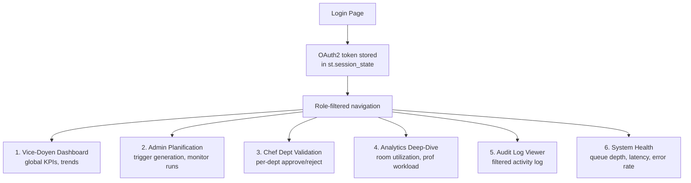

# 8.3. The Decoupled Streamlit Admin Portal

> [!abstract] What this note teaches you
> V1's Streamlit talked directly to Supabase. V2's Streamlit talks only to the Laravel REST API via OAuth2 bearer token. This note is the V2 admin portal: 6 pages, role-filtered navigation, shared components, and real API calls.

## The 6 admin pages



| Page | Roles that can access |
|---|---|
| Vice-Doyen Dashboard | `vice_doyen`, `super_admin` |
| Admin Planification | `admin_planification`, `super_admin` |
| Chef Dept Validation | `chef_dept`, `vice_doyen`, `super_admin` |
| Analytics Deep-Dive | `vice_doyen`, `admin_planification`, `super_admin` |
| Audit Log Viewer | `vice_doyen`, `super_admin` |
| System Health | `super_admin` |

## The main `app.py`

```python
# streamlit_app/app.py
import streamlit as st
import importlib
from auth import LaravelAuth
from api_client import LaravelAPI

st.set_page_config(page_title="Exam Ops", page_icon="🎓", layout="wide")

auth = LaravelAuth()
api = LaravelAPI(auth)

if not auth.is_authenticated():
    auth.show_login_screen()
    st.stop()

st.sidebar.title(f"Bienvenue, {auth.user_name()}")
st.sidebar.caption(f"Rôle: {auth.role()}")
st.sidebar.divider()

pages = {
    "📊 Vice-Doyen": "views.vice_doyen",
    "🗓️ Planification": "views.admin_planification",
    "✅ Validation Dept": "views.chef_dept",
    "📈 Analytics": "views.analytics",
    "📜 Audit Log": "views.audit_log",
    "🏥 Santé Système": "views.system_health",
}

# RBAC: filter pages by role
allowed_pages = [p for p, m in pages.items() if auth.can_view(m)]
selected = st.sidebar.radio("Navigation", allowed_pages)

if selected:
    module = importlib.import_module(pages[selected])
    module.render(api)

# Logout button at the bottom
st.sidebar.divider()
if st.sidebar.button("Déconnexion"):
    auth.logout()
    st.rerun()
```

## The auth module

```python
# streamlit_app/auth.py
import streamlit as st
import requests

class LaravelAuth:
    API_HOST = "https://api.univexam.cloud/v2"
    
    def __init__(self):
        if 'oauth_token' not in st.session_state:
            st.session_state.oauth_token = None
        if 'user_info' not in st.session_state:
            st.session_state.user_info = None
    
    def is_authenticated(self):
        return st.session_state.oauth_token is not None
    
    def show_login_screen(self):
        st.title("Connexion")
        with st.form("login"):
            email = st.text_input("Email")
            password = st.text_input("Mot de passe", type="password")
            if st.form_submit_button("Se connecter"):
                response = requests.post(
                    f"{self.API_HOST}/auth/login",
                    json={'email': email, 'password': password},
                    timeout=10,
                )
                if response.status_code == 200:
                    data = response.json()
                    st.session_state.oauth_token = data['token']
                    st.session_state.user_info = data['user']
                    st.rerun()
                else:
                    st.error("Identifiants invalides.")
    
    def logout(self):
        st.session_state.oauth_token = None
        st.session_state.user_info = None
    
    @property
    def token(self):
        return st.session_state.oauth_token
    
    def user_name(self):
        return st.session_state.user_info.get('name', 'Utilisateur')
    
    def role(self):
        return st.session_state.user_info.get('role', 'unknown')
    
    def can_view(self, module_name):
        """RBAC check based on role."""
        role_permissions = {
            'super_admin': ['*'],
            'vice_doyen': ['views.vice_doyen', 'views.chef_dept', 'views.analytics', 'views.audit_log'],
            'admin_planification': ['views.admin_planification', 'views.analytics'],
            'chef_dept': ['views.chef_dept'],
        }
        allowed = role_permissions.get(self.role(), [])
        return '*' in allowed or module_name in allowed
```

## The API client

```python
# streamlit_app/api_client.py
import streamlit as st
import requests

class LaravelAPI:
    def __init__(self, auth):
        self.auth = auth
    
    def get(self, endpoint):
        """Synchronous GET (no caching)."""
        response = requests.get(
            f"{self.auth.API_HOST}/{endpoint}",
            headers={"Authorization": f"Bearer {self.auth.token}"},
            timeout=15,
        )
        if response.status_code == 401:
            st.error("Session expirée. Veuillez vous reconnecter.")
            st.session_state.oauth_token = None
            st.rerun()
        return response.json() if response.status_code == 200 else {}
    
    def get_cached(self, endpoint, ttl=60):
        """Cached GET via @st.cache_data."""
        @st.cache_data(ttl=ttl, show_spinner=f"Fetching {endpoint}...")
        def _fetch(token, endpoint):
            return self.get(endpoint)
        return _fetch(self.auth.token, endpoint)
    
    def post(self, endpoint, json):
        """POST request."""
        response = requests.post(
            f"{self.auth.API_HOST}/{endpoint}",
            headers={"Authorization": f"Bearer {self.auth.token}"},
            json=json,
            timeout=15,
        )
        return response.json() if response.status_code in (200, 201, 202) else {}
    
    def invalidate_cache(self):
        st.cache_data.clear()
```

## Shared components

```python
# streamlit_app/components/header.py
import streamlit as st

def render_header(title, subtitle, gradient):
    c1, c2 = gradient
    st.markdown(f"""
    <div style="
        background: linear-gradient(135deg, {c1} 0%, {c2} 100%);
        color: white;
        padding: 1.5rem;
        border-radius: 12px;
        margin-bottom: 2rem;
    ">
        <h1 style="margin:0;font-size:1.8rem;">{title}</h1>
        <p style="margin:0.5rem 0 0;opacity:0.9;">{subtitle}</p>
    </div>
    """, unsafe_allow_html=True)

def require_session(api):
    """Get or select active session."""
    if 'active_session' not in st.session_state:
        sessions = api.get('/sessions')
        if not sessions:
            st.warning("Aucune session disponible.")
            st.stop()
        st.session_state.active_session = sessions[0]
    return st.session_state.active_session
```

## The Admin Planification page (with async job monitoring)

```python
# streamlit_app/views/admin_planification.py
import streamlit as st
import time
from components.header import render_header, require_session

def render(api):
    render_header("Planification", "Génération et gestion du planning", ("#059669", "#10b981"))
    session = require_session(api)
    
    tab1, tab2, tab3 = st.tabs(["🚀 Génération", "📋 Planning", "⚠️ Conflits"])
    
    with tab1:
        st.write("Algorithme: **CP-SAT** (Google OR-Tools)")
        max_exams = st.slider("Max examens/jour/étudiant", 1, 2, 1,
                              help="La valeur 2 est un assouplissement (à éviter).")
        timeout = st.slider("Timeout solver (secondes)", 10, 120, 30)
        
        if st.button("🚀 Lancer la génération", type="primary"):
            run = api.post(f"/sessions/{session['id']}/generate", json={
                'algorithm': 'cp_sat',
                'max_exams_per_day': max_exams,
                'timeout_seconds': timeout,
            })
            st.success(f"Génération lancée (Run #{run['id']})")
            st.session_state.current_run_id = run['id']
            api.invalidate_cache()
            st.rerun()
        
        # Live status polling
        if 'current_run_id' in st.session_state:
            run = api.get(f"/schedule-runs/{st.session_state.current_run_id}")
            if run['statut'] == 'en_cours' or run['statut'] == 'en_attente':
                with st.spinner("Génération en cours..."):
                    time.sleep(2)
                    st.rerun()
            elif run['statut'] == 'succes':
                st.success(f"✅ {run['scheduled_count']}/{run['total_modules']} planifiés "
                          f"en {run['duration_ms']/1000:.1f}s")
                if run.get('unscheduled_count', 0) > 0:
                    st.warning(f"⚠️ {run['unscheduled_count']} modules non planifiés.")
            elif run['statut'] == 'echec':
                st.error(f"Échec: {run['error_message']}")
```

## Common junior developer mistakes

- **Direct DB access from Streamlit.** Use the API client. See [[2.2. Streamlit to Database Coupling]].
- **No auth gate.** Every page must check `auth.is_authenticated()` and call `st.stop()` if not.
- **No role filtering.** A `chef_dept` should not see the "Generate schedule" button. Filter navigation by role.
- **Synchronous job execution.** The "Generate" button should dispatch a job and return immediately, then poll for status. Never block the UI for 30+ seconds.
- **Broken CSS in `unsafe_allow_html`.** V1's CSS was malformed (missing color stops in `linear-gradient`). Always test the rendered HTML.

## What to read next

- [[8.1. Streamlit Lifecycle and Top-to-Bottom Execution]] — the underlying model.
- [[8.2. st cache data and Session State Patterns]] — caching patterns.
- [[8.5. Validation State Machines in the UI]] — replacing V1's fake buttons.
- [[2.2. Streamlit to Database Coupling]] — the V1 anti-pattern.
