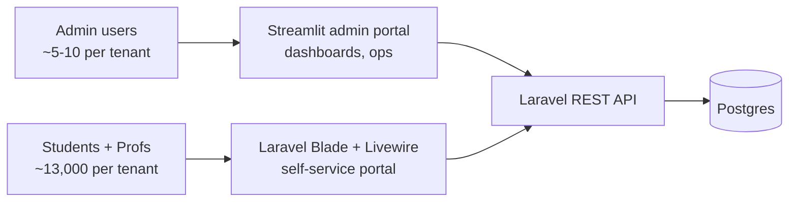

# 8.4. Laravel Blade and Livewire 3 for Student/Professor Portal

> [!abstract] What this note teaches you
> Streamlit is great for admin dashboards but bad for student/professor self-service (no auth, no mobile, no accessibility). V2 uses Laravel Blade + Livewire 3 + Tailwind 4 for the student/professor portal. This note explains why and shows the patterns.

## Why two frontends



| Criterion | Streamlit admin | Blade + Livewire portal |
|---|---|---|
| Audience | Internal ops staff | External students/profs |
| Volume | ~10 concurrent | ~10,000 concurrent |
| Auth | OAuth2 token in session_state | Session cookie (Sanctum stateful) |
| Mobile | Poor (Streamlit assumes desktop) | Excellent (Tailwind responsive) |
| Accessibility | Limited | WCAG 2.1 AA |
| Real-time | Polling | Livewire + WebSockets |
| SEO | N/A | Important (login page, public info) |

Streamlit is optimized for data exploration by a small team. Blade + Livewire is optimized for self-service by thousands of users on phones.

## The Blade portal structure

```
resources/views/
├── layouts/
│   ├── app.blade.php          # Main layout (nav, footer, scripts)
│   └── auth.blade.php         # Auth pages (login, 2FA)
├── components/
│   ├── schedule-card.blade.php
│   ├── kpi-card.blade.php
│   └── conflict-alert.blade.php
├── livewire/
│   ├── student-schedule.php   # Livewire component
│   ├── professor-availability.php
│   └── swap-request.php
├── student/
│   ├── dashboard.blade.php
│   ├── schedule.blade.php
│   └── conflict-report.blade.php
├── professor/
│   ├── dashboard.blade.php
│   ├── schedule.blade.php
│   └── declare-availability.blade.php
└── auth/
    ├── login.blade.php
    └── two-factor.blade.php
```

## A Livewire component example

Livewire components are PHP classes + Blade templates. They provide reactive UI without writing JavaScript.

```php
// app/Livewire/StudentSchedule.php
class StudentSchedule extends Component
{
    public string $filter = 'all';  // 'all', 'upcoming', 'past'
    
    public function render()
    {
        $etudiant = Auth::user()->etudiant;
        
        $exams = Examen::whereHas('module.inscriptions', function ($q) use ($etudiant) {
            $q->where('etudiant_id', $etudiant->id)
              ->whereIn('statut', ['inscrit', 'rattrapage']);
        })
        ->where('statut', '!=', 'annule')
        ->with(['module', 'creneau', 'lieu'])
        ->when($this->filter === 'upcoming', fn ($q) => $q->whereHas('creneau', fn ($q) => $q->where('date_examen', '>=', today())))
        ->when($this->filter === 'past', fn ($q) => $q->whereHas('creneau', fn ($q) => $q->where('date_examen', '<', today())))
        ->orderBy(fn ($q) => $q->join('creneaux', 'examens.creneau_id', '=', 'creneaux.id')->orderBy('creneaux.date_examen'))
        ->get();
        
        return view('livewire.student-schedule', compact('exams'));
    }
}
```

```blade
{{-- resources/views/livewire/student-schedule.blade.php --}}
<div>
    <div class="flex gap-2 mb-4">
        <button wire:click="$set('filter', 'all')" 
                class="px-4 py-2 rounded {{ $filter === 'all' ? 'bg-blue-500 text-white' : 'bg-gray-200' }}">
            Tous
        </button>
        <button wire:click="$set('filter', 'upcoming')"
                class="px-4 py-2 rounded {{ $filter === 'upcoming' ? 'bg-blue-500 text-white' : 'bg-gray-200' }}">
            À venir
        </button>
        <button wire:click="$set('filter', 'past')"
                class="px-4 py-2 rounded {{ $filter === 'past' ? 'bg-blue-500 text-white' : 'bg-gray-200' }}">
            Passés
        </button>
    </div>
    
    <div class="space-y-3">
        @forelse ($exams as $exam)
            <x-schedule-card :exam="$exam" />
        @empty
            <p class="text-gray-500">Aucun examen à afficher.</p>
        @endforelse
    </div>
    
    <div class="mt-6 flex gap-2">
        <a href="{{ route('student.schedule.ics') }}" class="px-4 py-2 bg-green-500 text-white rounded">
            📅 Export ICS
        </a>
        <a href="{{ route('student.schedule.pdf') }}" class="px-4 py-2 bg-red-500 text-white rounded">
            📄 PDF
        </a>
    </div>
</div>
```

When the user clicks a filter button, Livewire makes an AJAX request to the server, re-runs `render()`, and patches the DOM. No page reload, no JavaScript written by the developer.

## Student features

- **View own schedule** — filtered by their `etudiant_id`.
- **Export as ICS** — calendar import.
- **Export as PDF** — printable.
- **Report a conflict** — "I have two exams at the same time" form (should be impossible if the solver is correct, but the button exists as a safety net).
- **Request accommodation** — extra time, separate room; feeds into `lieu_indisponibilites` for future runs.

## Professor features

- **View own surveillances** — which exams they proctor.
- **Declare availability** — calendar widget to mark unavailable dates (feeds `professeur_indisponibilites`).
- **Swap request** — request a swap with another professor; the other prof accepts/rejects; admin approves.
- **Export schedule** — ICS, PDF.

## Tailwind 4 for responsive design

```blade
{{-- Mobile-first responsive layout --}}
<div class="grid grid-cols-1 md:grid-cols-2 lg:grid-cols-3 gap-4">
    @foreach ($exams as $exam)
        <div class="bg-white rounded-lg shadow p-4">
            <h3 class="font-bold text-lg">{{ $exam->module->nom }}</h3>
            <p class="text-gray-600">{{ $exam->creneau->date_examen->format('d/m/Y') }}</p>
            <p class="text-gray-600">{{ $exam->creneau->heure_debut->format('H:i') }}</p>
            <p class="text-gray-600">Salle: {{ $exam->lieu->nom }}</p>
        </div>
    @endforeach
</div>
```

- `grid-cols-1` on phones.
- `md:grid-cols-2` on tablets.
- `lg:grid-cols-3` on desktops.

## Common junior developer mistakes

- **Using Streamlit for student/professor UIs.** Streamlit is for internal dashboards, not public-facing portals. Use Blade + Livewire.
- **No mobile responsiveness.** Students will check their schedule on their phones. Test on a 360px-wide viewport.
- **No ICS export.** Students want to add exams to their phone calendar. ICS is the standard format.
- **Conflicting filters in Livewire.** The `when()` clauses can interact badly. Test all combinations.
- **Forgetting auth scope.** A student should only see their own exams. Filter by `Auth::user()->etudiant->id` at the query level, not just the UI level.

## What to read next

- [[8.1. Streamlit Lifecycle and Top-to-Bottom Execution]] — why admin uses Streamlit instead.
- [[8.6. Accessibility WCAG 2.1 AA]] — making the portal accessible.
- [[6.3. OAuth2 with Sanctum Fortify Socialite]] — auth for the portal.
- [[6.5. PII Redaction and GDPR FERPA Compliance]] — privacy for student data.
