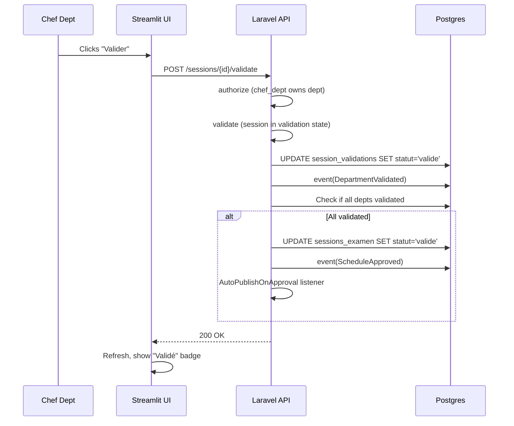

# 8.5. Validation State Machines in the UI

> [!abstract] What this note teaches you
> V1's "Valider le planning" button called `st.success(...)` and `st.balloons()` but never wrote to the database. V2 replaces fake buttons with real `POST /sessions/{id}/validate` calls that update the `session_validations` table and fire events. This note shows the V2 validation workflow UI.

## The V1 fake button (anti-pattern)

From `bda_test_univ_exam/src/frontend/pages/03_Chef_Dept_Validation.py`:

```python
# V1 — fake button
if st.button("✅ Valider le planning", type="primary", use_container_width=True):
    st.success(f"Planning du département {selected_dept} validé!")
    # TODO: Update session status in DB
```

And from `univ_exam_optimizer/03_Chef_Dept_Validation.py`:

```python
# V1 — fake button with balloons
if st.button("Valider ce planning"):
    st.balloons()
    st.success("Planning validé par le département !")
```

Both showed a success message but **did nothing**. The validation workflow was theater. The comment `# TODO: Update session status in DB` literally says it.

## The V2 real flow



## The V2 Chef Dept validation page

```python
# streamlit_app/views/chef_dept.py
import streamlit as st
from components.header import render_header, require_session

def render(api):
    render_header("Validation Département", "Approuver ou demander révision", 
                  ("#3b82f6", "#1e40af"))
    session = require_session(api)
    
    # Get the chef's department
    dept_id = api.get('/me/departement')['id']
    dept_name = api.get('/me/departement')['nom']
    
    # Get current validation status
    validation = api.get(f"/sessions/{session['id']}/validations/{dept_id}")
    
    # Display current status
    status_map = {
        'en_attente': ('⏳ En attente', 'orange'),
        'valide': ('✅ Validé', 'green'),
        'rejete': ('❌ Rejeté', 'red'),
        'a_reviser': ('⚠️ À réviser', 'yellow'),
    }
    status_label, status_color = status_map.get(validation['statut'], ('?', 'gray'))
    st.markdown(f"""
    <div style="padding:1rem;border-radius:8px;background:{status_color}20;
                border-left:4px solid {status_color};margin-bottom:1rem;">
        <strong>{status_label}</strong>
        {f"– Décidé par {validation.get('decided_by_name', '?')} le {validation.get('decided_at', '?')}" if validation.get('decided_at') else ''}
    </div>
    """, unsafe_allow_html=True)
    
    # Show the department's schedule
    schedule = api.get(f"/sessions/{session['id']}/schedule?dept={dept_id}")
    st.dataframe(schedule, use_container_width=True)
    
    # Only show action buttons if status is en_attente
    if validation['statut'] == 'en_attente':
        st.divider()
        col1, col2, col3 = st.columns([2, 2, 1])
        
        with col1:
            if st.button("✅ Valider", type="primary", use_container_width=True):
                response = api.post(f"/sessions/{session['id']}/validate", json={
                    'departement_id': dept_id,
                    'decision': 'valide',
                })
                if response.get('success'):
                    st.success("Planning validé.")
                    api.invalidate_cache()
                    st.rerun()
                else:
                    st.error(f"Erreur: {response.get('message', '?')}")
        
        with col2:
            if st.button("⚠️ Demander révision", use_container_width=True):
                comment = st.text_input("Commentaire", key="revision_comment")
                if comment:
                    response = api.post(f"/sessions/{session['id']}/validate", json={
                        'departement_id': dept_id,
                        'decision': 'a_reviser',
                        'commentaire': comment,
                    })
                    if response.get('success'):
                        st.success("Révision demandée.")
                        api.invalidate_cache()
                        st.rerun()
        
        with col3:
            if st.button("❌ Rejeter", use_container_width=True):
                response = api.post(f"/sessions/{session['id']}/validate", json={
                    'departement_id': dept_id,
                    'decision': 'rejete',
                })
                if response.get('success'):
                    st.error("Planning rejeté.")
                    api.invalidate_cache()
                    st.rerun()
    
    # Show other departments' status (for transparency)
    st.divider()
    st.subheader("Statut des autres départements")
    all_validations = api.get(f"/sessions/{session['id']}/validations")
    for v in all_validations:
        if v['departement_id'] != dept_id:
            label, color = status_map.get(v['statut'], ('?', 'gray'))
            st.markdown(f"- **{v['departement_nom']}**: {label}")
```

## The Laravel `ValidationController`

```php
class ValidationController extends Controller
{
    public function __construct(
        private readonly ValidationService $validationService
    ) {}
    
    public function store(StoreValidationRequest $request, string $sessionId): JsonResponse
    {
        $this->validationService->validateDepartment(
            sessionId: (int) $sessionId,
            deptId: $request->validated('departement_id'),
            userId: $request->user()->id,
            decision: $request->validated('decision'),
            comment: $request->validated('commentaire'),
        );
        
        return response()->json(['success' => true]);
    }
}

// app/Modules/Validation/Http/Requests/StoreValidationRequest.php
class StoreValidationRequest extends FormRequest
{
    public function authorize(): bool
    {
        // Only chef_dept of the right department can validate
        return $this->user()->hasRole('chef_dept')
            && $this->user()->departement_id === (int) $this->input('departement_id');
    }
    
    public function rules(): array
    {
        return [
            'departement_id' => ['required', 'integer', 'exists:departements,id'],
            'decision' => ['required', Rule::in(['valide', 'rejete', 'a_reviser'])],
            'commentaire' => ['nullable', 'string', 'max:1000'],
        ];
    }
}
```

## The `ValidationService::validateDepartment`

```php
public function validateDepartment(
    int $sessionId, int $deptId, int $userId, string $decision, ?string $comment
): void {
    DB::transaction(function () use ($sessionId, $deptId, $userId, $decision, $comment) {
        $validation = SessionValidation::firstOrCreate([
            'session_id' => $sessionId,
            'departement_id' => $deptId,
        ]);
        
        $validation->update([
            'statut' => $decision,
            'decided_by' => $userId,
            'decided_at' => now(),
            'commentaire' => $comment,
        ]);
        
        event(new DepartmentValidated($validation));
        
        // If all departments validated, transition session
        $allValidated = SessionValidation::where('session_id', $sessionId)
            ->where('statut', '!=', 'valide')
            ->doesntExist();
        
        if ($allValidated) {
            $session = Session::find($sessionId);
            $state = SessionStateFactory::make($session->statut);
            $state->transitionTo($session, 'valide');
            event(new ScheduleApproved($session));
        }
    });
}
```

See [[7.5. State Machines for Session and Validation]] for the state machine.

## Why this is better than V1's fake button

| Property | V1 fake button | V2 real API |
|---|---|---|
| DB update | None | `UPDATE session_validations` |
| Audit trail | None | Audit log captures who/when/decision |
| State transition | None | Session transitions to `valide` when all 7 approve |
| Cross-dept visibility | None | All chefs see all departments' status |
| Re-generation trigger | None | `a_reviser` decision triggers re-solve |
| Notifications | None | Vice-Doyen notified when all validate |
| Idempotency | N/A | Same decision re-submitted = no-op |
| Auth | None | `chef_dept` role + own-dept check |

## Common junior developer mistakes

- **Fake buttons with `st.success(...)`.** If the button doesn't write to the DB, it's not a button. It's theater.
- **No state machine on the backend.** Without state transitions, the validation status is just a column that anyone can update to anything.
- **No role check.** A chef_dept from department A should not validate department B.
- **No audit trail.** "Who validated this?" is the #1 question when something goes wrong.
- **No cross-dept visibility.** Each chef dept should see the others' status — it builds accountability.

## What to read next

- [[7.5. State Machines for Session and Validation]] — the backend state machine.
- [[8.3. The Decoupled Streamlit Admin Portal]] — the admin UI context.
- [[5.7. Laravel Events Listeners and Notifications]] — events fired on validation.
- [[6.6. Audit Logging and Hash Chaining]] — auditing validations.
