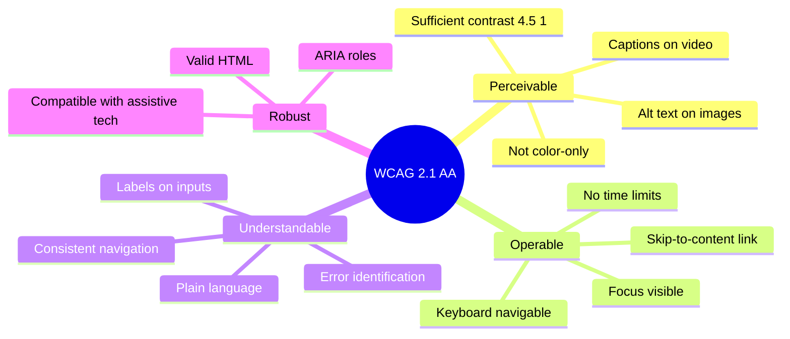

# 8.6. Accessibility (WCAG 2.1 AA)

> [!abstract] What this note teaches you
> V1 failed basic accessibility: no ARIA labels, color-only state indicators, contrast ratios below WCAG AA. V2 targets WCAG 2.1 AA throughout. This note is the V2 accessibility checklist with the specific V1 failures called out.

## The V1 accessibility failures

V1's Streamlit UI had:

1. **No ARIA labels** on any widget.
2. **No keyboard navigation** — custom HTML buttons weren't focusable.
3. **Color-only state indicators** — red/green/yellow badges with no text.
4. **No `alt` text** on images.
5. **Contrast ratio of `#667eea` on white is 4.16:1** — below WCAG AA (4.5:1 for normal text).
6. **Plotly charts not screen-reader accessible** — no `aria-label`, no data tables fallback.

These failures exclude users with visual impairments, motor disabilities, and color blindness.

## WCAG 2.1 AA — the 4 principles



## V2 accessibility checklist

### 1. Semantic HTML

```blade
{{-- Bad: div soup --}}
<div class="button" onclick="submit()">Valider</div>

{{-- Good: semantic button --}}
<button type="submit" class="px-4 py-2 bg-blue-500 text-white rounded">
    Valider
</button>
```

Use `<button>`, `<a>`, `<nav>`, `<main>`, `<header>`, `<footer>`, `<form>`, `<label>` — not `<div>` for everything. Screen readers understand semantic HTML; they don't understand div soup.

### 2. ARIA labels

```blade
{{-- Bad: icon-only button, no label --}}
<button><i class="fa fa-trash"></i></button>

{{-- Good: aria-label --}}
<button aria-label="Supprimer l'examen">
    <i class="fa fa-trash" aria-hidden="true"></i>
</button>
```

ARIA labels are read by screen readers. Icon-only buttons must have them.

### 3. Color contrast

WCAG AA requires:
- **Normal text (< 18pt):** contrast ratio ≥ 4.5:1.
- **Large text (≥ 18pt or ≥ 14pt bold):** contrast ratio ≥ 3:1.
- **UI components (borders, icons):** contrast ratio ≥ 3:1.

V1's `#667eea` on white = 4.16:1 — fails for normal text. V2 uses `#1e3a5f` on white = 12.6:1 — passes.

Tools:
- [WebAIM Contrast Checker](https://webaim.org/resources/contrastchecker/)
- Chrome DevTools "Lighthouse" accessibility audit.
- `axe-core` for automated testing.

### 4. Not color-only

```blade
{{-- Bad: color-only status --}}
<span class="bg-red-500"></span>

{{-- Good: color + icon + text --}}
<span class="inline-flex items-center gap-1 px-2 py-1 bg-red-100 text-red-800 rounded">
    <i class="fa fa-times" aria-hidden="true"></i>
    Rejeté
</span>
```

Color-blind users (8% of men) cannot distinguish red from green. Always pair color with text or icon.

### 5. Keyboard navigation

Every interactive element must be reachable and operable via keyboard:
- `Tab` to move forward.
- `Shift+Tab` to move backward.
- `Enter` or `Space` to activate.
- `Esc` to close dialogs.

Test: unplug your mouse. Can you use the site? If not, it's not accessible.

```blade
{{-- Visible focus ring --}}
<button class="focus:outline-none focus:ring-2 focus:ring-blue-500 focus:ring-offset-2">
    Submit
</button>
```

### 6. Form labels

```blade
{{-- Bad: placeholder only --}}
<input type="email" placeholder="Email">

{{-- Good: explicit label --}}
<label for="email" class="block text-sm font-medium text-gray-700">Email</label>
<input type="email" id="email" name="email" 
       class="mt-1 block w-full rounded-md border-gray-300 shadow-sm"
       required aria-required="true">
```

Placeholders disappear on focus and don't replace labels. Screen readers may not announce them.

### 7. Alt text on images

```blade
{{-- Decorative image --}}


{{-- Informative image --}}

```

Decorative images get `alt=""` (empty). Informative images get descriptive alt text.

### 8. Skip-to-content link

```blade
<a href="#main-content" class="sr-only focus:not-sr-only focus:absolute focus:top-2 focus:left-2 bg-blue-500 text-white px-4 py-2 rounded">
    Aller au contenu principal
</a>
<!-- ... nav, header ... -->
<main id="main-content">
    <!-- page content -->
</main>
```

Keyboard users press `Tab` and the first focusable element is "Skip to content" — saves them tabbing through the entire nav.

### 9. Accessible Plotly charts

Plotly charts are not screen-reader accessible by default. V2 wraps them with a fallback data table:

```blade
<div role="figure" aria-label="Graphique d'utilisation des salles">
    <div id="chart"></div>
    <details class="sr-only">
        <summary>Données du graphique</summary>
        <table>
            <thead><tr><th>Créneau</th><th>Utilisation %</th></tr></thead>
            <tbody>
                @foreach ($data as $row)
                    <tr><td>{{ $row->creneau }}</td><td>{{ $row->utilization }}%</td></tr>
                @endforeach
            </tbody>
        </table>
    </details>
</div>
```

Screen readers read the table; sighted users see the chart.

### 10. Multi-language (including RTL)

V2 supports French (LTR) and Arabic (RTL):

```blade
<html lang="{{ app()->getLocale() }}" dir="{{ app()->getLocale() === 'ar' ? 'rtl' : 'ltr' }}">
```

CSS uses logical properties (`margin-inline-start` instead of `margin-left`) so layouts flip correctly in RTL.

## Automated testing

```bash
# Install axe-core
npm install --save-dev @axe-core/playwright

# In Playwright tests
import { injectAxe, checkA11y } from '@axe-core/playwright';

test('student dashboard is accessible', async ({ page }) => {
    await page.goto('/student/dashboard');
    await injectAxe(page);
    await checkA11y(page, null, {
        detailedReport: true,
    });
});
```

Run in CI on every PR. Fail the build on accessibility violations.

## Common junior developer mistakes

- **"Accessibility is a nice-to-have."** It's a legal requirement (ADA, Section 508, EN 301 549). And it's the right thing to do.
- **Icon-only buttons without `aria-label`.** Screen reader users hear "button" with no context.
- **Placeholder-only inputs.** Placeholder is not a label.
- **Color-only status indicators.** 8% of men are color-blind.
- **No keyboard testing.** Unplug your mouse. Try again.
- **Contrast ratio below 4.5:1.** Use a contrast checker before approving a design.
- **No alt text.** Decorative images get `alt=""`; informative images get descriptions.
- **Forgetting RTL.** Arabic and Hebrew are RTL. Test with `dir="rtl"`.

## What to read next

- [[8.4. Laravel Blade and Livewire 3 for Student Professor Portal]] — where most accessibility applies.
- [[2.9. V1 Brief Compliance Scorecard]] — V1's accessibility failures.
- [[11.5. Testing Strategy Unit Integration E2E Property-Based]] — automated accessibility testing.
