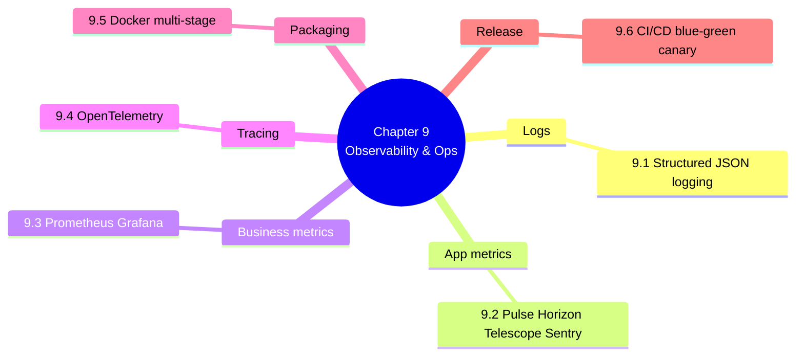

# 9. MOC — Observability and Production Operations

> [!abstract] Chapter goal
> V1's observability was `st.error(str(e))` leaking SQL to users. V2's observability is structured JSON logs, Laravel Pulse + Horizon + Telescope + Sentry, Prometheus metrics, OpenTelemetry tracing, and Docker multi-stage builds with non-root runtimes. This chapter teaches you the full production stack.

## Notes in this chapter

| Note | Title | What you learn |
|---|---|---|
| 9.1 | [[9.1. Structured JSON Logging with PII Redaction]] | Monolog JSON formatter, log levels, centralized ELK/Papertrail, PII redaction middleware. |
| 9.2 | [[9.2. Laravel Pulse Horizon Telescope Sentry]] | Pulse for prod app metrics, Horizon for queue dashboard, Telescope for dev query inspection, Sentry for exception tracking. |
| 9.3 | [[9.3. Prometheus Metrics and Grafana Dashboards]] | The 4 V2 business metrics: `schedule_generation_duration_seconds`, `exams_scheduled_total`, `conflicts_detected_total`, `active_sessions`. Alert rules. |
| 9.4 | [[9.4. OpenTelemetry Distributed Tracing]] | Trace ID propagation API → Job → Python solver → DB. 10% prod sampling, 100% staging. |
| 9.5 | [[9.5. Docker Multi-Stage Builds]] | `builder` stage with composer, minimal runtime stage with `postgres-libs` + `libzip` only, `USER www-data`, `EXPOSE 9000`, `CMD ["php-fpm"]`. |
| 9.6 | [[9.6. CI/CD with GitHub Actions Blue-Green Canary]] | Lint → test (PHP + Python + security) → build → deploy-staging → canary 5% → 100%. Trunk-based, `laravel/pennant` feature flags, `kubectl rollout undo`. |

## Why this chapter matters

A system you can't observe is a system you can't operate. V1 had no logs, no metrics, no tracing. When it failed (and it failed often), the author had no idea why. V2's observability stack is what lets a real ops team keep it alive.

## Where to go next

After mastering observability, proceed to [[10. MOC|Performance Engineering and Scale]] to see how V2 hits its performance targets.
