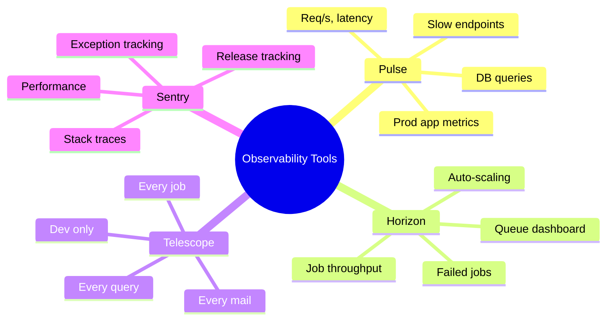
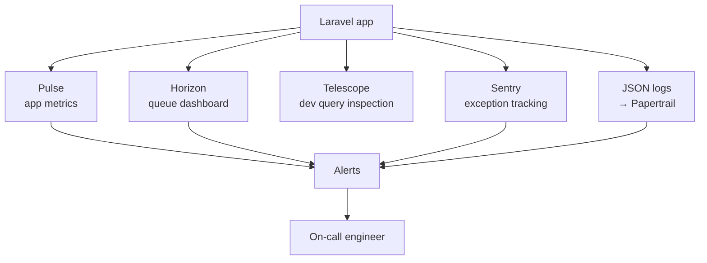

# 9.2. Laravel Pulse, Horizon, Telescope, Sentry

> [!abstract] What this note teaches you
> V2 uses 4 Laravel ecosystem packages for different observability needs: Pulse (prod app metrics), Horizon (queue dashboard), Telescope (dev query inspection), Sentry (exception tracking). This note explains each and when to use which.

## The 4 tools compared



| Tool | Environment | What it shows | Retention |
|---|---|---|---|
| Pulse | Production | App metrics (req/s, p95 latency, slow queries) | Configurable (default 7 days) |
| Horizon | Production | Queue depth, job throughput, failed jobs | Configurable (default 7 days) |
| Telescope | Dev/staging only | Every query, mail, job, log entry | Short (default 24h) |
| Sentry | Production | Exception stack traces, release tracking | 90 days |

## Laravel Pulse

Pulse is Laravel's self-hosted application metrics dashboard. It runs at `/pulse` and shows:

- **Top users by request count.**
- **Slowest endpoints** (p95 latency).
- **Slowest DB queries.**
- **Job throughput.**
- **Cache hit/miss rates.**
- **Outgoing HTTP calls.**

V2's `config/pulse.php`:

```php
'enabled' => env('PULSE_ENABLED', true),

'storage' => [
    'driver' => 'database',
    'database' => env('PULSE_DB_CONNECTION', 'pulse'),
    'table' => 'pulse_entries',
],

'retention' => [
    'interval' => '7 days',  // keep 7 days of metrics
],
```

Pulse writes to its own database (not the main app DB) to avoid contention. In production, it runs on a separate Postgres instance.

Usage: check Pulse daily for slow endpoints and queries. Set up alerts when p95 latency exceeds thresholds.

## Laravel Horizon

Horizon is the Redis queue supervisor. It runs at `/horizon` and shows:

- **Queue depth per queue** (default, scheduling, exports, audit).
- **Job throughput** (jobs/min, jobs/hour).
- **Failed jobs** with payloads and exceptions.
- **Worker processes** (current count, auto-scaling status).
- **Job latency** (time from dispatch to start).
- **Tags** (filter by `tenant:42`, `session:13`).

V2's `config/horizon.php` defines 3 supervisors (see [[7.1. Laravel Horizon and Redis Queues]]).

Usage: check Horizon when jobs are slow or failing. Set up alerts on queue depth > 25 (see [[9.3. Prometheus Metrics and Grafana Dashboards]]).

## Laravel Telescope

Telescope is the dev-mode introspection tool. It runs at `/telescope` and shows:

- **Every DB query** with EXPLAIN plan.
- **Every HTTP request** with payload and response.
- **Every job** dispatched.
- **Every mail** sent.
- **Every log entry**.
- **Every cache hit/miss**.

```php
// config/telescope.php
'enabled' => env('TELESCOPE_ENABLED', false),  // off by default

// Only enable in dev/staging
// In production, set TELESCOPE_ENABLED=false
```

> [!warning] Telescope is not for production
> Telescope stores every query and request, which generates massive data and slows down the app. Enable only in dev/staging.

Usage: when debugging a slow endpoint, open Telescope, find the request, see every query it ran with EXPLAIN. Indispensable for development.

## Sentry

Sentry is a hosted exception tracking service. When an exception is thrown in production:

1. Sentry captures the stack trace, request data, user data, and release version.
2. It deduplicates similar exceptions (so 1000 identical errors = 1 issue).
3. It emails/Slacks the on-call engineer.
4. It tracks when the issue first appeared, last appeared, and how many users were affected.
5. It correlates with releases ("this error was introduced in release abc123").

V2's Sentry integration:

```php
// config/sentry.php
'dsn' => env('SENTRY_DSN'),

'release' => env('APP_VERSION'),  // git SHA

'environment' => env('APP_ENV'),

'sample_rate' => env('SENTRY_SAMPLE_RATE', 0.1),  // 10% performance sampling

'before_send' => function (Event $event): ?Event {
    // PII redaction (defense-in-depth, in addition to the Monolog processor)
    foreach ($event->getRequest()->getData() as $key => $value) {
        if (in_array($key, ['password', 'email', 'matricule'])) {
            $event->getRequest()->setData()[$key] = '[REDACTED]';
        }
    }
    return $event;
},
```

Usage: Sentry is the primary exception alerting tool. Configure it to alert on:
- Any new exception type.
- Any exception affecting > 10 users in 1 hour.
- Any exception in the `critical` or `fatal` level.

## How the 4 tools compose



Each tool has a different purpose:
- **Pulse** answers "is the app slow?".
- **Horizon** answers "are jobs backing up?".
- **Telescope** answers "what did this request do?" (dev only).
- **Sentry** answers "what errors are users hitting?".
- **JSON logs** answer "what happened in this specific request?" (via request_id).

Use all 4. Don't try to do everything in one tool.

## Common junior developer mistakes

- **Telescope in production.** It generates massive data and slows the app. Disable.
- **No Sentry.** If you're relying on users to report errors, you'll never know about most of them.
- **No Pulse alerts.** Pulse shows the data, but you need to set up alerts (via Prometheus or Sentry) on the metrics.
- **Checking Horizon only when jobs fail.** Check it daily for queue depth trends.
- **Stale release tags in Sentry.** If `APP_VERSION` isn't the git SHA, you can't correlate errors to releases.

## What to read next

- [[7.1. Laravel Horizon and Redis Queues]] — Horizon in detail.
- [[9.1. Structured JSON Logging with PII Redaction]] — the logging layer.
- [[9.3. Prometheus Metrics and Grafana Dashboards]] — business metrics.
