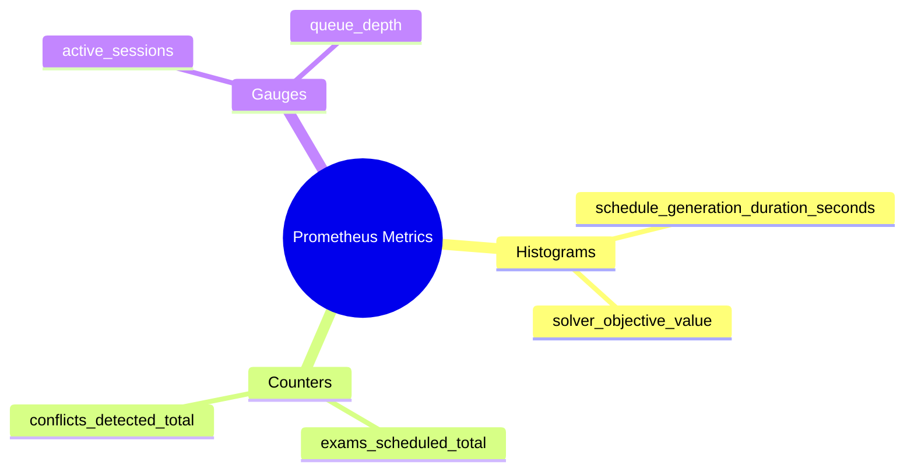
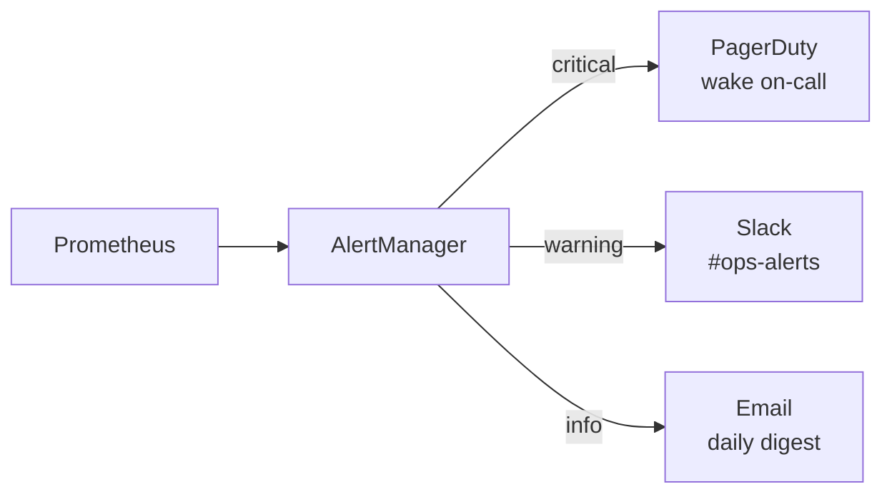

# 9.3. Prometheus Metrics and Grafana Dashboards

> [!abstract] What this note teaches you
> Pulse and Horizon show Laravel-internal metrics. V2 also exposes business metrics (scheduling duration, exams scheduled, conflicts detected) via Prometheus, scraped and visualized in Grafana. This note explains the 4 V2 business metrics, the alert rules, and the Grafana dashboard layout.

## The 4 V2 business metrics



### 1. `schedule_generation_duration_seconds` (histogram)

Time from job dispatch to completion. Buckets: 5s, 10s, 30s, 60s, 120s, 300s, 600s.

```php
// In GenerateScheduleJob::handle
$timer = microtime(true);
// ... do the work ...
$duration = microtime(true) - $timer;

$this->metrics->histogram(
    'schedule_generation_duration_seconds',
    $duration,
    ['tenant_id' => $this->tenantId, 'algorithm' => $this->algorithm]
);
```

### 2. `exams_scheduled_total` (counter, by tenant)

Total exams scheduled since the counter started. Used to compute scheduling rate.

```php
$this->metrics->increment(
    'exams_scheduled_total',
    $result->scheduled_count,
    ['tenant_id' => $this->tenantId]
);
```

### 3. `conflicts_detected_total` (counter, by type)

Conflicts detected per scheduling run, by type (`student_overlap`, `room_overlap`, `prof_unavailable`, etc.).

```php
foreach ($result->conflicts as $conflict) {
    $this->metrics->increment(
        'conflicts_detected_total',
        1,
        ['type' => $conflict['type'], 'severity' => $conflict['severity']]
    );
}
```

### 4. `active_sessions` (gauge)

Current number of sessions in `generation` or `validation` status. Spikes indicate bottlenecks.

```php
// Updated periodically by a scheduled job
$activeCount = Session::whereIn('statut', ['generation', 'validation'])->count();
$this->metrics->gauge('active_sessions', $activeCount);
```

## The Prometheus exporter

V2 uses `spatie/laravel-prometheus` to expose metrics at `/prometheus/metrics`:

```php
// routes/web.php
Route::get('/prometheus/metrics', [PrometheusController::class, 'metrics'])
    ->middleware('prometheus.auth');  // basic auth or IP allowlist
```

```php
// app/Http/Controllers/PrometheusController.php
class PrometheusController extends Controller
{
    public function __construct(
        private readonly Prometheus $prometheus
    ) {}
    
    public function metrics(): Response
    {
        return response(
            $this->prometheus->export(),
            200,
            ['Content-Type' => 'text/plain; version=0.0.4']
        );
    }
}
```

Prometheus scrapes this endpoint every 15 seconds.

## The Prometheus alerts

```yaml
# docker/prometheus/alerts.yml
groups:
  - name: univexam_operational_alerts
    rules:
      - alert: DatabaseConnectionFailure
        expr: pg_up == 0
        for: 30s
        labels:
          severity: critical
        annotations:
          summary: "Tenant Database Connection Lost"
          description: "PostgreSQL cluster connection became unreachable for longer than 30 seconds."
      
      - alert: OptimizationQueueBacklog
        expr: laravel_queue_jobs_waiting{queue="optimization-workers"} > 25
        for: 5m
        labels:
          severity: warning
        annotations:
          summary: "Scheduling pipeline queue backlog"
          description: "The optimization solver queue backlog is higher than 25 pending jobs for over 5 minutes."
      
      - alert: ScheduleGenerationSlowP95
        expr: histogram_quantile(0.95, rate(schedule_generation_duration_seconds_bucket[5m])) > 60
        for: 10m
        labels:
          severity: warning
        annotations:
          summary: "Schedule generation p95 latency > 60s"
      
      - alert: HighConflictRate
        expr: rate(conflicts_detected_total[5m]) > 0.05
        for: 10m
        labels:
          severity: warning
        annotations:
          summary: "Conflict rate > 5% — solver may be infeasible"
```

## Alert routing



- **Critical** (DB down, queue stuck): PagerDuty pages the on-call engineer.
- **Warning** (slow p95, high conflict rate): Slack `#ops-alerts` channel.
- **Info** (daily KPI summary): email.

## The Grafana dashboard

V2 has 4 Grafana dashboards:

### 1. Overview
- Total scheduling runs (24h, 7d, 30d).
- Success/failure rate.
- p50/p95/p99 duration.
- Active sessions by tenant.

### 2. Per-tenant
- Scheduling runs per tenant.
- Duration per tenant.
- Conflict rate per tenant.
- Top conflict types per tenant.

### 3. Solver
- Solver status distribution (OPTIMAL / FEASIBLE / INFEASIBLE / UNKNOWN).
- Objective value distribution.
- Fallback level usage.
- Solver timeout rate.

### 4. Queue health
- Queue depth per queue (default, scheduling, exports, audit).
- Job throughput.
- Failed jobs per hour.
- Worker count (auto-scaling visualization).

## Common junior developer mistakes

- **No business metrics.** Pulse shows app metrics (req/s, latency), but not "how many exams did we schedule?". Add business metrics.
- **Too many metrics.** Each metric has storage cost. Start with 4–6 and add as needed.
- **No alert routing.** All alerts to PagerDuty = alert fatigue. Route warnings to Slack.
- **Alert thresholds not tuned.** Set initial thresholds, then adjust based on actual data. Alerting on noise trains people to ignore alerts.
- **No dashboards.** Raw Prometheus queries are hard. Build Grafana dashboards.

## What to read next

- [[9.2. Laravel pulse Horizon Telescope Sentry]] — app-level metrics.
- [[9.4. OpenTelemetry Distributed Tracing]] — request-level tracing.
- [[10.7. Load Testing with Locust and k6]] — generating metric data for testing.
