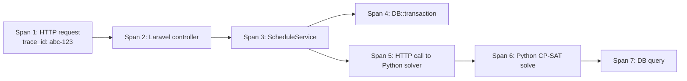
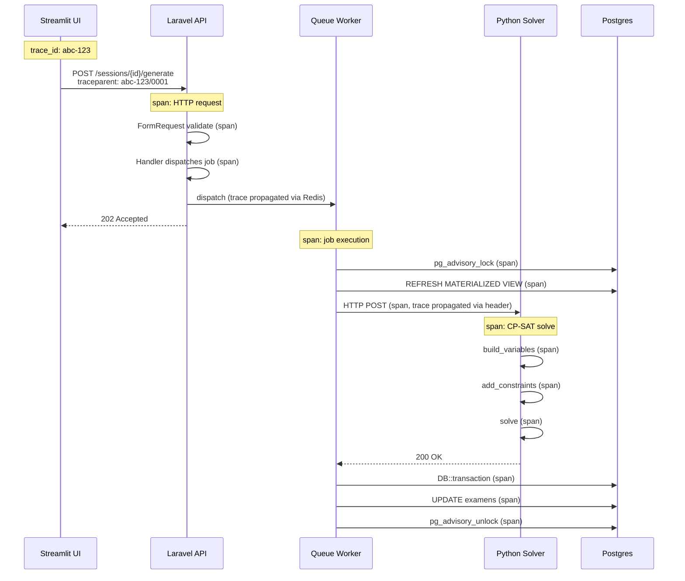

# 9.4. OpenTelemetry Distributed Tracing

> [!abstract] What this note teaches you
> Logs tell you what happened in one process. Metrics tell you aggregate behavior. Traces tell you what happened across processes — from HTTP request → job → Python solver → DB — as a single causal chain. V2 uses OpenTelemetry for distributed tracing. This note explains the trace flow and sampling strategy.

## What distributed tracing is

A **trace** is a tree of **spans**, where each span represents a unit of work. Spans from different services are correlated by a shared **trace ID**.



Each span has:
- `trace_id` — shared across all spans in the trace.
- `span_id` — unique per span.
- `parent_span_id` — links to the parent span.
- `start_time`, `end_time`.
- `attributes` — key-value metadata (e.g. `db.statement`, `http.url`).
- `status` — OK / ERROR.

## The V2 trace flow



The trace ID is propagated:
- UI → API: via `traceparent` HTTP header.
- API → Job: via Redis job payload (Laravel's `ShouldQueue` + custom middleware).
- Job → Solver: via `traceparent` HTTP header.
- Job → DB: via Postgres session variable (`SET app.trace_id = ?`).

A single trace can span 4 services and 30+ seconds, but you can see the entire causal chain in one view.

## The `traceparent` header

The W3C `traceparent` header format:

```
traceparent: 00-abc123def45678901234567890123456-0001abcdef123456-01
              ^  ^                                ^                ^
              version  trace_id (32 hex)          span_id (16 hex) sampled flag
```

V2's Streamlit client generates a trace ID and includes it in every request:

```python
# streamlit_app/api_client.py
import uuid

def get(self, endpoint):
    trace_id = str(uuid.uuid4()).replace('-', '')
    headers = {
        "Authorization": f"Bearer {self.auth.token}",
        "traceparent": f"00-{trace_id}-0000000000000001-01",
    }
    response = requests.get(f"{self.API_HOST}/{endpoint}", headers=headers, timeout=15)
    return response.json()
```

The Laravel side extracts it:

```php
// app/Http/Middleware/ExtractTraceContext.php
class ExtractTraceContext
{
    public function handle(Request $request, Closure $next): Response
    {
        $traceparent = $request->header('traceparent');
        if ($traceparent) {
            $parts = explode('-', $traceparent);
            if (count($parts) >= 2) {
                app()->instance('trace.id', $parts[1]);
                DB::statement("SET app.trace_id = ?", [$parts[1]]);
            }
        }
        return $next($request);
    }
}
```

## Sampling

Tracing every request is expensive (storage, network). V2 samples:

- **Production:** 10% of requests.
- **Staging:** 100%.
- **Errors:** always sampled (regardless of rate).

```php
// app/Providers/TelescopeServiceProvider.php
'sampler' => function (Request $request): bool {
    // Always sample errors
    if ($request->isMethod('POST') && str_contains($request->path(), 'generate')) {
        return true;  // always trace schedule generation
    }
    
    // Sample 10% of other requests
    return mt_rand(1, 10) === 1;
},
```

## Trace storage and visualization

V2 ships traces to:
- **Jaeger** (self-hosted) for dev/staging.
- **Datadog APM** or **Honeycomb** for production.

```php
// config/opentelemetry.php
'exporter' => env('OTEL_EXPORTER', 'jaeger'),
'endpoint' => env('OTEL_EXPORTER_ENDPOINT', 'http://jaeger:4318'),
```

To inspect a trace:
1. Get the `trace_id` from the request response header `X-Trace-Id`.
2. Open Jaeger (or Datadog).
3. Search for the trace ID.
4. See every span with timing, attributes, and errors.

## Why tracing matters

Without tracing:
- "Schedule generation took 60 seconds" — but which part was slow?
- Logs from 4 services don't correlate without manual timestamp matching.
- Errors in the Python solver are invisible to the Laravel-side monitoring.

With tracing:
- See that the 60s breakdown was: 5s MV refresh + 45s CP-SAT solve + 5s persist + 5s lock overhead.
- Identify the bottleneck (CP-SAT solve) and tune it.
- See that the solver returned `FEASIBLE` (not `OPTIMAL`) — the time budget was the issue.

## Common junior developer mistakes

- **No trace propagation across services.** If the trace ID isn't propagated from Laravel to Python, you have two unconnected traces.
- **Sampling everything in production.** Storage cost explodes. Sample 1–10%.
- **Not sampling errors.** Always trace errors, regardless of sample rate.
- **No spans for DB queries.** Auto-instrumentation captures HTTP but not DB. Add manual spans for slow queries.
- **Forgetting to set trace ID in DB session.** DB query logs won't correlate with the trace.
- **Trace ID not exposed to the user.** When the user reports a bug, they should have a trace ID to give support.

## What to read next

- [[9.1. Structured JSON Logging with PII Redaction]] — logs correlate with traces via trace ID.
- [[9.3. Prometheus Metrics and Grafana Dashboards]] — metrics aggregate traces.
- [[7.2. The GenerateScheduleJob Lifecycle]] — the multi-service pipeline that tracing illuminates.
