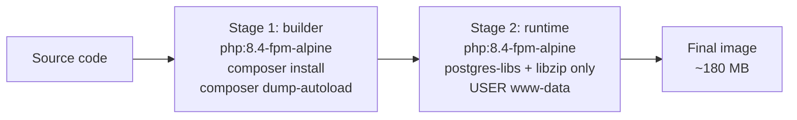

# 9.5. Docker Multi-Stage Builds

> [!abstract] What this note teaches you
> V1 had no Dockerfile for the Streamlit app — only a `render.yaml` for Render.com. V2 uses multi-stage Docker builds with a `builder` stage (composer install) and a minimal runtime stage (non-root user). This note is the V2 Docker strategy.

## Why multi-stage

A single-stage Dockerfile includes build tools (composer, dev dependencies) in the final image. This:
- Bloats the image (800MB instead of 200MB).
- Increases attack surface (dev tools have known vulnerabilities).
- Slows deployments (more to push/pull).

Multi-stage builds copy only what's needed from the builder stage to the runtime stage.



## The V2 Dockerfile

```dockerfile
# docker/production/Dockerfile

# Stage 1: Build dependency assets
FROM php:8.4-fpm-alpine AS builder

WORKDIR /var/www

# Install build-time dependencies
RUN apk add --no-cache \
    postgresql-dev \
    libzip-dev \
    zip \
    unzip \
    git

# Install PHP extensions
RUN docker-php-ext-install pdo pdo_pgsql zip bcmath

# Copy composer from official image
COPY --from=composer:2.8 /usr/bin/composer /usr/bin/composer

# Install dependencies (without scripts, autoloader — we'll dump later)
COPY composer.json composer.lock ./
RUN composer install --no-dev --no-scripts --no-autoloader --prefer-dist

# Copy application code
COPY . .

# Generate optimized autoloader
RUN composer dump-autoload --optimize

# Stage 2: Minimal runtime footprint
FROM php:8.4-fpm-alpine

WORKDIR /var/www

# Runtime-only dependencies (no build tools)
RUN apk add --no-cache postgresql-libs libzip

# Install the same PHP extensions (alpine doesn't keep them between stages)
RUN docker-php-ext-install pdo pdo_pgsql zip bcmath

# Copy the built application from the builder stage
COPY --from=builder /var/www /var/www

# Enforce secure non-root privileges
RUN chown -R www-data:www-data /var/www/storage

# Run as www-data, not root
USER www-data

EXPOSE 9000

CMD ["php-fpm"]
```

## Why `php:8.4-fpm-alpine`

- **PHP 8.4** — latest stable with property hooks, asymmetric visibility, `new` in attribute arguments.
- **fpm** — FastCGI Process Manager, the production-grade PHP SAPI. Works with nginx/Apache.
- **alpine** — minimal Linux (~5MB base). Smaller attack surface than Debian-based images.

## Why `USER www-data`

By default, Docker runs containers as root. If an attacker escapes the container, they have root on the host. Running as `www-data` (a non-privileged user) limits the blast radius.

```dockerfile
USER www-data
```

## The docker-compose for local dev

```yaml
# docker-compose.yml
services:
  app:
    build:
      context: .
      dockerfile: docker/production/Dockerfile
    ports:
      - "9000:9000"
    depends_on:
      - db
      - redis
    environment:
      - DB_HOST=db
      - DB_PORT=5432
      - DB_DATABASE=univexam
      - DB_USERNAME=univexam
      - DB_PASSWORD=secret
      - REDIS_HOST=redis
  
  worker:
    build:
      context: .
      dockerfile: docker/production/Dockerfile
    command: ["php", "artisan", "horizon"]
    depends_on:
      - db
      - redis
    environment:
      - DB_HOST=db
      - REDIS_HOST=redis
  
  db:
    image: postgres:17-alpine
    environment:
      POSTGRES_DB: univexam
      POSTGRES_USER: univexam
      POSTGRES_PASSWORD: secret
    volumes:
      - pgdata:/var/lib/postgresql/data
    ports:
      - "5432:5432"
  
  redis:
    image: redis:7-alpine
    ports:
      - "6379:6379"
  
  streamlit:
    build:
      context: ./streamlit
    ports:
      - "8501:8501"
    depends_on:
      - app
    environment:
      - API_HOST=http://app:9000

volumes:
  pgdata:
```

Three services from the same Dockerfile (`app`, `worker` — the worker just overrides the command to `php artisan horizon`).

## Image size comparison

| Approach | Image size | Attack surface |
|---|---|---|
| Single-stage with full Debian | ~850 MB | High (gcc, make, dev packages) |
| Single-stage with Alpine | ~250 MB | Medium (composer, git) |
| Multi-stage Alpine (V2) | ~180 MB | Low (only postgres-libs, libzip) |

The 70 MB savings (250 → 180) and the removed dev tools significantly reduce the security and operational footprint.

## The `HEALTHCHECK` directive

The V2 Dockerfile doesn't include `HEALTHCHECK` because Laravel's `/health` endpoint serves this purpose:

```yaml
# docker-compose.yml
services:
  app:
    # ...
    healthcheck:
      test: ["CMD", "curl", "-f", "http://localhost:9000/health"]
      interval: 30s
      timeout: 5s
      retries: 3
      start_period: 30s
```

Docker/K8s polls `/health` every 30s. If it fails 3 times, the container is marked unhealthy and restarted.

See [[9.2. Laravel pulse Horizon Telescope Sentry]] for the `HealthCheckController`.

## Common junior developer mistakes

- **Single-stage builds.** Image is huge, includes dev tools.
- **Running as root.** Security risk. Always `USER www-data` (or equivalent).
- **Forgetting `composer dump-autoload --optimize` in the builder.** Production autoloader is slower without `--optimize`.
- **Including `.env` in the image.** `.env` should be injected at runtime via environment variables, not baked into the image.
- **No healthcheck.** Docker/K8s can't detect a wedged container.
- **Alpine + glibc expectations.** Alpine uses musl, not glibc. Some PHP extensions may need recompilation. Test thoroughly.

## What to read next

- [[9.6. CI-CD with GitHub Actions Blue-Green Canary]] — how the image is built and deployed in CI.
- [[9.2. Laravel pulse Horizon Telescope Sentry]] — the `/health` endpoint.
- [[10.3. Connection Pooling with PgBouncer]] — the DB connection layer.
