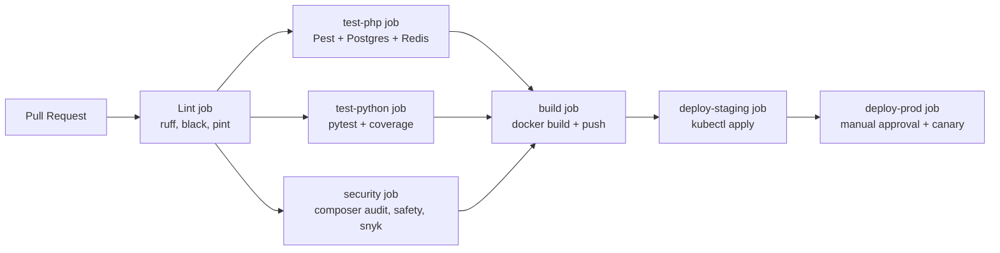
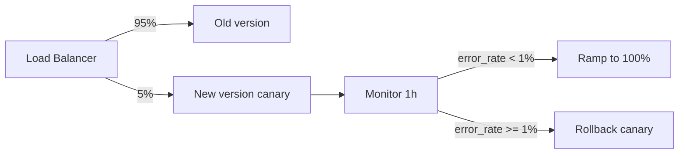
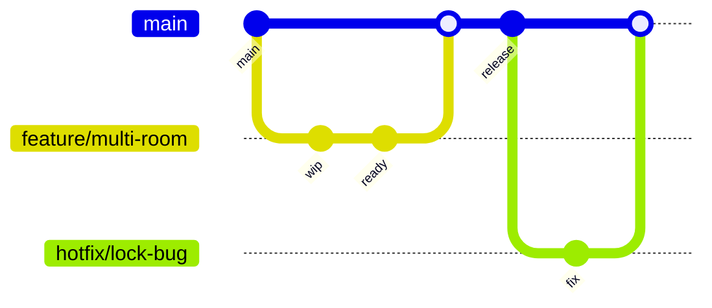

# 9.6. CI/CD with GitHub Actions, Blue-Green, Canary

> [!abstract] What this note teaches you
> V1 had no CI/CD — code was deployed manually via `render.yaml`. V2 uses GitHub Actions with lint → test → security → build → deploy stages, plus blue-green and canary deployment strategies. This note is the V2 release pipeline.

## The CI pipeline



## The GitHub Actions workflow

```yaml
# .github/workflows/ci.yml
name: CI

on:
  push:
    branches: [main]
  pull_request:
    branches: [main]

jobs:
  lint:
    runs-on: ubuntu-latest
    steps:
      - uses: actions/checkout@v4
      
      - name: Setup PHP
        uses: shivammathur/setup-php@v2
        with:
          php-version: '8.4'
          tools: composer:v2
      
      - name: Setup Python
        uses: actions/setup-python@v5
        with:
          python-version: '3.12'
      
      - name: Lint PHP
        run: |
          composer install --prefer-dist --no-progress
          ./vendor/bin/pint --test
      
      - name: Lint Python
        run: |
          pip install ruff black
          ruff check .
          black --check .
  
  test-php:
    runs-on: ubuntu-latest
    services:
      postgres:
        image: postgres:17-alpine
        env:
          POSTGRES_PASSWORD: secret
          POSTGRES_DB: univexam_test
        ports: ['5432:5432']
        options: >-
          --health-cmd pg_isready
          --health-interval 10s
          --health-timeout 5s
          --health-retries 5
      redis:
        image: redis:7-alpine
        ports: ['6379:6379']
    
    steps:
      - uses: actions/checkout@v4
      - name: Setup PHP
        uses: shivammathur/setup-php@v2
        with:
          php-version: '8.4'
          extensions: pdo, pdo_pgsql, zip, bcmath
          coverage: xdebug
      
      - name: Install dependencies
        run: composer install --prefer-dist --no-progress
      
      - name: Run migrations
        env:
          DB_HOST: localhost
          DB_DATABASE: univexam_test
          DB_USERNAME: postgres
          DB_PASSWORD: secret
        run: php artisan migrate --force
      
      - name: Run tests
        env:
          DB_HOST: localhost
          DB_DATABASE: univexam_test
          DB_USERNAME: postgres
          DB_PASSWORD: secret
          REDIS_HOST: localhost
        run: php artisan test --coverage --min=80 --coverage-clover=coverage.xml
      
      - name: Upload coverage
        uses: codecov/codecov-action@v4
        with:
          file: coverage.xml
  
  test-python:
    runs-on: ubuntu-latest
    steps:
      - uses: actions/checkout@v4
      - uses: actions/setup-python@v5
        with:
          python-version: '3.12'
      
      - name: Install dependencies
        run: |
          pip install -r scheduler/requirements.txt
          pip install pytest pytest-cov hypothesis
      
      - name: Run tests
        run: pytest scheduler/tests --cov=scheduler --cov-report=xml
      
      - name: Upload coverage
        uses: codecov/codecov-action@v4
  
  security:
    runs-on: ubuntu-latest
    steps:
      - uses: actions/checkout@v4
      - name: Setup PHP
        uses: shivammathur/setup-php@v2
        with:
          php-version: '8.4'
      
      - name: Composer audit
        run: |
          composer install --prefer-dist --no-progress
          composer audit
      
      - name: Python safety check
        run: |
          pip install safety
          safety check
      
      - name: Snyk
        uses: snyk/actions/php@master
        env:
          SNYK_TOKEN: ${{ secrets.SNYK_TOKEN }}
  
  build:
    needs: [lint, test-php, test-python, security]
    runs-on: ubuntu-latest
    steps:
      - uses: actions/checkout@v4
      - uses: docker/setup-buildx-action@v3
      
      - name: Login to GHCR
        uses: docker/login-action@v3
        with:
          registry: ghcr.io
          username: ${{ github.actor }}
          password: ${{ secrets.GITHUB_TOKEN }}
      
      - name: Build and push
        uses: docker/build-push-action@v5
        with:
          context: .
          file: docker/production/Dockerfile
          push: true
          tags: |
            ghcr.io/${{ github.repository_owner }}/exam-scheduler:${{ github.sha }}
            ghcr.io/${{ github.repository_owner }}/exam-scheduler:latest
          cache-from: type=gha
          cache-to: type=gha,mode=max
  
  deploy-staging:
    needs: build
    if: github.ref == 'refs/heads/main'
    runs-on: ubuntu-latest
    environment: staging
    steps:
      - uses: actions/checkout@v4
      - name: Deploy to staging
        run: |
          echo "Deploying ${{ github.sha }} to staging..."
          kubectl set image deployment/exam-scheduler-staging \
            app=ghcr.io/${{ github.repository_owner }}/exam-scheduler:${{ github.sha }}
          kubectl rollout status deployment/exam-scheduler-staging
  
  deploy-prod-canary:
    needs: deploy-staging
    if: github.ref == 'refs/heads/main'
    runs-on: ubuntu-latest
    environment: production-canary  # requires manual approval
    steps:
      - name: Canary 5% traffic
        run: |
          kubectl set image deployment/exam-scheduler-canary \
            app=ghcr.io/${{ github.repository_owner }}/exam-scheduler:${{ github.sha }}
          # Route 5% of traffic to canary
          kubectl patch virtualservice exam-scheduler --type=json \
            -p='[{"op": "replace", "path": "/spec/http/0/route/1/weight", "value": 5}]'
      
      - name: Wait 1 hour
        run: sleep 3600
      
      - name: Check canary metrics
        run: |
          # If error rate > 1%, abort
          ERROR_RATE=$(curl -s 'prometheus:9090/api/v1/query?query=rate(http_requests_total{status=~"5..",version="${{ github.sha }}"}[5m]) / rate(http_requests_total{version="${{ github.sha }}"}[5m])' | jq '.data.result[0].value[1]')
          if (( $(echo "$ERROR_RATE > 0.01" | bc -l) )); then
            echo "Canary error rate too high: $ERROR_RATE"
            kubectl rollout undo deployment/exam-scheduler-canary
            exit 1
          fi
  
  deploy-prod-full:
    needs: deploy-prod-canary
    runs-on: ubuntu-latest
    environment: production  # requires manual approval
    steps:
      - name: Blue-green swap
        run: |
          kubectl set image deployment/exam-scheduler-prod \
            app=ghcr.io/${{ github.repository_owner }}/exam-scheduler:${{ github.sha }}
          kubectl rollout status deployment/exam-scheduler-prod
```

## Blue-green deployment

Two identical environments: blue (current) and green (new). Traffic switches atomically.

```mermaid
flowchart LR
    LB[Load Balancer] -->|100%| Blue[Blue env<br/>v1.2.3]
    LB -.0%.-> Green[Green env<br/>v1.2.4]
    
    Green --> Ready{Health check?}
    Ready -->|pass| Switch[Switch traffic]
    Ready -->|fail| Rollback[Destroy green]
    Switch --> LB2[Load Balancer]
    LB2 -->|0%.-> Blue
    LB2 -->|100%.-> Green
```

If green is unhealthy, destroy it — blue keeps serving. No downtime.

## Canary deployment

Route 5% of traffic to the new version. Monitor for 1 hour. If healthy, ramp to 100%. If error rate > 1%, rollback.



## Feature flags with `laravel/pennant`

For riskier features, V2 uses feature flags:

```php
// Define a feature
use Laravel\Pennant\Feature;

Feature::define('multi-room-split', function (User $user) {
    return $user->tenant_id === 42;  // enable for one tenant first
});

// Check in code
if (Feature::active('multi-room-split')) {
    // ... new behavior
}

// Activate for all
Feature::activateForEveryone('multi-room-split');
```

This lets you merge code to main without enabling it for everyone. Roll out per-tenant, monitor, ramp.

## Trunk-based development

V2 uses trunk-based (not GitFlow):



- Short-lived feature branches (1–2 days).
- Squash-merge to main.
- Main is always deployable.
- Hotfixes go directly to main and cherry-pick to release branches if needed.

No `develop` branch, no release branches (except for critical hotfixes).

## Rollback

```bash
# Kubernetes
kubectl rollout undo deployment/exam-scheduler-prod

# Or rollback to a specific version
kubectl rollout undo deployment/exam-scheduler-prod --to-revision=42
```

Database migrations must be **forward-only** — never `rollback` in production. If a migration breaks something, write a new migration that fixes it. See [[3.2. Schema Design Principles for SaaS]].

## Common junior developer mistakes

- **No CI.** Manual deploys are error-prone. Automate from day 1.
- **CI without tests.** Lint-only CI catches typos but not logic bugs.
- **No staging environment.** Deploying to prod without staging is Russian roulette.
- **No manual approval for prod.** A bad merge to main should not auto-deploy to prod.
- **No canary.** 100% rollout means 100% of users hit a bug. Canary catches it at 5%.
- **No rollback plan.** "We'll fix it forward" doesn't work when the DB schema changed.
- **`php artisan migrate:rollback` in prod.** Forward-only. Always.
- **Long-lived feature branches.** The longer the branch, the harder the merge. Trunk-based with short branches.

## What to read next

- [[9.5. Docker Multi-Stage Builds]] — the image that CI builds.
- [[11.5. Testing Strategy Unit Integration E2E Property-Based]] — what CI runs.
- [[11.3. Risk Register and Mitigations]] — deployment risks.
