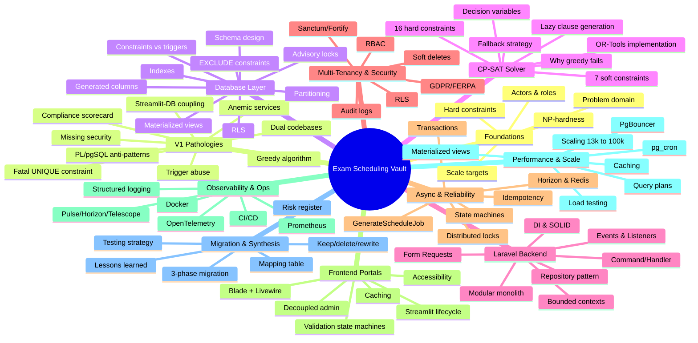
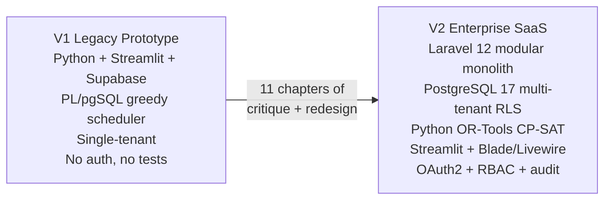

# University Exam Scheduling Platform — Engineering Knowledge Base

> [!info] Purpose
> This vault is a complete, brutally honest re-examination of a legacy university exam scheduling prototype (V1) and a full enterprise-grade redesign (V2). It is written for an engineer who "vibecoded" the original project, got it sort-of working, and now wants to **relearn everything from scratch** — the theory, the logic, the math, and the reasoning behind every architectural decision.

> [!warning] Reading order
> The chapters are sequenced as a learning roadmap, not as a reference manual. Read them in order the first time. Each chapter assumes you have read the ones before it. Cross-references (`[[Wiki Links]]`) let you jump sideways once you have the foundations.

---

## How this vault is organized

The vault has **11 chapters**, each containing 4–10 atomic notes. Every chapter folder opens with a `1. MOC.md` (Map of Content) that acts as the navigation hub for that chapter. The root `README.md` (this file) is the **top-level MOC** for the whole vault.

---

## Chapter index

| # | Chapter | What you will learn |
|---|---|---|
| 1 | [[1. MOC\|Foundations and Problem Domain]] | What university exam scheduling actually is, who the actors are, why it is NP-hard, and what the performance budget is. |
| 2 | [[2. MOC\|The V1 Architecture and Its Pathologies]] | A brutally honest teardown of the legacy prototype — every architectural, algorithmic, and security flaw, with verbatim V1 code. |
| 3 | [[3. MOC\|Database Layer Deep-Dive]] | PostgreSQL 17 fundamentals applied: indexes, partitioning, RLS, materialized views, EXCLUDE constraints, advisory locks. |
| 4 | [[4. MOC\|The Algorithmic Core — CP-SAT Solver]] | Why greedy fails on NP-hard problems, how CP-SAT works, the 16 hard constraints, the 7 soft constraints, full OR-Tools code. |
| 5 | [[5. MOC\|Backend Architecture — Laravel 12]] | Modular monolith, bounded contexts, repository pattern, command/handler, DI, Form Requests, events. |
| 6 | [[6. MOC\|Multi-Tenancy and Security]] | RLS, Sanctum/Fortify, RBAC with 7 roles, GDPR/FERPA, PII redaction, audit logs, soft deletes. |
| 7 | [[7. MOC\|Asynchronous Processing and Reliability]] | Horizon + Redis queues, GenerateScheduleJob lifecycle, distributed locks, state machines, idempotency. |
| 8 | [[8. MOC\|The Frontend Portals]] | Streamlit lifecycle, caching, decoupled admin portal, Blade + Livewire student/professor portal, accessibility. |
| 9 | [[9. MOC\|Observability and Production Operations]] | Structured logging, Pulse/Horizon/Telescope, Prometheus, OpenTelemetry, Docker, CI/CD with blue-green/canary. |
| 10 | [[10. MOC\|Performance Engineering and Scale]] | 13k→100k scaling path, query plans, PgBouncer, materialized views, Redis caching, pg_cron, load testing. |
| 11 | [[11. MOC\|Migration Path and Final Synthesis]] | 3-phase V1→V2 migration, what to keep/delete/rewrite, risk register, testing strategy, lessons learned. |

---

## The V1 → V2 transformation at a glance

| Dimension | V1 (legacy) | V2 (redesign) |
|---|---|---|
| **Backend** | Streamlit pages calling Supabase RPC directly | Laravel 12 modular monolith with DDD bounded contexts |
| **Database** | Single-tenant Supabase/Postgres, no RLS, no partitioning | PostgreSQL 17 with `tenant_id` + RLS + LIST/RANGE partitioning |
| **Algorithm** | Greedy first-fit PL/pgSQL loop, no backtracking | Google OR-Tools CP-SAT with 16 hard + 7 soft constraints |
| **Auth** | None — anyone with the URL can wipe schedules | Laravel Sanctum + Fortify + 7-role RBAC |
| **Frontend** | Streamlit only, broken CSS, fake buttons | Streamlit admin (decoupled, OAuth2) + Blade/Livewire student portal |
| **Async** | Synchronous blocking RPC, fake progress bar | Laravel Horizon + Redis queues, real job status polling |
| **Observability** | `st.error(str(e))` leaking SQL to users | Structured JSON logs, Prometheus, OpenTelemetry, Sentry |
| **Testing** | Two empty test files | Pest + pgTAP + Hypothesis + Locust + k6 + Playwright |

---

## How to read code blocks in this vault

Every code/SQL/PHP/Python block in this vault is preceded by a one-line caption explaining **what it is** and **where it appears**. V1 snippets are reproduced verbatim from the original project so you can see exactly what was wrong. V2 snippets are written to production quality and annotated with `// comments` explaining the reasoning.

> [!tip] Junior developer mistakes
> Throughout the vault, you will see callouts like this one flagging the **common junior mistakes** that the V1 code made. These are the patterns to internalize so you never repeat them.

> [!warning] Pitfalls
> Warning callouts mark places where a reasonable-looking choice turns out to be wrong, dangerous, or silently broken. Always read these before copying any snippet into production.

> [!example] V2 fix
> Example callouts show the V2 redesign's answer to a V1 problem, with the minimal code/SQL needed to understand the fix.

---

## Conventions used throughout

- **File and folder names** use spaces and hyphens, never underscores. Folders are numbered with `N. ` prefixes.
- **Internal links** use Obsidian `[[Wiki Links]]`. If a link target is in another chapter, the link still works because Obsidian resolves by basename.
- **Diagrams** are exclusively Mermaid (mind maps, flowcharts, sequence diagrams, ER diagrams). No ASCII art is used for diagrams.
- **Code blocks** are language-tagged for syntax highlighting.
- **Cross-references** at the bottom of each note list related notes via `[[Wiki Links]]` so you can navigate sideways.

---

## Where to start

If you are relearning everything from scratch, start at [[1.1. The University Exam Scheduling Problem]] and read in order. If you already know the domain and want the critique, jump to [[2. MOC]]. If you want the V2 redesign, jump to [[3. MOC]] and read forward.

---

## Source materials

This vault synthesizes and reconciles four source documents:
- `CODE_REVIEW_AND_REDESIGN_01.md` — Part I of the brutal code review (4,415 lines).
- `CODE_REVIEW_AND_REDESIGN_02.md` — Part II of the review (1,042 lines).
- `CODE_REVIEW_AND_REDESIGN_03.md` — Part III of the review (1,273 lines).
- `_entire_project_.txt` — The complete V1 source code (4,511 lines).
- `Projet-Num_Exam.pdf` — The original academic project specification (French).

Where the source documents disagreed (e.g., PostgreSQL 16 vs 17, 30 s vs 45 s vs 120 s time budgets, RLS via DB policy vs app-only enforcement), this vault explicitly reconciles them and explains the resolution. See [[11.6. Final Synthesis and Lessons Learned]] for the full conflict-resolution log.

---

Next: [[1. MOC|Foundations and Problem Domain]]
