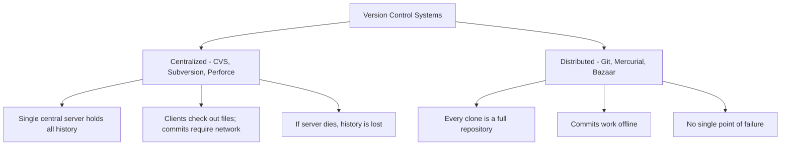
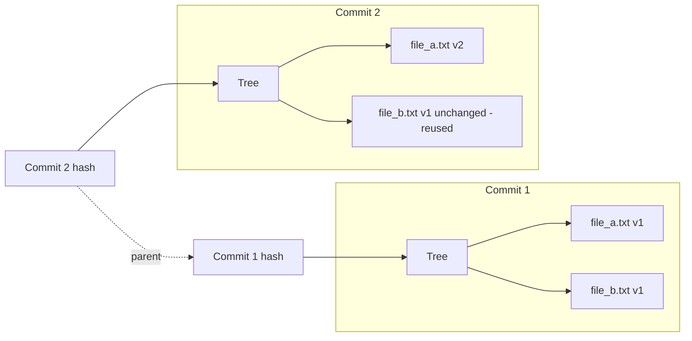
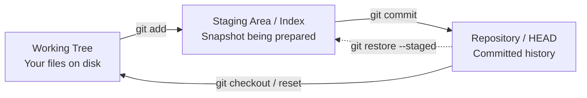

# 1. What is Git and Version Control

> **Tags:** #git #version-control #foundations

Git is a **distributed version control system (DVCS)**. That single sentence hides a great deal of meaning, and most of the confusion beginners have with Git comes from not unpacking each word. This note does the unpacking carefully and completely.

---

## 1.1 What "Version Control" Actually Means

A **version control system (VCS)** is a tool that records changes to a set of files over time so that you can:

1. Recover any past state of the project on demand.
2. Compare any two states to see exactly what changed, when, and by whom.
3. Branch off a parallel line of development without disturbing the main line.
4. Merge parallel lines back together, resolving conflicts deliberately rather than by accident.
5. Coordinate work between many contributors without them overwriting each other's changes.

Without version control, teams resort to ad-hoc schemes like `report_final_v2_REAL_final.docx`. These schemes do not scale: they lose history, they cannot merge parallel edits, and they make it impossible to attribute a change to a specific person or reason.

---

## 1.2 What Makes Git "Distributed"

There are two families of version control systems:

In a **centralized** system, only the server has the full history. Each developer has a working copy of the files but not the history. Every commit travels over the network to the server.

In a **distributed** system like Git, every clone contains the **entire history** of the project — every commit, every branch, every tag. You can commit, branch, merge, and inspect history entirely offline. You only need the network when you choose to synchronize with another repository.

This is why Git is described as "distributed": the work is distributed across many peers, each of which is a full peer.

---

## 1.3 The Snapshot Model (Not Diffs)

A common misconception is that Git stores **diffs** — that is, the changes between one version and the next. That is how some older systems (such as the original RCS) worked. Git does not.

Git stores **snapshots**. Every commit is a complete picture of what every tracked file looked like at that moment in time. Internally, Git uses a content-addressable filesystem (a key-value store where the key is the SHA-1 hash of the content) and de-duplicates identical files automatically, so storing many snapshots is cheap, but conceptually each commit *is* a full snapshot.

The arrows from commit 2 back to commit 1 form the **history graph**. A branch in Git is just a movable pointer to one commit in that graph.

---

## 1.4 The Three Areas of Git

Almost every Git operation moves data between three conceptual areas. Understanding this is the single most important thing you can do to stop fighting Git.

| Area | Also Called | What Lives Here |
| --- | --- | --- |
| Working tree | Working directory | The actual files you edit in your editor. |
| Staging area | Index, cache | A snapshot-in-progress that you are preparing for the next commit. |
| Repository | HEAD, `.git` directory | All commits that have been finalized, organized into branches and tags. |

Most beginner confusion — "I edited the file but `git status` says I have nothing to commit" — comes from not realizing that editing a file moves it into the working tree only, and you must explicitly `git add` it to the index before `git commit` will include it.

---

## 1.5 Why Git Exists: A Brief History

Git was created by **Linus Torvalds in 2005** to manage the Linux kernel source tree after the kernel community lost free access to BitKeeper, the proprietary VCS they had been using. The requirements Torvalds set for Git were:

1. **Speed** — fast enough to handle a kernel-sized tree (hundreds of thousands of files).
2. **Distributed** — every clone must be a first-class repository.
3. **Cryptographic integrity** — every object is hashed; corruption is detectable.
4. **Non-linear development** — branching and merging must be cheap and easy.

These design constraints explain why Git behaves the way it does. Branches are cheap (they are just pointers). Merges are first-class. History is immutable (rewriting history requires creating new commits that replace old ones). Integrity is enforced by SHA-1 hashing (with SHA-256 migration underway).

---

## 1.6 Common Misconceptions Students Have

- **"Git is GitHub."** No. Git is the tool. GitHub is one of many companies that host Git repositories online. GitLab, Bitbucket, Codeberg, and self-hosted Gitea instances are also Git hosts.
- **"A commit is a diff."** No. A commit is a snapshot plus metadata (author, date, parent commit, message).
- **"Branches are folders."** No. A branch is a 41-byte file containing the 40-character SHA-1 of the commit it points to. That is why creating and deleting branches is essentially free.
- **"I have to be online to commit."** No. Git is distributed; commits are local. You only need the network to push or pull.

---

## 1.7 Key Vocabulary

| Term | Definition |
| --- | --- |
| **Repository (repo)** | The `.git` directory plus the working tree it manages. |
| **Commit** | An immutable snapshot of the project at a moment in time. |
| **Branch** | A movable pointer to a commit. |
| **HEAD** | A special pointer that says "you are currently on this branch, looking at this commit." |
| **Remote** | A named pointer to another repository, usually on another machine. |
| **Staging area / Index** | The intermediate area where you assemble the next commit. |
| **Working tree** | The files as they currently exist on disk. |

---

## 1.8 What to Memorize

- Git stores **snapshots**, not diffs.
- Git is **distributed**; every clone is a full repository.
- Git has **three areas**: working tree, index, repository.
- A **branch** is a pointer, not a folder.
- A **commit** is identified by a SHA-1 hash of its content.

---

**Next:** [[2. CLI vs Terminal]] — disambiguating two terms that beginners conflate.
