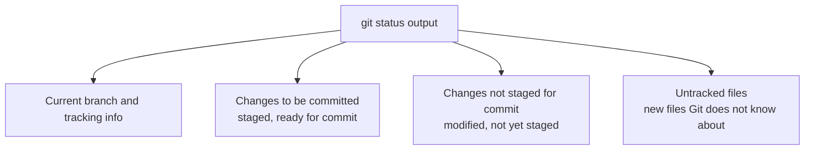
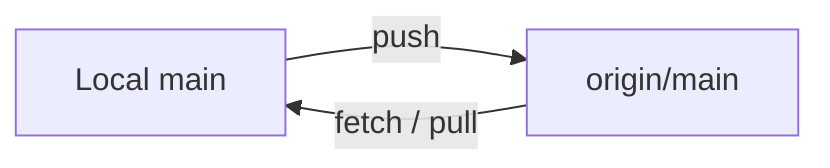
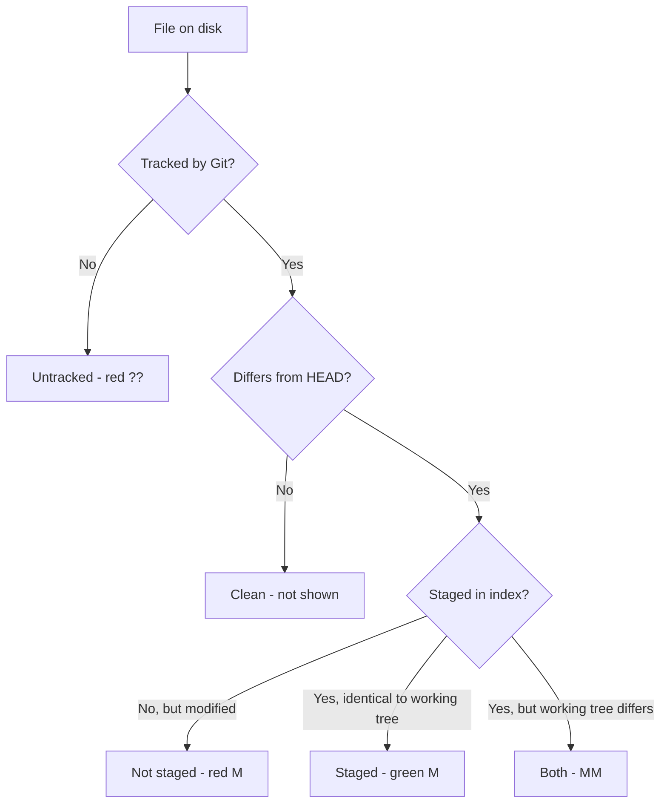

# 10. Git Status Explained

> **Tags:** #git #foundations #status

`git status` is the command you will run more than any other. It tells you what changed, what is staged, what is untracked, and what branch you are on. Learning to read its output quickly is the single biggest productivity boost a Git beginner can get.

---

## 10.1 What `git status` Reports



Each section maps directly to a state in the three-area model from [[9. Staged Changes and the Index]].

---

## 10.2 A Typical Output

```text
On branch main
Your branch is up to date with 'origin/main'.

Changes to be committed:
  (use "git restore --staged <file>..." to unstage)
        modified:   src/auth.js
        new file:   src/login.js

Changes not staged for commit:
  (use "git add <file>..." to update what will be committed)
  (use "git restore <file>..." to discard changes in working directory)
        modified:   src/utils.js

Untracked files:
  (use "git add <file>..." to include in what will be committed)
        notes.txt
```

Let's decode each line.

---

## 10.3 Line by Line

### `On branch main`

You are currently on the `main` branch. `HEAD` points to `refs/heads/main`.

### `Your branch is up to date with 'origin/main'.`

Your local `main` is at the same commit as `origin/main` (the remote-tracking branch). Other variants:

- `Your branch is ahead of 'origin/main' by 2 commits.` — you have 2 commits not yet pushed.
- `Your branch is behind 'origin/main' by 3 commits.` — remote has 3 commits you have not pulled.
- `Your branch and 'origin/main' have diverged, and have 2 and 3 different commits each.` — both have moved; you need to merge or rebase.

### `Changes to be committed:`

Files in this section are **staged** — they are in the index and will be included in the next `git commit`. To remove a file from this section, use `git restore --staged <file>`.

Within this section:

- `modified:` — the file existed in HEAD and the staged version differs from HEAD's version.
- `new file:` — the file did not exist in HEAD; the staged version is a brand-new file.
- `deleted:` — the file existed in HEAD; the staged version removes it.
- `renamed:` — the file is in HEAD under a different name; the staged version renames it.

### `Changes not staged for commit:`

Files in this section are **modified but not staged** — they differ between the working tree and the index. To stage them, use `git add <file>`. To discard the working-tree changes, use `git restore <file>`.

### `Untracked files:`

Files in this section are **not tracked at all** by Git. They exist on disk but Git has never been told to track them. To start tracking, use `git add <file>`. To keep them untracked permanently, add them to `.gitignore`.

---

## 10.4 Useful Flags

| Flag | Effect |
| --- | --- |
| `git status` | Standard output as above. |
| `git status -s` or `--short` | Compact one-line-per-file output, ideal for scripts and quick scans. |
| `git status -b` | Show branch info even in short mode. |
| `git status --ignored` | Also show files matched by `.gitignore`. |
| `git status -uall` | Show untracked files in untracked directories (default hides them). |

### Short Format Decoded

```text
 M src/utils.js       <- modified, not staged
M  src/auth.js        <- modified, staged
A  src/login.js       <- added (staged)
?? notes.txt          <- untracked
 D src/old.js         <- deleted, not staged
D  src/gone.js        <- deleted, staged
MM src/both.js        <- staged AND modified again (staged version differs from working version)
```

The format is `XY filename` where `X` is the index (staged) status and `Y` is the working-tree status:

- First column: status in the index vs HEAD.
- Second column: status in the working tree vs index.
- ` ` (space) means no change in that area.

So `MM` means: the file is staged with modifications, **and** it has been modified again in the working tree since being staged.

---

## 10.5 Branch Tracking Information

`git status` also reports the relationship between your local branch and its upstream:



- If `Local` is ahead: `git push` will publish your commits.
- If `Local` is behind: `git pull` will fetch and merge the new commits.
- If diverged: you must choose between `git pull` (merge), `git pull --rebase`, or `git push --force-with-lease` (only if you have rewritten local history on purpose).

---

## 10.6 Setting Upstream Tracking

When you create a new local branch and want to push it:

```bash
git push -u origin my-branch
```

The `-u` (long form: `--set-upstream`) tells Git that `my-branch` should track `origin/my-branch`. After this, plain `git push` and `git pull` on `my-branch` know which remote to use.

If you forgot `-u` and want to set it later:

```bash
git branch -u origin/my-branch
```

---

## 10.7 Common Mistakes

- **Reading only the top of the output.** The untracked files section at the bottom is easy to miss and is often where forgotten files (like `.env`) hide.
- **Assuming `nothing to commit, working tree clean` means you are up to date.** It only means there are no uncommitted changes. You could still be behind the remote; check the branch line.
- **Confusing `Changes to be committed` with `Changes not staged`.** The first is staged; the second is not. They are different commands away from being committed.
- **Forgetting that `git status` does not show ignored files.** Use `git status --ignored` to see them.

---

## 10.8 Making `git status` Faster on Large Repositories

On very large repos (e.g., the Linux kernel, Chrome), `git status` can take seconds. Two optimizations:

```bash
git config --global core.fsmonitor true     # use a filesystem monitor for incremental scans
git config --global core.untrackedcache true # cache untracked-file results
```

These make subsequent `git status` calls much faster by reusing previous results.

---

## 10.9 Quick Reference



This flowchart tells you, for any file, which section of `git status` it will appear in.

---

**Previous:** [[9. Staged Changes and the Index]]
**Next:** [[11. Clone vs Pull]]
