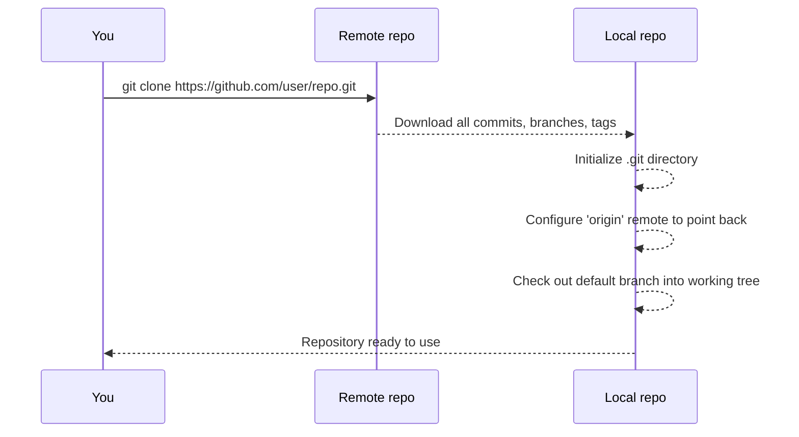
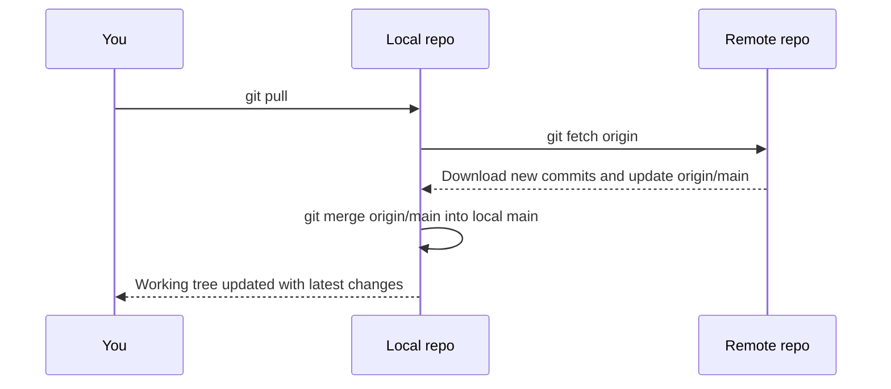
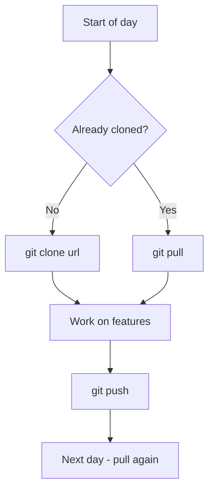

# 11. Clone vs Pull

> **Tags:** #git #foundations #clone #pull

`git clone` and `git pull` both bring content from a remote repository, but they serve completely different purposes. Confusing them leads to a common beginner mistake: re-cloning a repository every time you want the latest changes instead of just pulling.

---

## 11.1 The Difference in One Sentence

- **`git clone`** copies an entire remote repository to your machine **once**, the first time you start working on it.
- **`git pull`** brings the latest changes from a remote into an **existing** local repository.

You clone once. You pull many times.

---

## 11.2 What `git clone` Does



Concretely, `git clone <url>` performs these steps:

1. Creates a new directory named after the repository (e.g., `repo/`).
2. Initializes a `.git` directory inside it.
3. Configures a remote called `origin` pointing at `<url>`.
4. Downloads all commits, branches, and tags from the remote.
5. Checks out the remote's default branch (usually `main` or `master`) into the working tree.

After cloning, you have a fully functional local repository that knows its origin and can pull, push, branch, and commit normally.

---

## 11.3 What `git pull` Does



`git pull` is actually two commands run in sequence:

1. `git fetch` — downloads new commits from the remote and updates the remote-tracking branches (e.g., `origin/main`). It does **not** touch your working tree or local branches.
2. `git merge` — merges the fetched remote-tracking branch (e.g., `origin/main`) into your current local branch (e.g., `main`).

So `git pull` = `git fetch` + `git merge`. (You can configure it to use rebase instead of merge with `git pull --rebase` or `git config --global pull.rebase true`.)

---

## 11.4 When to Use Which

| Situation | Use |
| --- | --- |
| You want to start working on a project for the first time. | `git clone` |
| You already have the repository locally and want the latest changes. | `git pull` |
| You want to see what is on the remote without modifying your working tree. | `git fetch` (then inspect with `git log origin/main`). |
| You want to bring in changes from a specific branch. | `git pull origin <branch>` |
| You want a second copy of the repo in a different folder. | `git clone` again into a new directory. |

---

## 11.5 Common Mistakes

### Mistake 1: Re-cloning Instead of Pulling

```bash
# Wrong: deleting the repo and re-cloning every time you want updates
rm -rf repo/
git clone https://github.com/user/repo.git
```

This works but is wildly wasteful: it re-downloads the entire history every time. Use `git pull` instead.

### Mistake 2: Pulling Without a Remote

If you `git init` a local repository without adding a remote, `git pull` will fail with:

```
You are not currently on a branch.
...
fatal: no remote configured
```

Fix it by adding a remote first:

```bash
git remote add origin https://github.com/user/repo.git
git pull origin main
```

### Mistake 3: Pulling When You Have Local Uncommitted Changes

If you have uncommitted changes that conflict with what you are about to pull, Git will refuse:

```
error: Your local changes to the following files would be overwritten by merge:
        src/auth.js
Please commit your changes or stash them before you merge.
```

Fixes:

- Commit your changes first, then pull.
- Stash them: `git stash`, then `git pull`, then `git stash pop`.
- Discard them if you do not want them: `git restore .` then `git pull`.

### Mistake 4: Confusing `pull` and `fetch`

`git fetch` downloads commits but does not modify your working tree or local branches. `git pull` downloads commits and **merges them into your current branch**. If you want to inspect remote changes before integrating them, use `git fetch` followed by `git log origin/main`.

---

## 11.6 Shallow Clones

If you only need the latest code and not the full history (e.g., for CI or a quick test), use a shallow clone:

```bash
git clone --depth 1 https://github.com/user/repo.git
```

This downloads only the latest commit. The result is much smaller and faster, but you cannot view history before that commit. Useful for CI; less useful for development.

You can deepen a shallow clone later:

```bash
git fetch --unshallow
```

---

## 11.7 Cloning a Specific Branch

To clone only one branch (saves bandwidth on repos with many branches):

```bash
git clone --branch main --single-branch https://github.com/user/repo.git
```

---

## 11.8 The Daily Pattern



You clone exactly once per machine per repository. After that, every morning begins with `git pull`.

---

## 11.9 Key Takeaways

- `git clone` is for the first time. `git pull` is for every time after.
- `git pull` is `git fetch` + `git merge` (or rebase).
- `git fetch` is safe — it never modifies your working tree.
- Use shallow clones (`--depth 1`) when you do not need history.
- Always commit or stash before pulling if you have local changes.

---

**Previous:** [[10. Git Status Explained]]
**Next:** [[12. Origin and Master]]
