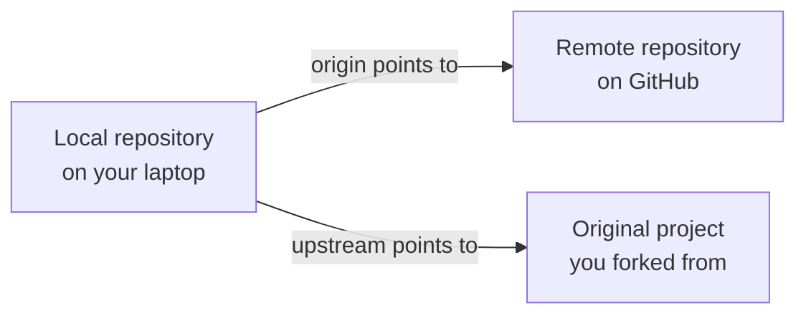
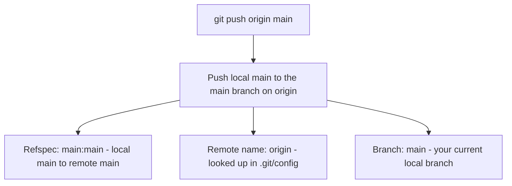

# 12. Origin and Master

> **Tags:** #git #foundations #remotes #branches

When you read Git documentation or tutorials, you will constantly see commands like `git push origin main`. Two words in that command — `origin` and `main` (or `master`) — have specific meanings that beginners often confuse. This note explains both precisely.

---

## 12.1 What "origin" Means

`origin` is the **conventional name** for the default remote repository. When you run `git clone https://github.com/user/repo.git`, Git automatically creates a remote named `origin` pointing at that URL.

A **remote** is a named pointer to another repository, usually on another machine. The name `origin` is just a convention — you could call it anything — but it is the universal default and every Git tutorial assumes it.



You can have multiple remotes. A common pattern when contributing to open source:

```bash
git remote add origin https://github.com/YOU/repo.git       # your fork
git remote add upstream https://github.com/ORIGINAL/repo.git # the original project
```

Then:

- `git push origin main` pushes to your fork.
- `git pull upstream main` pulls from the original project.

---

## 12.2 What "master" and "main" Mean

`master` was the historical default branch name in Git. When you ran `git init`, Git created a branch called `master` automatically. When you cloned, the default branch (almost always `master`) was checked out.

In 2020, the Git project, GitHub, GitLab, and others changed the default to `main` for inclusivity reasons. Both names still exist in the wild:

- Older repositories (created before 2020) usually use `master`.
- Newer repositories usually use `main`.
- GitHub's web UI defaults to `main` for new repositories.

The branch name has no functional significance — it is just a string. You can rename a branch at any time:

```bash
git branch -m master main       # rename current branch from master to main
git push -u origin main         # push the new name
git push origin --delete master # delete the old name on the remote
```

To set `main` as the default for new repositories you create:

```bash
git config --global init.defaultBranch main
```

---

## 12.3 Anatomy of `git push origin main`



Breaking the command apart:

- `git push` — the verb; tells Git to upload local commits to a remote.
- `origin` — **which** remote to push to. Looked up in `.git/config` under `[remote "origin"]`.
- `main` — **which** local branch to push, and (by default) **which** remote branch to update.

The full form is `git push <remote> <local-branch>:<remote-branch>`. When you omit the colon and the remote branch name, Git assumes they have the same name. So `git push origin main` is shorthand for `git push origin main:main`.

You can push a local branch to a differently-named remote branch:

```bash
git push origin feature-x:experimental
```

This pushes your local `feature-x` to the remote branch `experimental`.

---

## 12.4 Setting Upstream Tracking

After your first push of a new branch, you usually want Git to remember the relationship so that plain `git push` and `git pull` work without arguments:

```bash
git push -u origin main
```

The `-u` (long form: `--set-upstream`) records that your local `main` tracks `origin/main`. After this, you can run:

- `git push` (no arguments)
- `git pull` (no arguments)
- `git status` shows `Your branch is up to date with 'origin/main'.`

You can verify the tracking relationship:

```bash
git branch -vv
```

Output shows the tracking branch in square brackets:

```
* main a1b2c3d [origin/main] Add login form
  feature-x d4e5f6a [origin/feature-x: ahead 2] WIP on feature
```

---

## 12.5 Multiple Remotes: A Worked Example

Imagine you fork `someproject` on GitHub to contribute a fix. You now have two remotes to think about:

```bash
# Clone your fork
git clone https://github.com/YOU/someproject.git
cd someproject

# Add the original project as a second remote
git remote add upstream https://github.com/ORIGINAL/someproject.git

# Verify
git remote -v
```

`git remote -v` output:

```
origin    https://github.com/YOU/someproject.git (fetch)
origin    https://github.com/YOU/someproject.git (push)
upstream  https://github.com/ORIGINAL/someproject.git (fetch)
upstream  https://github.com/ORIGINAL/someproject.git (push)
```

Workflow:

```bash
# Get the latest from the original project
git fetch upstream
git checkout main
git merge upstream main          # or: git rebase upstream/main
git push origin main             # keep your fork up to date

# Make a feature branch for your fix
git checkout -b fix-typo
# (edit, commit)
git push -u origin fix-typo
# Open a PR on GitHub from YOU/someproject:fix-typo to ORIGINAL/someproject:main
```

---

## 12.6 Why "origin" Is Just a Convention

Git does not care what your remotes are named. The name `origin` is used by tutorials and tools because `git clone` creates it automatically, but you can rename it:

```bash
git remote rename origin upstream
```

Now your remote is called `upstream` and you would use `git push upstream main`. The name is purely a label.

Some teams use the remote name to indicate ownership:

- `origin` — the canonical repository.
- `fork` — your personal fork.
- `coworker` — a coworker's fork you occasionally pull from.

Whatever names you pick, the commands are the same: `git push <name> <branch>`, `git pull <name> <branch>`, `git fetch <name>`.

---

## 12.7 Key Takeaways

- `origin` is the conventional name for the default remote. It is not special — just a label.
- `main` and `master` are both just branch names. Modern default is `main`.
- `git push origin main` means "push my local `main` branch to the `main` branch on the `origin` remote."
- Use `-u` once to set up tracking; after that, plain `git push` and `git pull` work.
- You can have multiple remotes. Conventionally, `origin` is your fork and `upstream` is the original project.

---

**Previous:** [[11. Clone vs Pull]]
**Next:** [[13. What is a Remote]]
