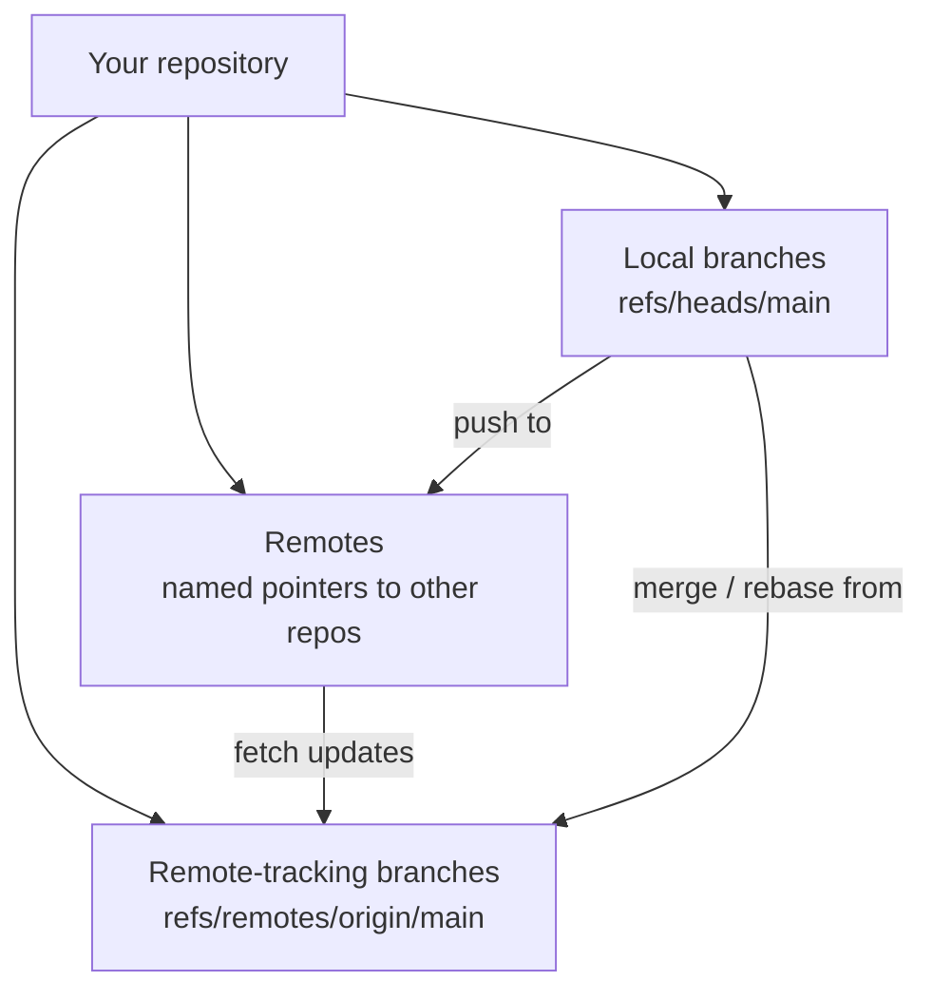
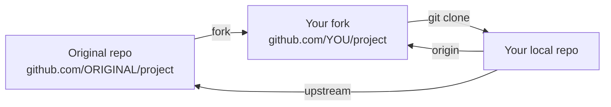

# 13. What is a Remote

> **Tags:** #git #foundations #remotes

A **remote** is a named pointer from your local repository to another repository, typically hosted on a server like GitHub, GitLab, or Bitbucket. Remotes are how Git coordinates work between machines. This note explains what remotes are, how to manage them, and how they fit into the broader Git workflow.

---

## 13.1 Definition

A remote is a **named reference** to another repository. The reference consists of:

1. A **name** — a short label like `origin`, `upstream`, or `coworker`.
2. A **URL** — the location of the other repository, over HTTPS or SSH.

Both pieces of information live in your local repository's `.git/config` file:

```ini
[remote "origin"]
    url = https://github.com/user/repo.git
    fetch = +refs/heads/*:refs/remotes/origin/*
```

The `fetch` line is a **refspec** — it tells Git which references to fetch from the remote and where to store them locally. You rarely need to modify this manually.

---

## 13.2 Local vs Remote vs Remote-Tracking Branches

This is one of the most confusing distinctions in Git. Three different things are all called "branches":



| Concept | Where it lives | Example | What it represents |
| --- | --- | --- | --- |
| Local branch | Your `.git/refs/heads/` | `main` | A line of development you can commit to directly. |
| Remote-tracking branch | Your `.git/refs/remotes/origin/` | `origin/main` | Your local cache of where `main` was on `origin` last time you fetched. |
| The actual branch on the remote | On the server | `main` on GitHub | The real, current state of `main` on the remote. |

The crucial insight: **`origin/main` is not "the `main` branch on `origin` right now." It is your local snapshot of where `main` was on `origin` the last time you ran `git fetch` or `git pull`.**

To update your remote-tracking branches, run `git fetch`:

```bash
git fetch origin
```

This downloads any new commits from `origin` and updates `origin/*` to match. Your local branches (`main`, etc.) are untouched.

---

## 13.3 Managing Remotes

### Listing Remotes

```bash
git remote -v
```

Output:

```
origin    https://github.com/YOU/repo.git (fetch)
origin    https://github.com/YOU/repo.git (push)
```

The `-v` (verbose) flag shows the URLs. Without it, only names are shown.

### Adding a Remote

```bash
git remote add upstream https://github.com/ORIGINAL/repo.git
```

### Removing a Remote

```bash
git remote remove upstream
```

### Changing a Remote's URL

```bash
git remote set-url origin git@github.com:YOU/repo.git
```

Use this when switching from HTTPS to SSH, or when a repository has moved.

### Renaming a Remote

```bash
git remote rename origin fork
```

### Inspecting a Remote

```bash
git remote show origin
```

Output includes the URL, all remote branches, which local branches track which remote branches, and whether each local branch is ahead or behind.

---

## 13.4 The Default Remote: `origin`

When you `git clone`, Git automatically creates a remote called `origin` pointing at the URL you cloned from. This is so universal that most tutorials, including this one, use `origin` as the default remote name without comment.

You do not have to use `origin`. You can rename it immediately after cloning:

```bash
git clone https://github.com/user/repo.git
cd repo
git remote rename origin upstream
```

But unless you have a reason to do so, sticking with `origin` makes your work consistent with documentation and other people's expectations.

---

## 13.5 Multiple Remotes: Forking Workflow

The most common reason to have multiple remotes is the **forking workflow** for open source:



Setup:

```bash
# Clone your fork (this creates 'origin')
git clone https://github.com/YOU/project.git
cd project

# Add the original project as 'upstream'
git remote add upstream https://github.com/ORIGINAL/project.git

# Fetch from upstream to get the latest changes
git fetch upstream

# Merge upstream's main into your local main
git checkout main
git merge upstream/main

# Push the updated main to your fork
git push origin main
```

Now your fork is up to date with the original project, and you can create feature branches for new contributions.

---

## 13.6 Fetching, Pulling, and Pushing

| Command | What it does |
| --- | --- |
| `git fetch <remote>` | Download new commits and update remote-tracking branches. Does not touch local branches or working tree. |
| `git fetch --all` | Fetch from all configured remotes. |
| `git fetch --all --prune` | Also delete remote-tracking branches that no longer exist on the remote. |
| `git pull <remote> <branch>` | `git fetch <remote>` + `git merge <remote>/<branch>`. |
| `git pull --rebase` | `git fetch` + `git rebase` instead of merge. |
| `git push <remote> <branch>` | Upload your local branch to the remote. |
| `git push -u <remote> <branch>` | Push and set up tracking. |
| `git push --force-with-lease` | Force-push but refuse if the remote has new commits you have not fetched. |

---

## 13.7 SSH vs HTTPS Remotes

Remotes can use either HTTPS or SSH URLs:

| Protocol | URL format | Authentication | When to use |
| --- | --- | --- | --- |
| HTTPS | `https://github.com/user/repo.git` | Username + Personal Access Token (PAT) | Simplest, works through firewalls |
| SSH | `git@github.com:user/repo.git` | SSH key pair | Long-term, no repeated token entry |

GitHub stopped accepting HTTPS password authentication in August 2021. You must use a PAT over HTTPS or switch to SSH. See [[15. GitHub SSH Setup]] for SSH setup and [[1. Password Authentication Not Supported]] in Chapter 2 for HTTPS PAT setup.

To switch a remote from HTTPS to SSH:

```bash
git remote set-url origin git@github.com:USER/repo.git
```

To switch back to HTTPS:

```bash
git remote set-url origin https://github.com/USER/repo.git
```

---

## 13.8 Common Mistakes

- **Forgetting to fetch before acting on `origin/main`.** Your `origin/main` is a cached snapshot; if you have not fetched recently, it is stale.
- **Pushing to the wrong remote.** If you have both `origin` (your fork) and `upstream` (the original), `git push upstream main` will usually fail (no write access) but it is still a mistake.
- **Confusing remote-tracking branches with local branches.** You cannot commit to `origin/main`. It moves only when you fetch.
- **Leaving stale remotes.** If a coworker's fork is gone or you no longer need it, `git remote remove` it to keep your config clean.

---

## 13.9 Key Takeaways

- A remote is a named pointer to another repository, stored in `.git/config`.
- `origin` is the conventional default, created automatically by `git clone`.
- `origin/main` is your local cache of where `main` is on `origin` — update it with `git fetch`.
- You can have multiple remotes; the forking workflow uses `origin` (your fork) and `upstream` (the original project).
- SSH is the recommended long-term protocol; HTTPS works but requires a Personal Access Token.

---

**Previous:** [[12. Origin and Master]]
**Next:** [[14. GitHub Lifecycle]]
