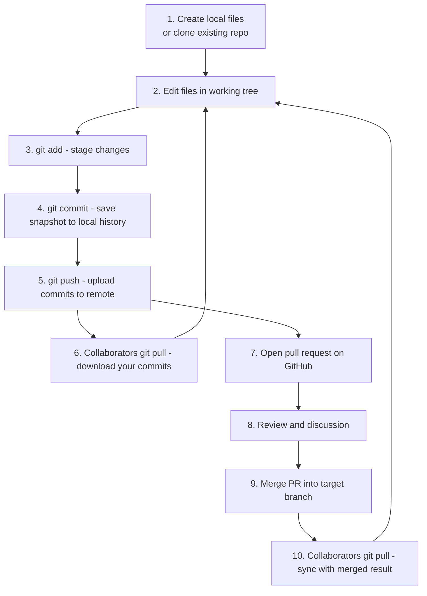
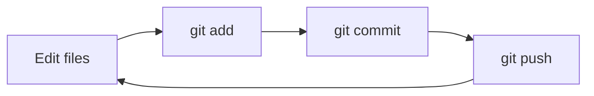

# 14. GitHub Lifecycle

> **Tags:** #git #github #foundations #workflow

This note assembles the pieces from the previous notes into the complete **local-to-remote collaboration loop** that is the daily reality of working with Git and GitHub. By the end of this note, the individual commands from earlier notes should click together into a single coherent workflow.

---

## 14.1 The Full Lifecycle



Each step corresponds to a command or action you have already learned. The lifecycle is the orchestration of those commands.

---

## 14.2 Step-by-Step Walkthrough

### Step 1 — Create or Clone

You start a project either by **creating** files locally or by **cloning** an existing repository:

```bash
# Option A: start from scratch
mkdir my-project && cd my-project
git init

# Option B: clone an existing repo
git clone https://github.com/user/repo.git
cd repo
```

### Step 2 — Edit Files

Make changes in your working tree using any editor. At this point, Git sees the files as **modified** (if they were already tracked) or **untracked** (if they are new).

### Step 3 — Stage Changes

```bash
git add .
# or, more selectively:
git add -p
```

Stage only what you want in the next commit. See [[9. Staged Changes and the Index]].

### Step 4 — Commit Locally

```bash
git commit -m "feat: add login form"
```

The commit is now in your local repository but **not** on the remote yet. Your local branch is one commit ahead of `origin/main`.

### Step 5 — Push to the Remote

```bash
git push origin main
# or, if tracking is set up:
git push
```

Your local commits are uploaded to the remote. Your branch is now in sync with `origin/main`.

### Step 6 — Collaborators Pull

Other people working on the same project run:

```bash
git pull
```

They receive your commits and their local `main` advances to match yours.

### Step 7 — Open a Pull Request

For team projects, you typically do not push directly to `main`. Instead:

```bash
git checkout -b feature/add-login
# (edit, stage, commit)
git push -u origin feature/add-login
```

Then on GitHub, open a pull request from `feature/add-login` to `main`.

### Step 8 — Review

Team members review the PR, leave comments, request changes. You respond by pushing more commits to the same branch:

```bash
# (more edits)
git add .
git commit -m "address review feedback"
git push
```

The PR updates automatically.

### Step 9 — Merge

Once approved, a maintainer merges the PR on GitHub. The commits from `feature/add-login` are integrated into `main` on the remote.

### Step 10 — Sync Local Main

```bash
git checkout main
git pull
```

Your local `main` now reflects the merged state, and you can start a new feature branch.

---

## 14.3 The Single-Developer Loop

If you are working alone on a project, the loop is simpler:



But even solo, the discipline of feature branches and PRs pays off — they give you a clean reviewable history and a place to write notes to yourself about each change.

---

## 14.4 The Team Loop with Code Review

```mermaid
sequenceDiagram
    participant Dev as Developer
    participant Local as Local repo
    participant Fork as Personal fork
    participant Upstream as Team repo
    participant CI as CI system
    Dev->>Local: git checkout -b feature/X
    Dev->>Local: edit, add, commit
    Dev->>Fork: git push -u origin feature/X
    Dev->>Upstream: open PR feature/X -> main
    Upstream->>CI: trigger tests
    CI-->>Upstream: test results
    Upstream->>Dev: review feedback
    Dev->>Local: address feedback, commit
    Dev->>Fork: git push
    Upstream->>Upstream: maintainer merges PR
    Dev->>Local: git checkout main ; git pull upstream main
```

In a fork-based workflow, you have two remotes:

- `origin` — your personal fork (where you have write access).
- `upstream` — the team repository (where you only have read access; PRs are how you ask for changes).

---

## 14.5 Rebase vs Merge in the Lifecycle

When your feature branch falls behind `main` (because someone else merged a PR), you have two ways to bring your branch up to date:

### Option 1: Merge `main` Into Your Branch

```bash
git checkout feature/X
git merge main
```

This creates a **merge commit** that combines the two histories. The history is preserved exactly, but the log becomes non-linear with merge commits.

### Option 2: Rebase Your Branch Onto `main`

```bash
git checkout feature/X
git rebase main
```

This **rewrites** your feature branch's history so that your commits are reapplied on top of the latest `main`. The history stays linear, but the commit hashes change.

Team conventions vary. Some teams prefer merge for transparency; others prefer rebase for cleanliness. Find out your team's convention and follow it.

---

## 14.6 Lifecycle as a Checklist

When you sit down to work, mentally walk through this checklist:

- [ ] Am I on the right branch? (`git status`)
- [ ] Is my local `main` up to date? (`git checkout main && git pull`)
- [ ] Should I create a new feature branch? (`git checkout -b feature/X`)
- [ ] Have I committed atomically? (small, focused commits)
- [ ] Have I pushed? (`git push`)
- [ ] Does the PR pass CI?
- [ ] Did I sync `main` after the merge? (`git pull`)

---

## 14.7 Common Lifecycle Mistakes

- **Committing directly to `main` on a shared project.** Always use a feature branch.
- **Leaving stale feature branches.** Delete them after the PR merges: `git branch -d feature/X` locally, and `git push origin --delete feature/X` on the remote.
- **Forgetting to pull before starting new work.** You will end up duplicating someone else's work or hitting a merge conflict that could have been avoided.
- **Force-pushing to shared branches.** `git push --force` on `main` rewrites everyone's history. Only force-push to branches you alone own, and prefer `--force-with-lease`.
- **Not setting up tracking with `-u`.** Forgetting this means plain `git push` and `git pull` will not know which remote to use.

---

## 14.8 Key Takeaways

- The lifecycle is: edit → add → commit → push → pull → repeat.
- Feature branches and pull requests are the standard way to collaborate.
- Always pull before starting new work to avoid conflicts.
- Rebase keeps history linear; merge preserves it exactly.
- Delete merged branches to keep the repository clean.

---

**Previous:** [[13. What is a Remote]]
**Next:** [[15. GitHub SSH Setup]]
