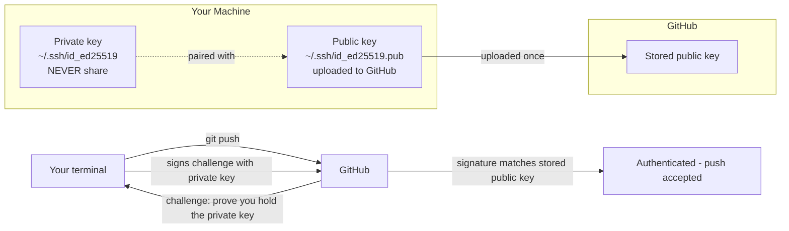

# 15. GitHub SSH Setup

> **Tags:** #git #github #ssh #authentication #foundations

SSH keys are the recommended way to authenticate with GitHub over the long term. Once set up, they let you push and pull without ever typing a password or pasting a token. This note walks through the complete setup on Linux and macOS, with verification steps so you know each stage worked.

---

## 15.1 Why SSH Over HTTPS

GitHub stopped accepting password authentication over HTTPS in August 2021. You have two options for HTTPS:

1. **Personal Access Tokens (PATs)** — paste a long-lived token as your password. Tokens expire, must be rotated, and must be carefully scoped.
2. **SSH keys** — a key pair that lives on your machine. No expiry unless you set one, no copy-paste, easy to rotate.

For long-term use, SSH is the better choice. The setup is one-time and the keys work across every repository you have access to.

See [[1. Password Authentication Not Supported]] in Chapter 2 for the HTTPS side of this story.

---

## 15.2 How SSH Authentication Works



SSH uses **public-key cryptography**. You generate a key pair: a **private key** that stays on your machine and a **public key** that you upload to GitHub. When you push, GitHub sends a challenge that can only be answered by someone holding the private key. Your SSH client signs the challenge; GitHub verifies the signature against your stored public key.

The private key never leaves your machine. Even if someone intercepts the network traffic, they cannot derive your private key from the signature.

---

## 15.3 Step 1 — Generate an SSH Key Pair

```bash
ssh-keygen -t ed25519 -C "your_email@example.com"
```

Explanation of the flags:

- `-t ed25519` — use the Ed25519 algorithm, the modern recommendation. (If you must support very old systems, use `-t rsa -b 4096`.)
- `-C "your_email@example.com"` — a comment appended to the public key for identification. Use the email associated with your GitHub account.

You will be prompted:

```
Enter file in which to save the key (/home/you/.ssh/id_ed25519):
```

Press **Enter** to accept the default location. (You can specify a different name if you have multiple keys — e.g., `id_ed25519_github`.)

```
Enter passphrase (empty for no passphrase):
Enter same passphrase again:
```

A **passphrase** encrypts the private key on disk. If your laptop is stolen, the thief cannot use your private key without the passphrase. For development machines, many people leave it empty for convenience; for shared or higher-security machines, set a passphrase.

If you set a passphrase, you will enter it once per session; the SSH agent remembers it for the rest of the session (see step 4).

---

## 15.4 Step 2 — Verify the Key Files

```bash
ls -la ~/.ssh/
```

You should see two new files:

```
id_ed25519       <- private key (keep secret, never share)
id_ed25519.pub   <- public key (safe to share, upload to GitHub)
```

The private key file should have permissions `600` (readable only by you). If `ssh-keygen` did not set them, fix it:

```bash
chmod 600 ~/.ssh/id_ed25519
chmod 644 ~/.ssh/id_ed25519.pub
```

---

## 15.5 Step 3 — Copy the Public Key

Display the public key:

```bash
cat ~/.ssh/id_ed25519.pub
```

Output will look like:

```
ssh-ed25519 AAAAC3NzaC1lZDI1NTE5AAAAI... your_email@example.com
```

Copy the **entire** output, starting with `ssh-ed25519` and ending with your email comment. This is what you will paste into GitHub.

---

## 15.6 Step 4 — Add the Key to GitHub

1. Go to <https://github.com/settings/keys>.
2. Click **New SSH key**.
3. Give it a **title** that identifies the machine (e.g., "Personal laptop — Ubuntu 24.04").
4. **Key type** should be **Authentication Key** (default).
5. Paste the public key into the **Key** field.
6. Click **Add SSH key**.
7. GitHub may ask for your password to confirm.

---

## 15.7 Step 5 — Start the SSH Agent and Add Your Key

The **SSH agent** is a background process that holds your decrypted private key in memory so you do not have to type the passphrase every time you push.

```bash
# Start the agent
eval "$(ssh-agent -s)"

# Add your private key
ssh-add ~/.ssh/id_ed25519
```

If you set a passphrase, you will be prompted for it now. The agent will remember the key for the rest of your session.

To make the agent start automatically on Linux, create or edit `~/.ssh/config`:

```
Host github.com
    AddKeysToAgent yes
    IdentityFile ~/.ssh/id_ed25519
```

On macOS, add `UseKeychain yes` to the host block to store the passphrase in the Keychain:

```
Host github.com
    AddKeysToAgent yes
    UseKeychain yes
    IdentityFile ~/.ssh/id_ed25519
```

---

## 15.8 Step 6 — Test the Connection

```bash
ssh -T git@github.com
```

The first time you connect, SSH will ask you to verify GitHub's host fingerprint:

```
The authenticity of host 'github.com (140.82.114.3)' can't be established.
ED25519 key fingerprint is SHA256:+DiY3wvvV6TuJJhbpZisF/zLDA0zPMSvHdkr4UvCOqU.
Are you sure you want to continue connecting (yes/no/[fingerprint])?
```

Type `yes`. GitHub's fingerprints are published at <https://docs.github.com/en/authentication/keeping-your-account-and-data-secure/githubs-ssh-key-fingerprints> — verify against this list if you are paranoid.

If everything is set up, you will see:

```
Hi your_username! You've successfully authenticated, but GitHub does not provide shell access.
```

This is the success message. The "does not provide shell access" part is normal — GitHub does not let you SSH into a shell, only use SSH for Git operations.

---

## 15.9 Step 7 — Switch Your Repository to SSH

If you cloned over HTTPS, switch the remote to SSH:

```bash
git remote -v
# origin  https://github.com/user/repo.git (fetch)
# origin  https://github.com/user/repo.git (push)

git remote set-url origin git@github.com:user/repo.git

git remote -v
# origin  git@github.com:user/repo.git (fetch)
# origin  git@github.com:user/repo.git (push)
```

The HTTPS URL `https://github.com/user/repo.git` becomes the SSH URL `git@github.com:user/repo.git` — note the colon instead of the slash between `github.com` and `user`.

Now `git push` and `git pull` will use SSH automatically.

---

## 15.10 Multiple SSH Keys

If you have separate GitHub accounts (e.g., personal and work), you need separate SSH keys and an SSH config that routes each one correctly.

Generate two keys:

```bash
ssh-keygen -t ed25519 -C "personal@example.com" -f ~/.ssh/id_ed25519_personal
ssh-keygen -t ed25519 -C "work@company.com"    -f ~/.ssh/id_ed25519_work
```

Add each public key to the corresponding GitHub account.

Configure `~/.ssh/config`:

```
Host github.com
    HostName github.com
    User git
    IdentityFile ~/.ssh/id_ed25519_personal
    AddKeysToAgent yes

Host github-work
    HostName github.com
    User git
    IdentityFile ~/.ssh/id_ed25519_work
    AddKeysToAgent yes
```

Now use `github-work` as the host in your work repository URLs:

```bash
git clone git@github-work:work-org/repo.git
```

SSH will route through the work key for that repository.

---

## 15.11 Troubleshooting

### "Permission denied (publickey)"

The most common error. Causes:

- The public key was not added to GitHub (verify at <https://github.com/settings/keys>).
- The private key file has wrong permissions (`chmod 600 ~/.ssh/id_ed25519`).
- The SSH agent is not running (`eval "$(ssh-agent -s)"`).
- The key was not added to the agent (`ssh-add ~/.ssh/id_ed25519`).
- You are using the wrong key (check `~/.ssh/config`).

Run with verbose output to see what is happening:

```bash
ssh -vT git@github.com
```

### "Agent admitted failure to sign using the key"

On older Linux systems, the agent may not support Ed25519. Update your SSH client or use RSA.

### "Host key verification failed"

You previously declined GitHub's host key. Remove the offending entry:

```bash
ssh-keygen -R github.com
```

Then retry `ssh -T git@github.com` and accept the host key.

---

## 15.12 Key Takeaways

- SSH keys are the recommended long-term authentication method for GitHub.
- Generate with `ssh-keygen -t ed25519`.
- Upload the **public** key to GitHub. Never share the **private** key.
- Test with `ssh -T git@github.com`.
- Switch remotes with `git remote set-url origin git@github.com:user/repo.git`.
- For multiple accounts, use `~/.ssh/config` to route each key.

---

**Previous:** [[14. GitHub Lifecycle]]
**Next chapter:** [[1. Password Authentication Not Supported]] (Chapter 2)
