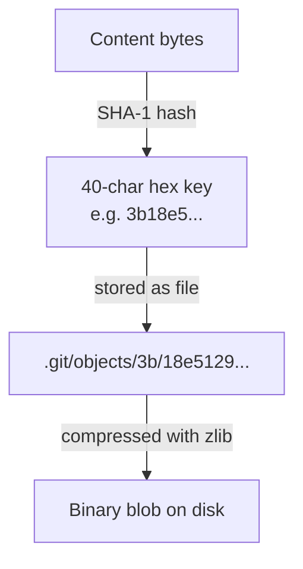
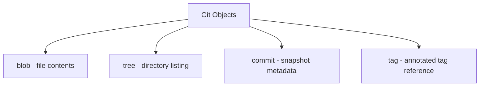
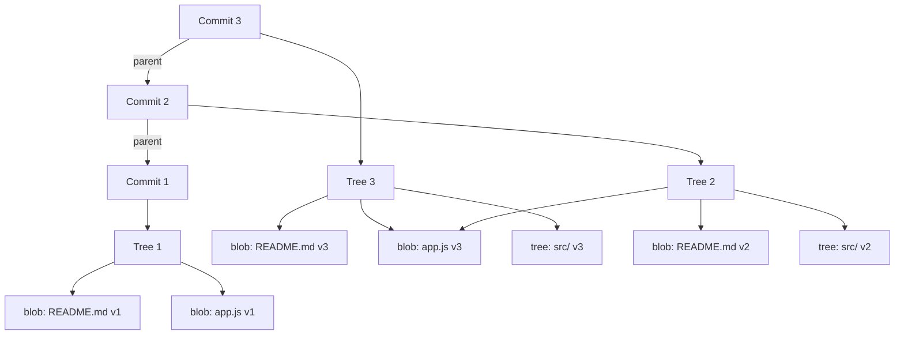

# 16. Git Internals and the Object Model

> **Tags:** #git #internals #objects #sha #plumbing

Most developers use Git through "porcelain" commands — `add`, `commit`, `push`, `pull`. Underneath is a "plumbing" layer of objects and refs that makes the whole system work. Understanding this layer transforms Git from a black box into a transparent, predictable tool.

---

## 16.1 The Content-Addressable Filesystem

At its core, Git is a **content-addressable filesystem** — a key-value store where the key is the SHA-1 hash of the content's bytes, and the value is the content itself. Everything Git stores — every file version, every directory listing, every commit — is an object addressed by its hash.



The objects live in `.git/objects/`. The first two characters of the hash form a subdirectory; the remaining 38 characters form the filename. So object `3b18e51290336c2c32e8a3de1f1c3a5a3a5a3a5a` lives at `.git/objects/3b/18e51290336c2c32e8a3de1f1c3a5a3a5a3a5a`.

---

## 16.2 The Four Object Types

Git has exactly four types of objects:



### Blob

A **blob** is the contents of a file at a specific version. It is just the bytes — no filename, no permissions (except the executable bit, which is stored in the tree). If two files have identical contents, they share the same blob object (deduplication).

```bash
# Hash a file's contents the way Git does:
git hash-object myfile.txt
# Output: 3b18e51290336c2c32e8a3de1f1c3a5a3a5a3a5a

# Write the file into the object store:
git hash-object -w myfile.txt
```

### Tree

A **tree** is the equivalent of a directory. It lists the entries in that directory: blobs (files) and subtrees (subdirectories), each with a name, mode, and hash. A tree is the snapshot of a directory at a point in time.

```bash
# List the contents of a tree object:
git cat-file -p master^{tree}
# Output:
# 100644 blob a1b2c3d...    .gitignore
# 100755 blob e4f5g6h...    build.sh
# 040000 tree i7j8k9l...    src
```

Modes: `100644` = regular file, `100755` = executable file, `120000` = symlink, `040000` = directory.

### Commit

A **commit** ties everything together. It contains:

1. A pointer to the top-level tree (the snapshot of the project root).
2. One or more parent commit hashes (zero for the initial commit, one for a normal commit, two or more for a merge).
3. Author name, email, and timestamp.
4. Committer name, email, and timestamp.
5. The commit message.

```bash
# Inspect a commit object:
git cat-file -p HEAD
# Output:
# tree 9f8e7d6c...
# parent 1a2b3c4d...
# author Mersel <mersel@example.com> 1719000000 +0100
# committer Mersel <mersel@example.com> 1719000000 +0100
#
# Add login form
```

### Tag (Annotated)

An **annotated tag** is an object that points to a commit (or another object) with additional metadata: tagger, date, message. Lightweight tags are just refs without a tag object.

---

## 16.3 The Object Graph



Commits form a chain (each pointing to its parent). Each commit points to a tree. Trees point to blobs and subtrees. Identical blobs are shared across commits, which is why Git is space-efficient even though it stores full snapshots.

---

## 16.4 Refs: Branches and Tags

A **ref** is a named pointer to a commit. Branches, tags, and remote-tracking branches are all refs.

| Ref type | Location | Example |
| --- | --- | --- |
| Local branch | `.git/refs/heads/` | `refs/heads/main` |
| Remote-tracking branch | `.git/refs/remotes/` | `refs/remotes/origin/main` |
| Tag | `.git/refs/tags/` | `refs/tags/v1.0` |

A branch file contains exactly one line: the 40-character hash of the commit it points to. That is why creating a branch is essentially free — it writes 41 bytes.

```bash
# See the raw content of a branch ref:
cat .git/refs/heads/main
# Output: 3b18e51290336c2c32e8a3de1f1c3a5a3a5a3a5a
```

`HEAD` is a special symbolic ref. It usually points to a branch:

```bash
cat .git/HEAD
# Output: ref: refs/heads/main
```

When you commit, Git reads `HEAD` to find the current branch, reads that branch's commit hash to find the parent, creates a new commit object with that parent, and updates the branch file to point to the new commit.

---

## 16.5 Plumbing Commands

The porcelain commands you use daily are built on plumbing commands. Knowing a few plumbing commands lets you inspect Git's internals directly.

| Plumbing command | What it does |
| --- | --- |
| `git hash-object <file>` | Compute the SHA-1 of a file's contents. |
| `git hash-object -w <file>` | Write the file as a blob into the object store. |
| `git cat-file -t <hash>` | Show the type of an object (blob, tree, commit, tag). |
| `git cat-file -p <hash>` | "Pretty-print" an object's contents. |
| `git cat-file -p <tree-ish>` | List a tree's entries. |
| `git ls-files` | List all files in the index. |
| `git rev-parse <ref>` | Resolve a ref to a full SHA-1. |
| `git update-ref <ref> <hash>` | Directly update a ref to point to a hash. |
| `git write-tree` | Create a tree object from the current index. |
| `git commit-tree <tree> -p <parent> -m <msg>` | Create a commit object from a tree. |

---

## 16.6 Walking the Object Store

To see the full chain from a commit down to its blobs:

```bash
# 1. Inspect the commit
git cat-file -p HEAD

# 2. Take the tree hash and inspect it
git cat-file -p <tree-hash>

# 3. Take any blob hash and see its contents
git cat-file -p <blob-hash>
```

This is exactly what `git log`, `git show`, and `git diff` do internally — they walk the object graph and format the results for human consumption.

---

## 16.7 Why This Matters

Understanding Git internals lets you:

- **Recover from mistakes.** `git reflog` shows where HEAD has been; you can `git reset --hard <reflog-entry>` to recover.
- **Understand merge conflicts.** Conflicts happen when two commits modify the same lines and Git cannot find a common base — the merge base is the lowest common ancestor in the commit graph.
- **Debug repository corruption.** `git fsck` walks the object store and reports missing or corrupted objects.
- **Appreciate why branches are cheap.** A branch is 41 bytes. Switching branches just changes which commit `HEAD` points to.
- **Use advanced commands confidently.** `rebase`, `cherry-pick`, and `reset` are easier to reason about when you see them as operations on the object graph.

---

## 16.8 Key Takeaways

- Git is a content-addressable filesystem: keys are SHA-1 hashes, values are objects.
- Four object types: blob, tree, commit, tag.
- Branches are 41-byte files containing a commit hash.
- `HEAD` is a symbolic ref pointing to the current branch.
- Plumbing commands (`cat-file`, `hash-object`, `write-tree`) let you inspect and manipulate objects directly.
- Understanding internals makes recovery, debugging, and advanced commands intuitive.

---

**Previous:** [[15. GitHub SSH Setup]]
**Next:** [[17. Branches and Branching Strategies]]
