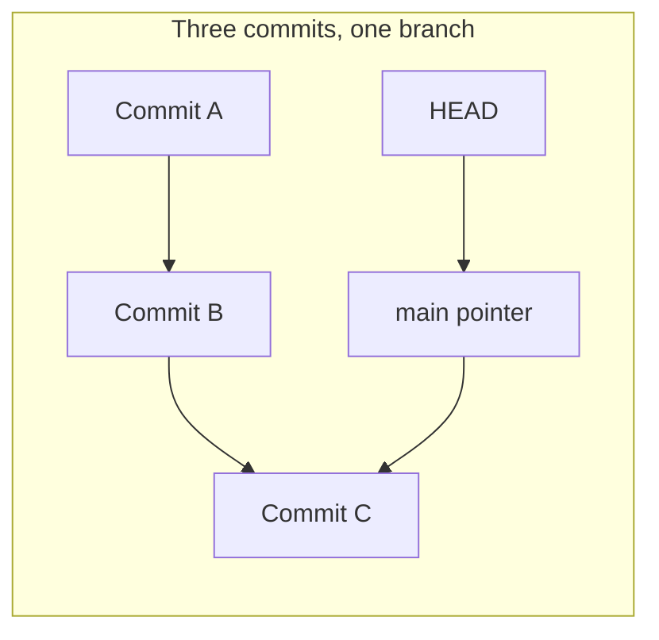
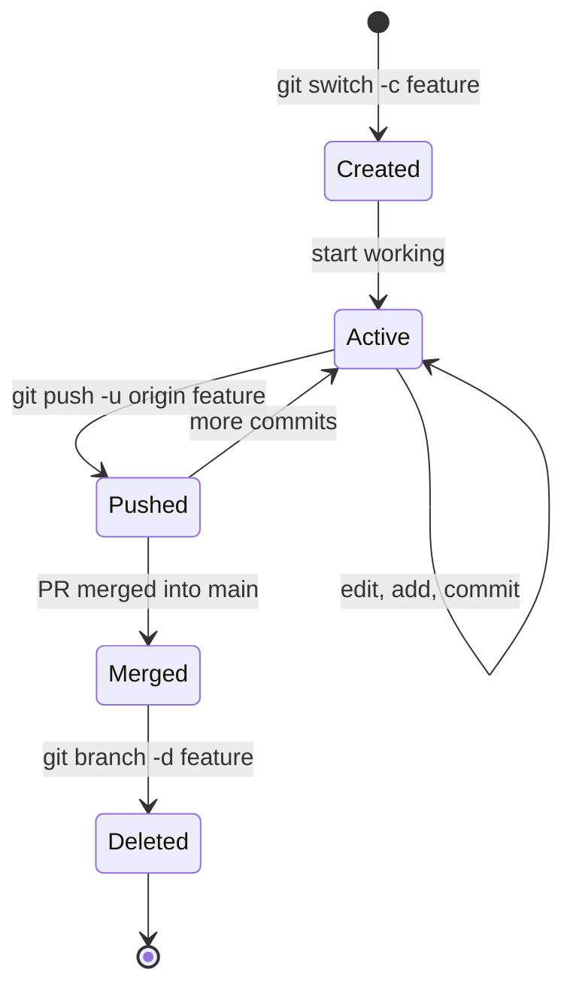
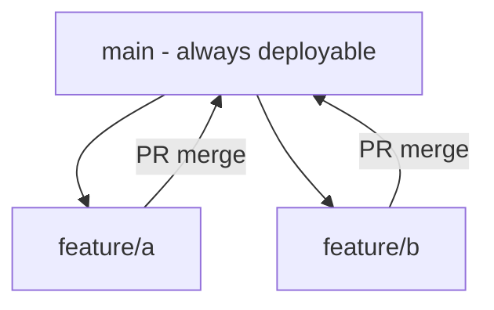
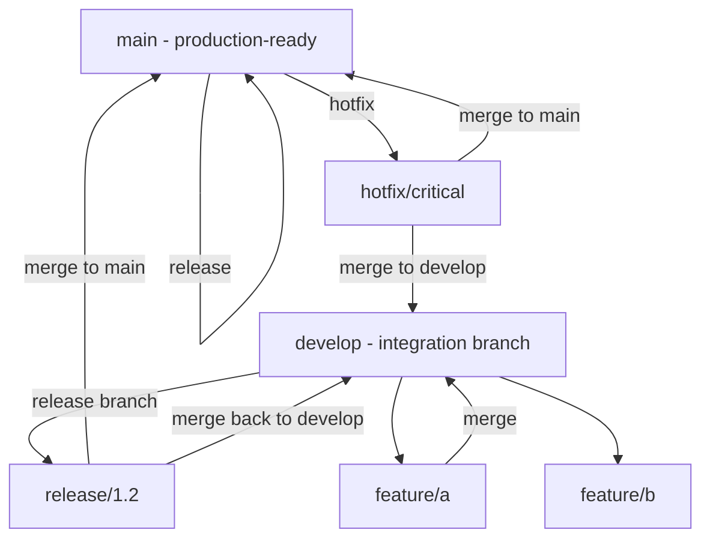
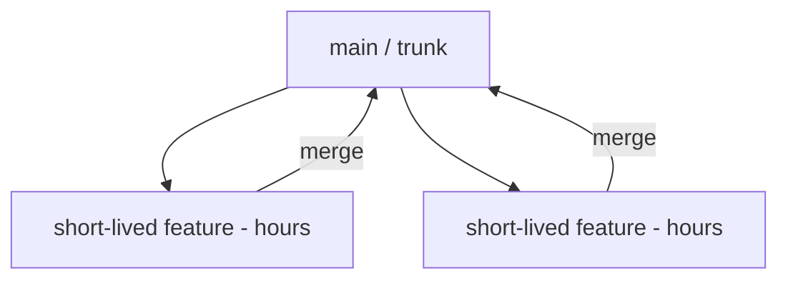
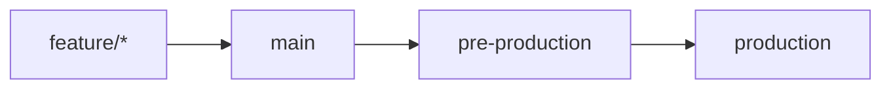

# 17. Branches and Branching Strategies

> **Tags:** #git #branches #workflow #branching-strategy

A branch in Git is a movable pointer to a commit. That simplicity is what makes branching cheap and what enables the workflows that define modern software development. This note covers the mechanics of branches and the strategies teams use to organize them.

---

## 17.1 What a Branch Really Is

A branch is a file in `.git/refs/heads/` containing a 40-character commit hash. When you commit, Git creates a new commit whose parent is the current branch's commit, then updates the branch file to point to the new commit. The branch has "moved forward."

Creating a branch does not copy any files. It writes one small file. Switching branches updates your working directory to match the target commit — but only the files that differ between the two commits are touched.

---

## 17.2 Branch Commands

| Command | What it does |
| --- | --- |
| `git branch` | List local branches. `*` marks the current branch. |
| `git branch -a` | List all branches including remote-tracking. |
| `git branch <name>` | Create a new branch pointing at the current commit. Does not switch. |
| `git branch -d <name>` | Delete a branch. Refuses if not merged. |
| `git branch -D <name>` | Force-delete a branch. |
| `git branch -m <new>` | Rename the current branch. |
| `git switch <name>` | Switch to an existing branch. |
| `git switch -c <name>` | Create a new branch and switch to it. |
| `git checkout <name>` | Older form of `git switch`. |
| `git checkout -b <name>` | Older form of `git switch -c`. |

The modern `switch` command (Git 2.23+) is preferred over `checkout` for branch operations because it is focused: `checkout` does too many things (switch branches, restore files, checkout commits).

---

## 17.3 The Branch Lifecycle

A typical feature branch:

1. **Created** from `main` (or `develop`) with `git switch -c feature/login`.
2. **Active** — you commit to it locally.
3. **Pushed** to the remote with `git push -u origin feature/login`.
4. **Merged** into the target branch via a pull request.
5. **Deleted** locally (`git branch -d feature/login`) and remotely (`git push origin --delete feature/login`).

---

## 17.4 Branching Strategies

A **branching strategy** is a team's convention for how branches are organized and merged. The right strategy depends on team size, release cadence, and project type.

### GitHub Flow

The simplest strategy, used by small teams and continuous-deployment projects.

- One long-lived branch: `main`.
- All work happens on short-lived feature branches.
- Each feature branch is merged via a pull request.
- `main` is always deployable. Deploys happen directly from `main`.

**Pros:** simple, supports continuous deployment.
**Cons:** no explicit release branch; harder to manage multiple deployed versions.

### Git Flow

The classic strategy from Vincent Driessen, suited for projects with scheduled releases.

- `main` holds production-ready code. Each commit on `main` is a release.
- `develop` is the integration branch where features merge.
- `feature/*` branches branch from `develop` and merge back to `develop`.
- `release/*` branches prepare a release. Bug fixes go here; new features do not.
- `hotfix/*` branches branch from `main` for urgent production fixes and merge to both `main` and `develop`.

**Pros:** explicit release management, supports multiple versions.
**Cons:** complex, heavy for small teams or continuous deployment.

### Trunk-Based Development

All developers commit to a single branch (`main` or `trunk`). Feature branches, if used at all, are very short-lived (hours, not days).

- Encourages small, frequent commits.
- Feature flags gate unfinished work in `main`.
- Releases are cut from `main` (or short-lived release branches).

**Pros:** fastest integration, least merge debt, supports continuous deployment.
**Cons:** requires discipline (small commits, feature flags, strong CI).

### GitLab Flow

Combines feature branches with environment branches.

- Feature branches merge to `main`.
- `main` deploys to pre-production.
- Pre-production promotes to production (by merging, not cherry-picking).

**Pros:** clear environment progression, audit trail.
**Cons:** can lead to "upstream merging" debates.

---

## 17.5 Choosing a Strategy

| Situation | Recommended strategy |
| --- | --- |
| Solo developer or small team, continuous deployment | GitHub Flow |
| Small to medium team, periodic releases | GitHub Flow or simplified Git Flow |
| Large team, scheduled releases, multiple supported versions | Git Flow |
| Team practicing continuous deployment with strong CI | Trunk-Based Development |
| Team with distinct environment stages | GitLab Flow |

The most important rule: **pick one strategy and apply it consistently.** Switching strategies mid-project creates confusion.

---

## 17.6 Branch Naming Conventions

Common prefixes:

| Prefix | Meaning |
| --- | --- |
| `feature/` | New feature |
| `fix/` or `bugfix/` | Bug fix |
| `hotfix/` | Urgent production fix |
| `release/` | Release preparation |
| `chore/` | Maintenance (deps, configs) |
| `docs/` | Documentation only |
| `refactor/` | Code restructuring |
| `test/` | Test additions or fixes |

Include a ticket number if you use an issue tracker: `feature/PROJ-123-add-login`.

---

## 17.7 Common Mistakes

- **Long-lived feature branches.** The longer a branch lives, the more it diverges from `main` and the harder the merge. Keep branches short — days, not weeks.
- **Not deleting merged branches.** Stale branches clutter the repository. Delete them after merge.
- **Committing directly to `main`.** On team projects, always use a feature branch and a pull request.
- **Branching from an outdated `main`.** Always `git pull` (or `git fetch` + `git rebase`) before branching to avoid integration conflicts.
- **Forgetting to set upstream.** Use `git push -u origin <branch>` on first push so subsequent `git push` and `git pull` work without arguments.

---

## 17.8 Key Takeaways

- A branch is a 41-byte pointer to a commit. Creating and switching is essentially free.
- Use `git switch` (modern) rather than `git checkout` for branch operations.
- Branching strategies: GitHub Flow (simple), Git Flow (structured releases), Trunk-Based (fast CD), GitLab Flow (environment progression).
- Choose based on team size, release cadence, and deployment model.
- Keep branches short-lived; delete them after merge.

---

**Previous:** [[16. Git Internals and the Object Model]]
**Next:** [[18. Merging and Merge Conflicts]]
