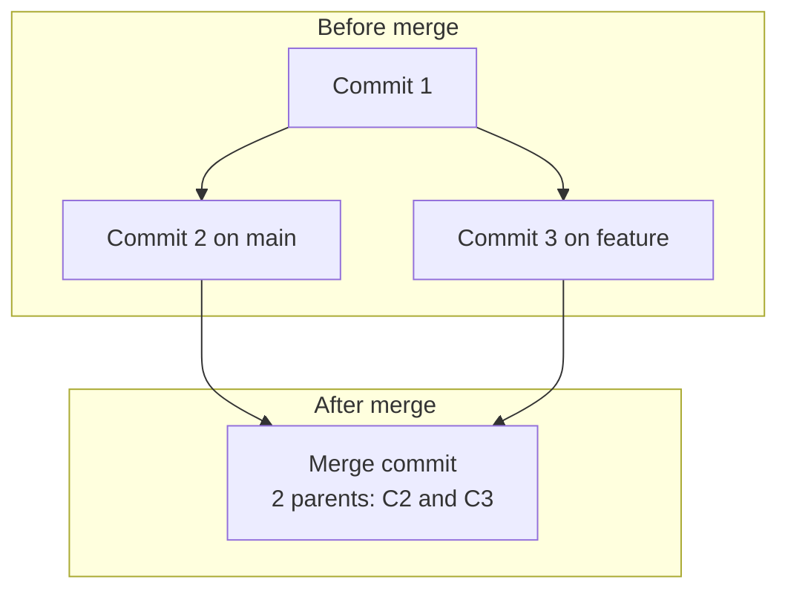
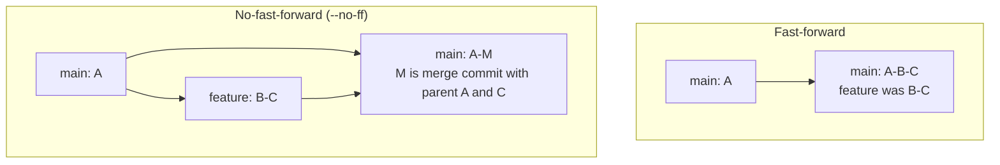
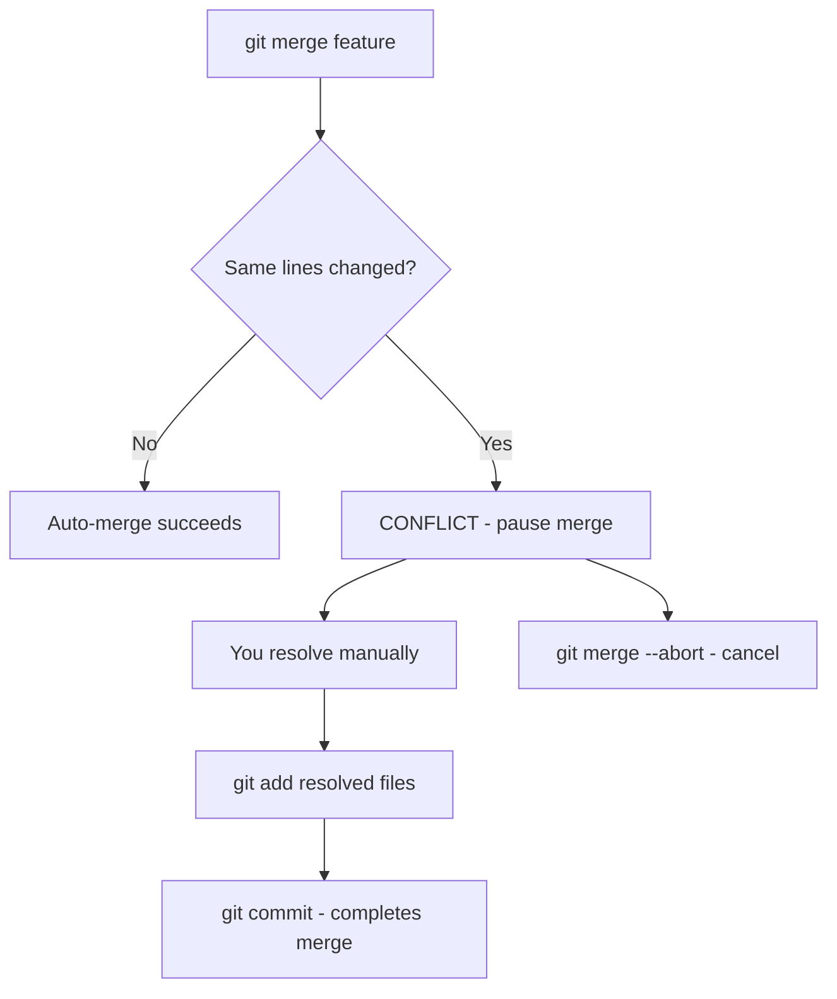

# 18. Merging and Merge Conflicts

> **Tags:** #git #merge #conflicts #workflow

Merging is how Git combines the histories of two branches. Most of the time it is automatic. When it is not — when both branches changed the same lines — you get a **merge conflict** that you must resolve manually. This note covers both the happy path and the conflict path in detail.

---

## 18.1 What Merging Does

When you merge branch B into branch A, Git creates a new commit (a **merge commit**) that has two parents: the tip of A and the tip of B. The merge commit's tree reflects the combined state of both branches.



If the two branches did not modify the same lines, Git performs a **fast-forward** merge: it simply moves the branch pointer forward without creating a merge commit. If they diverged, Git creates a merge commit.

---

## 18.2 Types of Merge

| Merge type | What happens | Command |
| --- | --- | --- |
| **Fast-forward** | Branch pointer moves forward; no merge commit. | `git merge feature` (default if possible) |
| **No-fast-forward** | Forces a merge commit even if a fast-forward is possible. | `git merge --no-ff feature` |
| **Squash** | Combines all feature-branch commits into a single commit on the target. | `git merge --squash feature` |
| **Three-way** | Standard merge with diverged histories; creates a merge commit. | `git merge feature` (when not fast-forward) |
| **Octopus** | Merges more than two heads at once. Rare. | `git merge a b c` |

### Fast-Forward vs No-Fast-Forward



`--no-ff` preserves the history of the feature branch — you can see that a set of commits was a feature. Fast-forward produces a linear history but loses that information.

Many teams prefer `--no-ff` for feature merges to keep the history readable: `git config --global merge.ff false` makes it the default.

---

## 18.3 Performing a Merge

```bash
# 1. Switch to the target branch (e.g., main)
git switch main

# 2. Make sure it is up to date
git pull

# 3. Merge the feature branch
git merge feature/login

# 4. If there are no conflicts, Git creates the merge commit
#    (or fast-forwards). Push the result.
git push
```

---

## 18.4 Merge Conflicts

A conflict occurs when the two branches changed the same lines of the same file (or one branch deleted a file the other modified). Git cannot decide which version to keep, so it pauses the merge and asks you to resolve it.



### What a Conflict Looks Like

In the conflicted file, Git inserts markers:

```text
<<<<<<< HEAD
This is the version on the current branch (main).
=======
This is the version on the feature branch.
>>>>>>> feature/login
```

- `<<<<<<< HEAD` to `=======`: the version on the branch you are merging **into** (the current branch).
- `=======` to `>>>>>>>`: the version on the branch you are merging **from**.

---

## 18.5 Resolving Conflicts

### Step 1 — See Which Files Conflict

```bash
git status
# Output:
# Unmerged paths:
#   both modified:   src/auth.js
```

### Step 2 — Open the File and Edit

Open `src/auth.js` in your editor. Find the conflict markers. Decide what the final version should be — it can be one side, the other side, or a combination. Remove the markers (`<<<<<<<`, `=======`, `>>>>>>>`).

```text
# Before resolution:
function login(user) {
<<<<<<< HEAD
    return authenticate(user, 'v2');
=======
    return authenticate(user, 'v1');
>>>>>>> feature/login
}

# After resolution (you chose to combine):
function login(user) {
    return authenticate(user, 'v2');
}
```

### Step 3 — Stage the Resolved File

```bash
git add src/auth.js
```

Staging tells Git "I have resolved this file."

### Step 4 — Complete the Merge

```bash
git commit
```

Git opens your editor with a default merge message like `Merge branch 'feature/login'`. Save and close to complete the merge.

### Step 5 — Push

```bash
git push
```

---

## 18.6 Conflict Resolution Tools

### VS Code

VS Code highlights conflicts and offers inline buttons: **Accept Current Change**, **Accept Incoming Change**, **Accept Both Changes**, **Compare Changes**. This is the fastest way to resolve simple conflicts.

### `git mergetool`

Git can launch a visual merge tool (meld, kdiff3, Beyond Compare, VS Code):

```bash
git mergetool
```

Configure your preferred tool:

```bash
git config --global merge.tool vscode
git config --global mergetool.vscode.cmd 'code --wait $MERGED'
```

### Command-Line `git checkout`

For simple "keep one side" resolutions:

```bash
# Keep the current branch's version (--ours)
git checkout --ours src/auth.js

# Keep the incoming branch's version (--theirs)
git checkout --theirs src/auth.js

git add src/auth.js
```

Note: `--ours` and `--theirs` are from the perspective of the merge — "ours" is the branch you are on (the target), "theirs" is the branch being merged in. During a **rebase**, these are swapped, which confuses many people.

---

## 18.7 Aborting a Merge

If you are overwhelmed by conflicts or merged the wrong branch:

```bash
git merge --abort
```

This cancels the merge and returns your working tree to the state before `git merge`. Use it freely — there is no shame in aborting and trying again with a cleaner plan.

---

## 18.8 Reducing Conflicts

- **Pull frequently.** The longer you go without integrating, the more your branch diverges and the larger the conflicts.
- **Small, focused branches.** A branch that touches one feature in a few files conflicts less than a branch that touches many files.
- **Communicate with your team.** If two people are about to edit the same file, coordinate.
- **Rebase instead of merge** (see [[19. Rebasing]]) to keep your branch up to date with `main` and resolve conflicts in smaller chunks.
- **Split large changes.** If a PR is huge, reviewers cannot help with conflicts. Smaller PRs are easier to merge and less conflict-prone.

---

## 18.9 Common Mistakes

- **Forgetting to `git add` after resolving.** The file is not staged until you add it. The merge will not complete.
- **Leaving conflict markers in the file.** If you commit with markers still present, the next person to read the code will be confused.
- **Choosing "Accept Both" blindly.** This often produces broken code (two function definitions, duplicate lines). Read and understand before choosing.
- **Committing without testing.** After resolving a conflict, run your tests before committing. A syntactically valid resolution may still be logically wrong.
- **Confusing `--ours` and `--theirs` during rebase.** They are swapped relative to merge. Always check `git status` to confirm which branch you are on.

---

## 18.10 Key Takeaways

- Merging combines two branches; fast-forward moves the pointer, three-way creates a merge commit.
- Conflicts happen when both branches change the same lines.
- Resolve by editing the file, removing markers, `git add`, `git commit`.
- Use `git merge --abort` to cancel.
- Reduce conflicts by pulling frequently, keeping branches small, and communicating.

---

**Previous:** [[17. Branches and Branching Strategies]]
**Next:** [[19. Rebasing]]
