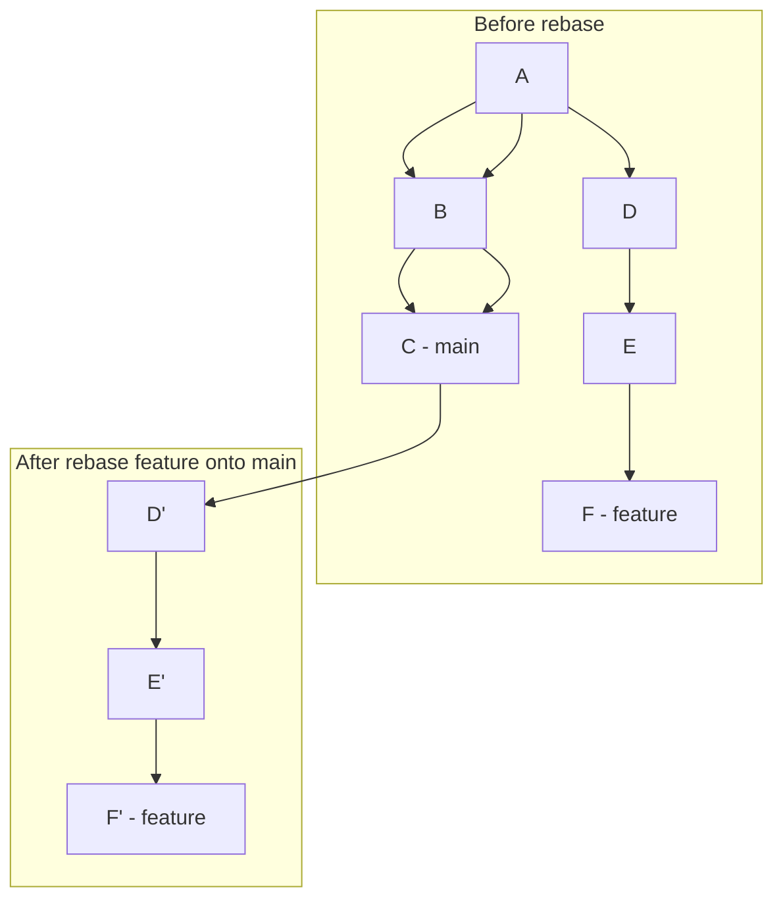
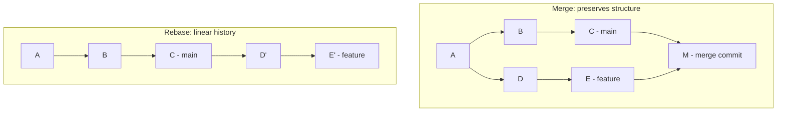
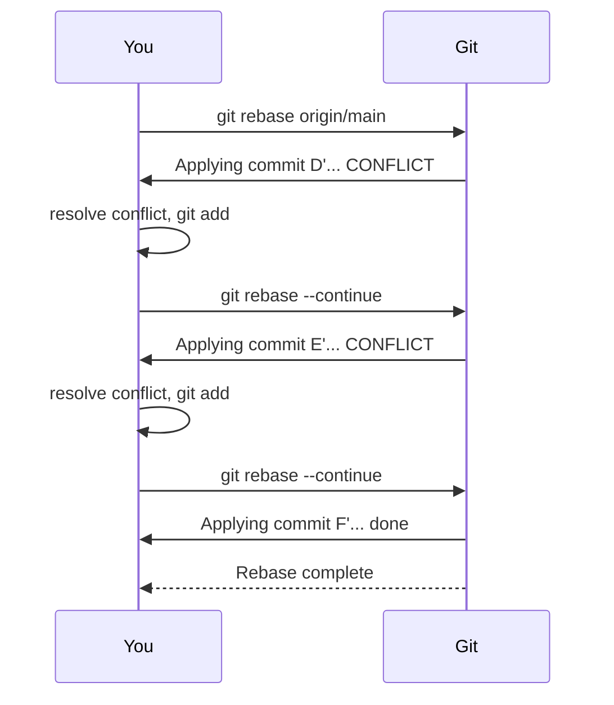

# 19. Rebasing

> **Tags:** #git #rebase #history #workflow

Rebasing is Git's other way of integrating changes between branches. Where merging preserves history exactly and adds a merge commit, rebasing **rewrites** your branch's history so that it appears to start from the latest commit of the target branch. The result is a linear, clean history.

---

## 19.1 What Rebase Does



When you `git rebase main` while on `feature`:

1. Git identifies the commits on `feature` that are not on `main` (D, E, F).
2. It saves them as patches.
3. It resets `feature` to point to the tip of `main` (C).
4. It reapplies each patch in order, creating new commits (D', E', F') on top of C.

The new commits have different hashes than the originals because their parent changed. The content is (usually) the same, but the history is rewritten.

---

## 19.2 Merge vs Rebase

| Aspect | Merge | Rebase |
| --- | --- | --- |
| History | Preserves exact branching structure | Linearizes history |
| Merge commit | Yes (unless fast-forward) | No |
| Commit hashes | Unchanged | Rewritten |
| When conflicts arise | Resolved once, in the merge commit | Resolved per commit, during rebase |
| Safety on shared branches | Safe | Dangerous (rewrites history) |



---

## 19.3 When to Rebase

### Rebase your feature branch onto the latest main

Before merging a feature, rebasing it onto `main` ensures the merge will be a fast-forward (no merge commit) and that you have resolved any conflicts in small chunks.

```bash
git switch feature
git fetch origin
git rebase origin/main
# Resolve any conflicts per commit
git switch main
git merge feature  # fast-forward, no merge commit
```

### Do NOT rebase shared branches

If others have based work on a branch, rebasing that branch rewrites history. Their local copies now point to commits that no longer exist on the remote. This causes confusion and duplicated work.

**The Golden Rule of Rebase:** Never rebase a branch that others have pulled. Rebase only your own private branches.

---

## 19.4 Interactive Rebase

`git rebase -i` lets you rewrite history in powerful ways before pushing. It opens an editor listing the commits to be rebased, with a "pick" action next to each.

```bash
git rebase -i HEAD~5  # rebase the last 5 commits
```

The editor shows:

```text
pick a1b2c3d Add login form
pick d4e5f6a Fix typo in login
pick 7g8h9i0 Add password validation
pick j1k2l3m Refactor auth helper
pick n4o5p6q Update tests
```

### Available Actions

| Action | What it does |
| --- | --- |
| `pick` (or `p`) | Keep the commit as-is. |
| `reword` (or `r`) | Keep the commit but edit its message. |
| `edit` (or `e`) | Pause to amend the commit (add files, split it, etc.). |
| `squash` (or `s`) | Combine this commit with the previous one; edit the combined message. |
| `fixup` (or `f`) | Like squash but discard this commit's message. |
| `drop` (or `d`) | Remove the commit entirely. |
| `exec` (or `x`) | Run a shell command at this point. |

You can also **reorder** commits by moving lines, and **split** commits by marking them `edit` and using `git reset HEAD^` when paused.

### Common Use Case: Squashing Before a PR

```text
pick a1b2c3d Add login form
fixup d4e5f6a Fix typo in login
squash 7g8h9i0 Add password validation
pick j1k2l3m Refactor auth helper
drop n4o5p6q Update tests
```

This combines the first three commits into one, keeps the refactor, and drops the test update. The result is a clean, reviewable history.

---

## 19.5 Resolving Conflicts During Rebase

Unlike merge (where conflicts are resolved once), rebase applies commits one at a time, so conflicts may arise on each commit.



Commands during a rebase:

| Command | What it does |
| --- | --- |
| `git rebase --continue` | After resolving and staging, continue the rebase. |
| `git rebase --skip` | Skip the current commit (e.g., if it is already applied). |
| `git rebase --abort` | Cancel the rebase and return to the state before it started. |

---

## 19.6 Force-Pushing After Rebase

Because rebase rewrites commit hashes, your local branch has diverged from the remote. A normal `git push` will be rejected. You must force-push:

```bash
git push --force-with-lease
```

**Always use `--force-with-lease`, never `--force`.** `--force-with-lease` checks that the remote has not moved since your last fetch; if it has (because someone else pushed), the force-push is rejected. This prevents you from overwriting someone else's work.

---

## 19.7 Rebase vs Merge: Team Conventions

Teams choose one of two policies:

### "Merge commits welcome" (merge-based)

- All merges go through pull requests with merge commits.
- History is a graph showing when features were integrated.
- Pros: exact history, no rewriting, safe.
- Cons: history can be noisy with merge commits.

### "Keep history linear" (rebase-based)

- Feature branches are rebased onto `main` before merging.
- Merges are fast-forward (no merge commit).
- Pros: clean linear history, easy to bisect.
- Cons: rewriting history requires force-push; lost context of feature boundaries.

Some teams use a hybrid: rebase feature branches before merge, then use `--no-ff` to create a merge commit. This gives both clean per-commit history and visible feature boundaries.

---

## 19.8 The Reflog: Your Safety Net

If a rebase goes wrong, `git reflog` records where HEAD has been. You can reset to any previous state:

```bash
git reflog
# Output:
# a1b2c3d HEAD@{0}: rebase finished
# d4e5f6a HEAD@{1}: rebase: checkout origin/main
# 7g8h9i0 HEAD@{2}: commit: last commit before rebase

git reset --hard HEAD@{2}  # undo the rebase
```

The reflog is local only; it is not pushed. Entries are kept for 90 days by default.

---

## 19.9 Common Mistakes

- **Rebasing a shared branch.** Others' work breaks. Never rebase `main` or any branch others have pulled.
- **Using `git push --force` instead of `--force-with-lease`.** `--force` overwrites blindly; `--force-with-lease` is safer.
- **Forgetting `git rebase --abort` when confused.** If a rebase is going badly, abort and start over rather than pushing through.
- **Squashing commits that others have reviewed.** If you squash after a review, the reviewer's inline comments may be lost. Squash before requesting review.
- **Rebasing across merges.** Rebasing a branch that contains merge commits can produce confusing results. Avoid `git rebase` on branches with merge commits; use `git rebase --rebase-merges` if you must.

---

## 19.10 Key Takeaways

- Rebase rewrites your branch's history on top of another branch, producing a linear history.
- Use rebase to keep your feature branch up to date with `main` before merging.
- Never rebase shared branches — only your own private branches.
- Interactive rebase (`-i`) lets you squash, reword, reorder, and drop commits.
- After rebase, force-push with `--force-with-lease`.
- `git reflog` is your safety net for rebase mistakes.

---

**Previous:** [[18. Merging and Merge Conflicts]]
**Next:** [[20. Cherry Picking]]
