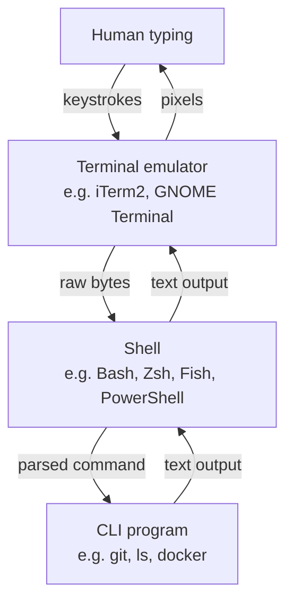

# 2. CLI vs Terminal

> **Tags:** #git #foundations #terminology

Two terms that beginners treat as synonyms but that mean different things: **CLI** (Command Line Interface) and **terminal**. Confusing them is harmless in casual speech but causes real confusion the moment you start configuring your development environment or reading error messages.

---

## 2.1 What Is a CLI

A **Command Line Interface (CLI)** is a style of interaction between a human and a program. In a CLI, the user types text commands and the program responds with text output. The defining trait is that the input is **textual commands**, not graphical actions like clicking or dragging.

Examples of CLIs include:

- The Git CLI: `git commit -m "fix typo"`.
- The Bash shell: `ls -la /home`.
- The Python REPL: `>>> print("hello")`.
- The Docker CLI: `docker run --rm alpine echo hi`.

Each of these is a **program** that accepts text commands. The CLI is the *interface*, not the program.

---

## 2.2 What Is a Terminal

A **terminal** is the **window or device** that displays the text input and output of a CLI session. Historically, a terminal was a physical piece of hardware — a keyboard and a CRT monitor connected by serial cable to a mainframe. Today, terminals are almost always software emulators of those physical devices.

Examples of modern terminal programs include:

- **macOS:** Terminal.app, iTerm2, Warp, Kitty, Alacritty.
- **Windows:** Windows Terminal, the legacy "Command Prompt" window (which conflates the terminal and the shell), PowerShell window.
- **Linux:** GNOME Terminal, Konsole, xterm, Alacritty, Kitty, Terminator.

A terminal's job is to:

1. Accept keystrokes and send them to whatever program is running inside it.
2. Display the text output that program produces.
3. Handle terminal-specific concerns like colors, cursor positioning, and resize events.

The terminal does **not** interpret your commands. It just shows them.

---

## 2.3 Where the Shell Fits In

Between the terminal and the CLI sits a third component that beginners rarely distinguish: the **shell**. The shell is the program that actually interprets the commands you type.

| Layer | What it does | Examples |
| --- | --- | --- |
| Terminal emulator | Renders text, sends keystrokes | iTerm2, GNOME Terminal, Windows Terminal |
| Shell | Parses commands, manages variables, job control, history | Bash, Zsh, Fish, PowerShell, Nushell |
| CLI program | Performs the actual work the user requested | git, ls, docker, kubectl |

When you type `git status` and press Enter:

1. The terminal sends the string `git status\n` to the shell.
2. The shell parses it: command `git`, argument `status`.
3. The shell finds the `git` executable on your `PATH` and runs it with the argument `status`.
4. Git produces text output and writes it to its standard output.
5. The shell does nothing with that output; it just lets it pass through.
6. The terminal renders the output on your screen.

---

## 2.4 Why the Distinction Matters

You will frequently see advice like "open a terminal and run `git status`." That advice conflates the terminal and the shell because, in practice, opening a terminal on most systems also starts a default shell inside it. But the distinction matters in several real situations:

- **You can change shells without changing terminals.** Many developers switch from Bash to Zsh or Fish inside the same terminal emulator. The terminal does not care which shell runs inside it.
- **You can change terminals without changing shells.** Switching from GNOME Terminal to Alacritty does not affect your shell configuration, your aliases, or your prompt.
- **A program can be a CLI without a terminal.** A cron job, a CI runner, and a build script can all invoke `git` as a CLI without any terminal being involved at all.
- **Some error messages mention the terminal, others mention the shell.** Knowing which one is misbehaving tells you what to fix.

---

## 2.5 Practical Examples

### Example 1: You type `git sattus` (typo)

- The **terminal** faithfully sent your typo to the shell.
- The **shell** parsed it as command `git` with argument `sattus`.
- The **Git CLI** received the argument, did not recognize `sattus`, and printed an error.
- The terminal displayed the error.

The fix is to type the correct command — neither the terminal nor the shell needs to change.

### Example 2: Arrow keys do not work in `git --interactive`

- The **terminal** is sending the arrow keys as escape sequences.
- The **shell** is not involved (you are inside Git's interactive mode, not at a shell prompt).
- The **Git CLI** is misinterpreting the escape sequences.

The fix is to configure your terminal's `TERM` environment variable (e.g., `TERM=xterm-256color`) so that Git can recognize the escape sequences.

### Example 3: Aliases like `gst` for `git status` do not work

- The alias is configured in your **shell** (Bash, Zsh, etc.).
- If you switch to a different shell, the alias is gone — even though you are in the same terminal.

The fix is to define the alias in the configuration file of the new shell (`.bashrc`, `.zshrc`, etc.).

---

## 2.6 Quick Mental Model

> The **terminal** is the window. The **shell** is the program that reads what you type. The **CLI** is the interface style of the program the shell runs for you.

If you remember that one sentence, you will correctly interpret most of the documentation you read.

---

**Previous:** [[1. What is Git and Version Control]]
**Next:** [[3. What is a Repository]]
