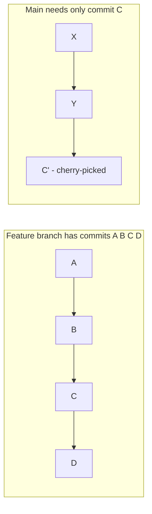
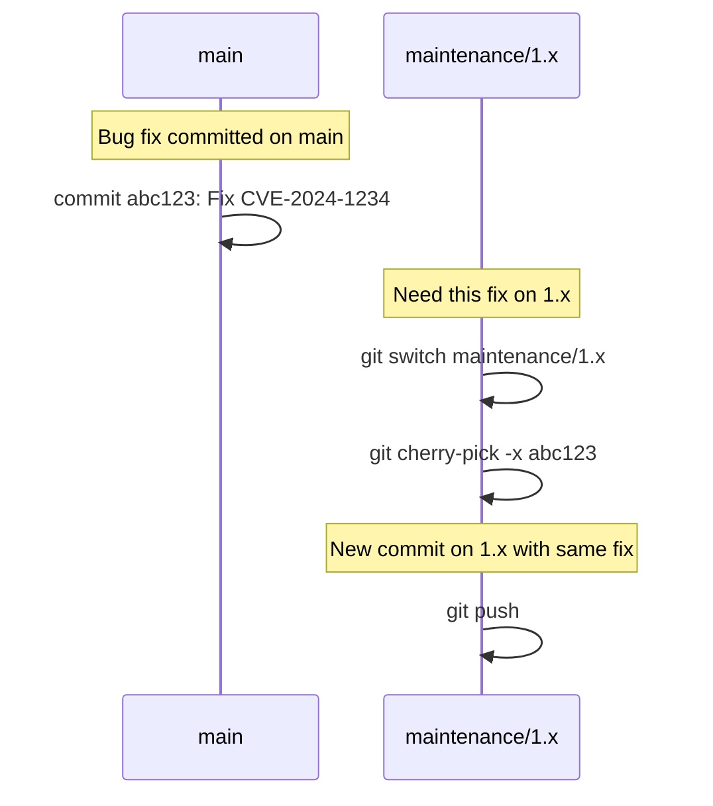

# 20. Cherry Picking

> **Tags:** #git #cherry-pick #workflow

`git cherry-pick` applies the changes from an existing commit onto your current branch, creating a new commit with the same content (but a different hash). It is how you move a single commit from one branch to another without merging the entire branch.

---

## 20.1 When to Cherry-Pick



Common scenarios:

- **Hotfix backporting.** A bug fix on `main` needs to go to a maintenance branch. Cherry-pick the fix commit.
- **Selective feature merging.** A feature branch has several commits; you want only one of them on `main` now.
- **Recovering a lost commit.** You accidentally committed to the wrong branch. Cherry-pick the commit onto the right branch.

---

## 20.2 How to Cherry-Pick

```bash
# 1. Switch to the target branch
git switch main

# 2. Find the commit hash you want to cherry-pick
git log feature-branch --oneline
# Output: c1d2e3f Add password validation

# 3. Cherry-pick it
git cherry-pick c1d2e3f
```

Git applies the changes from commit `c1d2e3f` onto your current branch and creates a new commit with the same message, author, and date (but a new hash and a new committer).

---

## 20.3 Cherry-Picking Multiple Commits

```bash
# A range (exclusive start, inclusive end)
git cherry-pick A..D    # applies B, C, D

# A range (inclusive start)
git cherry-pick A^..D   # applies A, B, C, D

# Multiple individual commits
git cherry-pick A C F
```

---

## 20.4 Cherry-Pick Conflicts

If the commit's changes conflict with your current branch, Git pauses and asks you to resolve:

```bash
git cherry-pick c1d2e3f
# CONFLICT in src/auth.js

# Resolve the conflict in your editor, then:
git add src/auth.js
git cherry-pick --continue

# Or abort:
git cherry-pick --abort
```

---

## 20.5 Cherry-Pick Options

| Option | What it does |
| --- | --- |
| `--no-commit` (`-n`) | Apply the changes to the working tree and index but do not commit. Useful for combining multiple cherry-picks into one commit. |
| `--edit` (`-e`) | Open the editor to edit the commit message before committing. |
| `--signoff` | Add a `Signed-off-by` line to the commit message. |
| `-x` | Append a line "cherry picked from commit <hash>" to the message, for traceability. |
| `--strategy` | Choose the merge strategy (e.g., `recursive`, `ours`, `theirs`). |

---

## 20.6 Cherry-Pick vs Merge vs Rebase

| Operation | Scope | Result |
| --- | --- | --- |
| `git merge feature` | Entire branch | One merge commit (or fast-forward) integrating all of `feature`. |
| `git rebase main` (on feature) | Entire branch | Rewrites `feature` on top of `main`; no new commits on `main`. |
| `git cherry-pick <commit>` | Single commit | New commit on current branch with the same changes as `<commit>`. |

Cherry-pick is for **selective** transfer. Merge and rebase are for **full** integration.

---

## 20.7 The Downside of Cherry-Pick: Duplicate Commits

If you cherry-pick commit C from `feature` to `main`, and later merge `feature` into `main`, Git may try to apply C again, causing a conflict. This is because the cherry-picked commit has a different hash, so Git does not know it is the same change.

Mitigation:

- Use `-x` to record where the commit came from, for traceability.
- Avoid cherry-picking from a branch you intend to merge later. If you must, consider rebasing the feature branch and dropping the original commit (`git rebase -i`).
- For backporting hotfixes, cherry-pick to the maintenance branch and document it. When the next minor release merges `main` into the maintenance branch, the duplicate will be detected and skipped (Git's patch-id matching usually handles this).

---

## 20.8 Worked Example: Backporting a Hotfix



Commands:

```bash
# On main, the fix is commit abc123
git switch maintenance/1.x
git cherry-pick -x abc123
# This creates a new commit on 1.x with message:
# Fix CVE-2024-1234
#
# (cherry picked from commit abc123...)
git push
```

The `-x` flag adds the traceability line so future maintainers know where the fix came from.

---

## 20.9 Common Mistakes

- **Cherry-picking instead of merging.** If you want all of a branch's changes, merge or rebase — do not cherry-pick every commit.
- **Forgetting `-x` for traceability.** Without it, future maintainers cannot tell where a cherry-picked commit came from.
- **Cherry-picking a commit that depends on earlier commits.** The cherry-pick may fail or produce broken code if the surrounding context is missing.
- **Expecting cherry-pick to "move" a commit.** Cherry-pick **copies** — the original commit stays on its branch. If you want to move it, cherry-pick and then remove the original (via interactive rebase).

---

## 20.10 Key Takeaways

- `git cherry-pick <commit>` applies a single commit's changes onto your current branch.
- Use it for selective transfer: hotfix backports, isolated features, recovering misplaced commits.
- Conflicts are resolved like a merge: edit, `git add`, `--continue`.
- Use `-x` for traceability and `-n` to combine multiple cherry-picks into one commit.
- Beware duplicate commits when later merging the source branch.

---

**Previous:** [[19. Rebasing]]
**Next:** [[21. Stashing and the Working Directory]]
