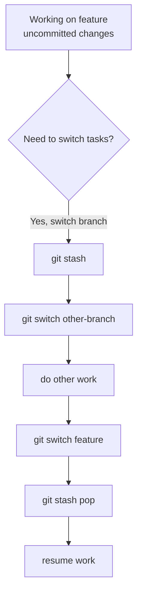

# 21. Stashing and the Working Directory

> **Tags:** #git #stash #workflow

`git stash` saves your uncommitted changes (both staged and unstaged) on a stack, restoring a clean working tree. You can later restore those changes. It is the "hold this for a moment" command.

---

## 21.1 When to Stash



Common scenarios:

- You are mid-feature and need to switch branches to fix an urgent bug.
- You want to pull the latest changes but have local modifications that conflict.
- You want to test whether a bug reproduces on a clean checkout, then return to your changes.
- You started down a wrong path and want to set the changes aside (not discard) before trying a different approach.

---

## 21.2 Basic Stash Commands

| Command | What it does |
| --- | --- |
| `git stash` | Save staged and unstaged tracked changes; restore working tree to HEAD. |
| `git stash push -m "message"` | Save with a descriptive message. |
| `git stash list` | List all stashes. |
| `git stash pop` | Apply the most recent stash and remove it from the stack. |
| `git stash apply` | Apply the most recent stash but keep it on the stack. |
| `git stash apply stash@{2}` | Apply a specific stash. |
| `git stash drop stash@{0}` | Remove a specific stash from the stack. |
| `git stash clear` | Remove all stashes. |
| `git stash show -p` | Show the diff of the most recent stash. |

---

## 21.3 What Stash Stores

`git stash` saves:

- **Staged changes** (modifications in the index).
- **Unstaged tracked changes** (modifications in the working tree to tracked files).

By default, `git stash` does **not** store:

- **Untracked files** — files Git does not know about. Use `git stash -u` (or `--include-untracked`) to include them.
- **Ignored files** — files in `.gitignore`. Use `git stash -a` (or `--all`) to include everything.

```bash
# Stash including untracked files
git stash -u

# Stash including untracked AND ignored files (rarely needed)
git stash -a
```

---

## 21.4 Stash Stack

Stashes form a stack. The most recent stash is `stash@{0}`, the next is `stash@{1}`, and so on.

```bash
git stash list
# Output:
# stash@{0}: WIP on feature: a1b2c3d Add login form
# stash@{1}: WIP on main: d4e5f6a Fix typo
# stash@{2}: On feature: refactoring attempt
```

To apply a specific stash:

```bash
git stash apply stash@{1}
```

---

## 21.5 Pop vs Apply

- **`git stash pop`** — apply the stash and remove it from the stack. If the apply causes conflicts, the stash is **not** removed (so you can retry or drop it manually).
- **`git stash apply`** — apply the stash but keep it on the stack. Safer if you are not sure the apply will work cleanly.

Use `apply` when you want to inspect the result before committing to it. Use `pop` when you are confident.

---

## 21.6 Stash Conflicts

If the stashed changes conflict with the current state of the working tree:

```bash
git stash pop
# CONFLICT in src/auth.js
```

Resolve the conflict as you would a merge conflict. After resolving and staging, the stash is removed from the stack (if you used `pop`).

If you want to abort:

```bash
git checkout --theirs src/auth.js  # or --ours
git checkout -- .
git stash drop  # remove the stash if you do not want to retry
```

---

## 21.7 Creating a Branch From a Stash

If a stash has been sitting around for a while and you want to turn it into a proper branch:

```bash
git stash branch feature/from-stash stash@{0}
```

This creates a new branch from the commit where the stash was created, applies the stash, and drops the stash if successful. Useful when the original branch has moved on and the stash no longer applies cleanly.

---

## 21.8 Common Mistakes

- **Stashing and forgetting.** Stashes are easy to forget. Run `git stash list` periodically to check for forgotten work.
- **Using stash as a permanent save.** Stashes are not commits; they are not pushed and can be lost if the `.git` directory is corrupted. If work is important, commit it (even as a draft) rather than stashing.
- **`git stash clear` by accident.** This permanently deletes all stashes with no confirmation. There is no easy recovery.
- **Not using `-u` for untracked files.** If you created new files and stash without `-u`, those files remain in your working tree and may confuse the next branch switch.
- **Popping into the wrong branch.** A stash created on `feature/a` may not apply cleanly on `main`. Always switch to the original branch before popping.

---

## 21.9 Key Takeaways

- `git stash` saves uncommitted changes and restores a clean working tree.
- Use `-u` to include untracked files.
- Stashes form a stack; `pop` applies and removes, `apply` applies and keeps.
- Use `git stash branch` to turn an old stash into a proper branch.
- Do not use stash as a permanent save — commit if the work matters.

---

**Previous:** [[20. Cherry Picking]]
**Next:** [[22. Tags and Release Management]]
