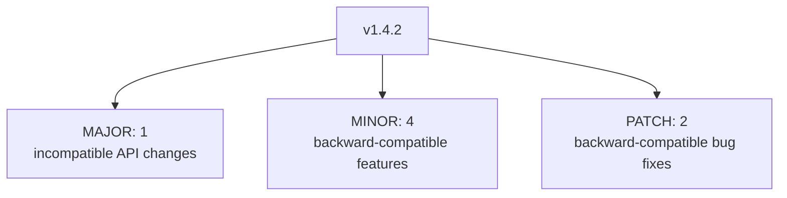
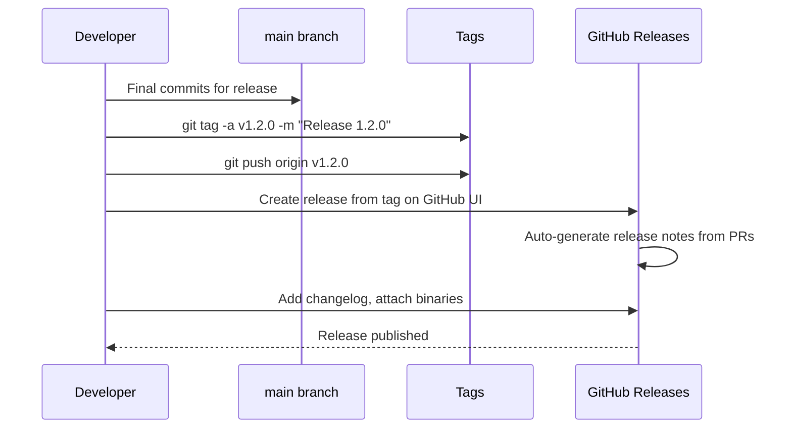

# 22. Tags and Release Management

> **Tags:** #git #tags #releases #versioning

A **tag** is a named pointer to a commit, like a branch, but **immutable** — it does not move as new commits are added. Tags are used to mark releases (`v1.0.0`, `v2.1.3`) and other significant points in history.

---

## 22.1 Lightweight vs Annotated Tags

| Tag type | What it is | When to use |
| --- | --- | --- |
| **Lightweight** | Just a ref pointing to a commit. No metadata. | Quick local markers; temporary labels. |
| **Annotated** | A full Git object (like a commit) with tagger, date, message, and optional signature. | Public releases; anything you will share. |

For releases, **always use annotated tags**. They carry metadata and can be GPG-signed for verification.

---

## 22.2 Creating Tags

```bash
# Lightweight tag
git tag v1.0

# Annotated tag
git tag -a v1.0 -m "Release 1.0: initial public release"

# Annotated tag with signature (requires GPG setup)
git tag -s v1.0 -m "Release 1.0"

# Tag a specific past commit
git tag -a v0.9 -m "Backtagging 0.9" abc1234
```

---

## 22.3 Listing and Inspecting Tags

```bash
# List all tags
git tag

# List tags matching a pattern
git tag -l "v1.*"

# See details of an annotated tag
git show v1.0
# Output:
# tag v1.0
# Tagger: Mersel <mersel@example.com>
# Date:   Tue Jun 25 10:00:00 2024 +0100
#
# Release 1.0: initial public release
#
# commit a1b2c3d (tag: v1.0)
# Author: ...
```

---

## 22.4 Pushing Tags

Tags are **not** pushed by `git push` by default. You must push them explicitly:

```bash
# Push a single tag
git push origin v1.0

# Push all tags
git push origin --tags

# Push tags and branches together
git push origin main --follow-tags
```

`--follow-tags` pushes only annotated tags reachable from the pushed commits. Configure it as default:

```bash
git config --global push.followTags true
```

---

## 22.5 Deleting Tags

```bash
# Delete a local tag
git tag -d v1.0

# Delete a remote tag
git push origin --delete v1.0
```

---

## 22.6 Semantic Versioning

Most projects use **Semantic Versioning (SemVer)** for release tags: `MAJOR.MINOR.PATCH`.



| Version bump | When to use | Example |
| --- | --- | --- |
| **Major** (1.x.x → 2.0.0) | Breaking changes; existing code may not work. | Removing a public API; changing a return type. |
| **Minor** (1.4.x → 1.5.0) | New backward-compatible features. | Adding a new endpoint; new optional parameter. |
| **Patch** (1.4.2 → 1.4.3) | Backward-compatible bug fixes. | Fixing a crash; correcting a calculation. |

Pre-release suffixes: `1.0.0-alpha`, `1.0.0-beta.2`, `1.0.0-rc.1`. Build metadata: `1.0.0+20240625`.

---

## 22.7 The Release Workflow



A typical release:

1. Ensure `main` is in a releasable state (all tests pass, CI green).
2. Update the version in `package.json` / `Cargo.toml` / etc.
3. Commit the version bump: `chore: bump version to 1.2.0`.
4. Tag the commit: `git tag -a v1.2.0 -m "Release 1.2.0"`.
5. Push the commit and the tag: `git push && git push origin v1.2.0`.
6. On GitHub, create a Release from the tag. Add release notes (changelog).
7. If applicable, attach build artifacts (binaries, installers).
8. Announce the release.

---

## 22.8 GitHub Releases

GitHub Releases are a UI layer on top of Git tags. A release is associated with a tag and adds:

- A **title** and **description** (markdown).
- **Release notes** (can be auto-generated from merged PRs).
- **Binary attachments** (compiled binaries, installers).
- A **"latest"** flag (GitHub marks the most recent non-prerelease release as "latest").

Releases make it easy for users to find and download specific versions without navigating Git history.

---

## 22.9 Changelog Management

Two common approaches:

### Keep a CHANGELOG.md file

```markdown
# Changelog

## [1.2.0] - 2024-06-25
### Added
- Login with OAuth
### Fixed
- Crash on empty cart

## [1.1.0] - 2024-05-10
### Added
- Dark mode
```

Update the file with each release. Tools like `conventional-changelog` can generate it from commit messages.

### Auto-generate from commits

Use Conventional Commits (see [[8. Commits and Commit Messages]] in Chapter 1) and tools like `semantic-release` to auto-generate changelogs and bump versions based on commit types.

---

## 22.10 Common Mistakes

- **Using lightweight tags for releases.** They lack metadata. Use annotated tags (`-a`).
- **Forgetting to push tags.** `git push` does not push tags by default. Use `git push origin <tag>` or `--tags`.
- **Tagging the wrong commit.** If you tag before the final release commit, the tag points to the wrong state. Delete and recreate.
- **Inconsistent versioning.** Mixing `1.0`, `v1.0`, `1.0.0` confuses users. Pick one format (e.g., `v1.0.0`) and stick to it.
- **Not writing release notes.** Users need to know what changed. Even a one-line summary helps.

---

## 22.11 Key Takeaways

- Tags are immutable named pointers to commits.
- Use **annotated tags** (`-a`) for releases; lightweight tags for local markers.
- Tags are not pushed by default; push explicitly.
- Follow Semantic Versioning: `MAJOR.MINOR.PATCH`.
- GitHub Releases add a UI layer with notes and binaries on top of tags.
- Maintain a changelog or auto-generate one from conventional commits.

---

**Previous:** [[21. Stashing and the Working Directory]]
**Next:** [[23. Pull Requests and Code Reviews]]
