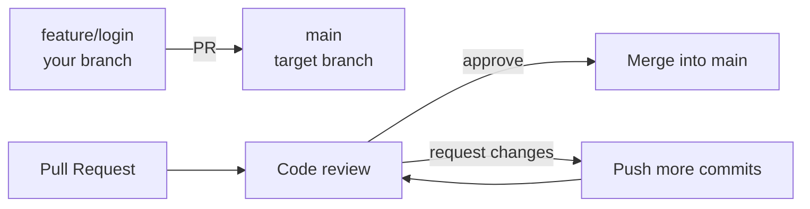
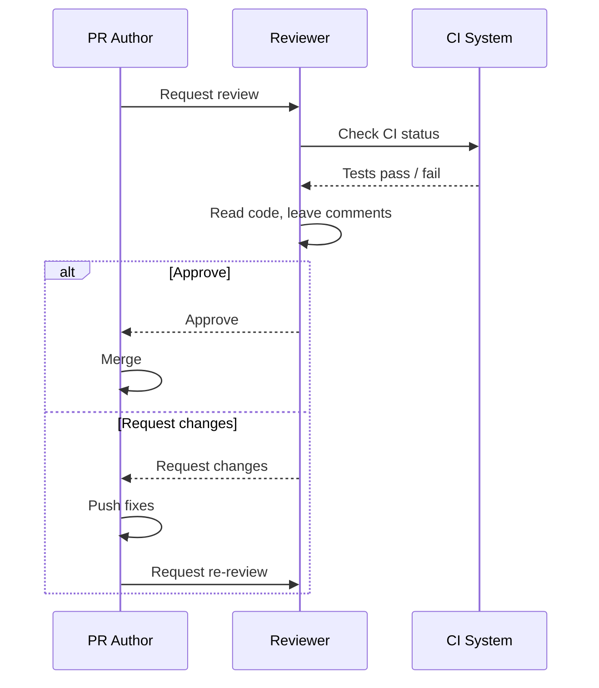

# 23. Pull Requests and Code Reviews

> **Tags:** #git #github #pull-requests #code-review #workflow

A **pull request** (PR) — called a **merge request** on GitLab — is a request to merge a branch into another branch, accompanied by discussion and review. PRs are the central collaboration mechanism on GitHub. This note covers how to create them, how to review them, and the etiquette that makes them effective.

---

## 23.1 What a Pull Request Is



A PR is not a Git concept — it is a GitHub feature. Under the hood, a PR is metadata on top of two branches: a source (head) and a target (base). The PR tracks the diff between them, the discussion, the review status, and the CI checks.

---

## 23.2 Creating a PR

### From the Command Line (using GitHub CLI)

```bash
# Push your feature branch
git push -u origin feature/login

# Create the PR
gh pr create --title "Add login form" --body "Implements the login UI and validation."
```

The `gh` CLI opens an editor for the body if you omit `--body`, or you can write the body in a markdown file and pass `--body-file pr-description.md`.

### From the GitHub Web UI

1. Push your branch to GitHub.
2. GitHub shows a "Compare & pull request" button on the repository page.
3. Click it.
4. Write a title and description.
5. Choose the target branch (usually `main`).
6. Click "Create pull request."

---

## 23.3 The PR Description

A good PR description has:

```markdown
## What
One-sentence summary of what this PR does.

## Why
The motivation. What problem does it solve? Link to the issue: Fixes #123.

## How
Brief description of the approach. Highlight any non-obvious decisions.

## Testing
How to test this change. Steps to reproduce, expected behavior.

## Screenshots (if UI)
Before / after images.

## Checklist
- [ ] Tests added
- [ ] Documentation updated
- [ ] CHANGELOG updated
```

The description is the reviewer's first impression. A vague description ("fix bug") wastes everyone's time. A detailed description makes review fast and pleasant.

---

## 23.4 The Review Process



### Reviewer Etiquette

- **Review the code, not the person.** "This function is hard to follow" not "You wrote this badly."
- **Be specific.** "Line 42: this will fail if `user` is null" not "this is buggy."
- **Explain why.** "Suggest extracting this into a helper because it is duplicated in three places."
- **Distinguish "must fix" from "nitpick."** Use prefixes like `[nit]` or `[optional]` for minor suggestions.
- **Approve when ready.** Do not block on nits. If the code is correct and readable, approve with optional suggestions.
- **Respond promptly.** If you cannot review within a day, say so. Do not leave the author waiting in silence.

### Author Etiquette

- **Self-review before requesting.** Read through your own diff. Catch the obvious issues first.
- **Keep PRs small.** A 50-line PR gets a thorough review; a 500-line PR gets a skim. Split large work into smaller PRs.
- **Respond to every comment.** Even if you disagree, acknowledge the feedback. Push commits that address the comment, or explain why you chose a different approach.
- **Do not take feedback personally.** The goal is better code, not a verdict on you.
- **Mark resolved threads.** After addressing a comment, resolve the conversation so the reviewer knows.

---

## 23.5 Review Types

| Review type | Meaning |
| --- | --- |
| **Comment** | General feedback; does not block merge. |
| **Approve** | The reviewer approves; merge is allowed. |
| **Request changes** | The reviewer requires changes before merge. |

On GitHub, you can also mark a review as a "reviewer" review or a non-blocking comment.

---

## 23.6 CI Checks on PRs

Most projects configure CI (GitHub Actions, etc.) to run on every PR:

- **Lint** — code style checks.
- **Tests** — unit and integration tests.
- **Build** — verify the project compiles.
- **Coverage** — verify test coverage does not drop.

A PR with failing CI should not be merged. If a test is flaky, fix the flakiness or mark the test as skipped with an explanation.

---

## 23.7 Merge Strategies on GitHub

When you click "Merge pull request," GitHub offers up to three strategies:

| Strategy | What it does |
| --- | --- |
| **Create a merge commit** | Default. Creates a merge commit on the target branch. Preserves all feature commits. |
| **Squash and merge** | Combines all feature commits into one commit on the target. Clean history; loses individual commit detail. |
| **Rebase and merge** | Replays each feature commit onto the target. No merge commit; linear history. |

Choose based on team convention:

- **Merge commit** — preserves context of the feature branch; good for auditability.
- **Squash** — clean history; good for small features with messy commit logs.
- **Rebase** — linear history; good for one-commit-per-feature conventions.

---

## 23.8 Draft PRs

GitHub supports **draft PRs** — PRs that are explicitly marked as work-in-progress. They cannot be merged until marked "ready for review."

Use draft PRs to:

- Get early feedback on a direction before the code is polished.
- Show progress on a large feature.
- Run CI on a branch before requesting review.

Mark a PR as draft when creating it, or via the "Convert to draft" button on an existing PR.

---

## 23.9 Common Mistakes

- **Giant PRs.** Reviewers cannot effectively review 1000-line PRs. Split them.
- **Vague descriptions.** "Fix bug" tells the reviewer nothing. Describe what, why, and how.
- **Not running CI.** Merging with red CI breaks `main` for everyone.
- **Ignoring review comments.** If you disagree, say so — do not silently dismiss feedback.
- **Reviewing too quickly.** A 10-second "LGTM" review misses bugs. Read the code carefully.
- **Reviewing too slowly.** If reviews take a week, the author context-switches and productivity drops. Aim for 24-hour turnaround.

---

## 23.10 Key Takeaways

- A PR is a request to merge a branch, with discussion and review.
- Write a detailed description: what, why, how, testing.
- Reviewers: be specific, kind, and prompt. Distinguish must-fix from nits.
- Authors: self-review, keep PRs small, respond to every comment.
- Three merge strategies: merge commit, squash, rebase. Pick a team convention.
- Use draft PRs for early feedback.

---

**Previous:** [[22. Tags and Release Management]]
**Next:** [[24. Forks and Open Source Workflows]]
