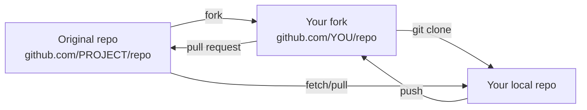

# 24. Forks and Open Source Workflows

> **Tags:** #git #github #forks #open-source #workflow

A **fork** is a personal copy of someone else's repository on GitHub. Forks are the foundation of open source contribution: you cannot push to a repository you do not own, but you can fork it, make changes in your fork, and submit a pull request back to the original.

---

## 24.1 The Fork Workflow



The workflow:

1. **Fork** the original repository on GitHub (click the "Fork" button).
2. **Clone** your fork locally.
3. Add the original repository as a remote called `upstream`.
4. Create a feature branch.
5. Make changes and push to your fork (`origin`).
6. Open a pull request from your fork's branch to the original's `main`.

---

## 24.2 Setting Up the Fork

```bash
# 1. Fork on GitHub via the web UI

# 2. Clone YOUR fork (not the original)
git clone git@github.com:YOU/repo.git
cd repo

# 3. Add the original as 'upstream'
git remote add upstream git@github.com:PROJECT/repo.git

# 4. Verify
git remote -v
# Output:
# origin    git@github.com:YOU/repo.git (fetch)
# origin    git@github.com:YOU/repo.git (push)
# upstream  git@github.com:PROJECT/repo.git (fetch)
# upstream  git@github.com:PROJECT/repo.git (push)
```

---

## 24.3 Keeping Your Fork in Sync

The original repository (`upstream`) continues to receive changes. Your fork does not update automatically. Sync periodically:

```bash
# 1. Fetch the latest from upstream
git fetch upstream

# 2. Switch to your local main
git switch main

# 3. Merge upstream's main into your main
git merge upstream/main

# 4. Push the updated main to your fork
git push origin main
```

Or, if you prefer rebase:

```bash
git fetch upstream
git rebase upstream/main
git push origin main --force-with-lease
```

---

## 24.4 Submitting a Pull Request

```bash
# 1. Create a feature branch from the latest main
git switch main
git pull upstream main
git switch -c fix/typo-in-readme

# 2. Make your changes
# (edit files)
git add .
git commit -m "docs: fix typo in README"

# 3. Push to YOUR fork
git push -u origin fix/typo-in-readme

# 4. Open a PR on GitHub from YOU/repo:fix/typo-in-readme to PROJECT/repo:main
gh pr create --repo PROJECT/repo --base main --head YOU:fix/typo-in-readme \
  --title "Fix typo in README" --body "Corrects a spelling error in the installation section."
```

---

## 24.5 Tips for Open Source Contributions

- **Read `CONTRIBUTING.md`.** Most projects have one. It explains the contribution process, coding standards, and PR expectations.
- **Start small.** Documentation fixes, typo corrections, and small bug fixes are great first contributions. Look for issues tagged `good first issue`.
- **Open an issue first.** For non-trivial changes, open an issue describing what you want to do before writing code. Maintainers may have guidance that saves you time.
- **Follow the project's conventions.** Code style, commit message format, test requirements — match what the project already does.
- **Be patient.** Maintainers are often volunteers. It may take days or weeks for a review. Politely ping after a week of silence.
- **Be respectful.** Maintainers may reject your PR. Accept feedback gracefully. You can always fork and maintain your own version.
- **Sign your work.** Some projects require a Developer Certificate of Origin (DCO) sign-off (`git commit -s`) or a Contributor License Agreement (CLA). Check the contribution guide.

---

## 24.6 Forks vs Branches

| Aspect | Fork | Branch |
| --- | --- | --- |
| Ownership | Your copy of someone else's repo | Within a single repo |
| Permissions | You have full write access to your fork | You need write access to the repo |
| Use case | Contributing to projects you do not own | Internal team collaboration |
| PR direction | From your fork to the original | From your branch to `main` within the same repo |

For internal team projects, use branches (not forks). For open source, use forks.

---

## 24.7 Common Mistakes

- **Cloning the original instead of your fork.** You will not have push access. Clone your fork; add the original as `upstream`.
- **Forgetting to sync with upstream.** Your fork falls behind, and your PR may conflict with recent changes.
- **Committing to `main` in your fork.** If you commit directly to `main` in your fork and then try to sync, you get conflicts. Always use feature branches.
- **Not reading the contribution guide.** Each project has its own conventions. Ignoring them wastes the maintainer's time.
- **Opening a PR without testing.** Make sure your change works. Run the project's tests locally before submitting.

---

## 24.8 Key Takeaways

- A fork is your personal copy of a repository on GitHub.
- Clone your fork; add the original as `upstream`.
- Sync periodically with `git fetch upstream` and merge.
- Submit PRs from your fork's feature branch to the original's `main`.
- Read `CONTRIBUTING.md`, start small, be patient and respectful.

---

**Previous:** [[23. Pull Requests and Code Reviews]]
**Next:** [[25. GitHub Actions and CI CD]]
