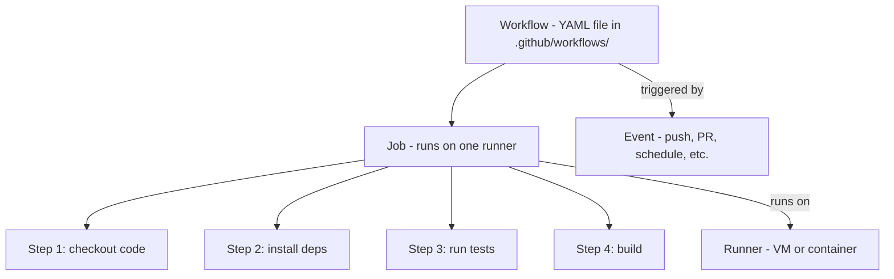

# 25. GitHub Actions and CI CD

> **Tags:** #git #github #ci-cd #actions #automation

**GitHub Actions** is GitHub's built-in CI/CD platform. It lets you automate workflows — running tests, building artifacts, deploying applications — in response to events like pushes, pull requests, and releases. This note covers the fundamentals of writing and using GitHub Actions.

---

## 25.1 Key Concepts



| Concept | What it is |
| --- | --- |
| **Workflow** | A YAML file in `.github/workflows/` defining an automated process. |
| **Event** | What triggers a workflow (push, pull_request, schedule, workflow_dispatch, release, etc.). |
| **Job** | A set of steps that run on the same runner. Jobs can run in parallel or sequentially. |
| **Step** | An individual task within a job: a shell command or a pre-built action. |
| **Action** | A reusable unit of code that performs a task (e.g., `actions/checkout`). |
| **Runner** | The machine (VM or container) that executes the job. GitHub provides Ubuntu, Windows, and macOS runners. |

---

## 25.2 A Minimal Workflow

```yaml
# .github/workflows/ci.yml
name: CI

on:
  push:
    branches: [main]
  pull_request:
    branches: [main]

jobs:
  test:
    runs-on: ubuntu-latest
    steps:
      - name: Checkout code
        uses: actions/checkout@v4

      - name: Set up Node.js
        uses: actions/setup-node@v4
        with:
          node-version: '20'

      - name: Install dependencies
        run: npm ci

      - name: Run tests
        run: npm test
```

This workflow:

1. Triggers on push or PR to `main`.
2. Runs on an Ubuntu VM.
3. Checks out the code.
4. Installs Node.js 20.
5. Installs dependencies with `npm ci`.
6. Runs the test suite.

---

## 25.3 Common Events

| Event | Triggers when |
| --- | --- |
| `push` | Commits are pushed to a branch. |
| `pull_request` | A PR is opened, updated, or reopened. |
| `schedule` | On a cron schedule. |
| `workflow_dispatch` | Manually triggered from the GitHub UI. |
| `release` | A release is published. |
| `issues` | An issue is opened, closed, etc. |
| `issue_comment` | A comment is added to an issue or PR. |

Example with multiple events:

```yaml
on:
  push:
    branches: [main, develop]
  pull_request:
  schedule:
    - cron: '0 2 * * *'  # daily at 2 AM UTC
  workflow_dispatch:      # manual button
```

---

## 25.4 Jobs and Steps

A workflow has one or more **jobs**. By default, jobs run in **parallel**. Use `needs` to make jobs depend on each other:

```yaml
jobs:
  lint:
    runs-on: ubuntu-latest
    steps:
      - uses: actions/checkout@v4
      - run: npm run lint

  test:
    runs-on: ubuntu-latest
    needs: lint  # wait for lint to pass
    steps:
      - uses: actions/checkout@v4
      - run: npm test

  deploy:
    runs-on: ubuntu-latest
    needs: test  # wait for test to pass
    if: github.ref == 'refs/heads/main'  # only on main
    steps:
      - run: echo "Deploying..."
```

---

## 25.5 Using Pre-Built Actions

The GitHub Marketplace (github.com/marketplace) has thousands of pre-built actions. Reference them with `uses`:

```yaml
steps:
  - uses: actions/checkout@v4          # checkout the repo
  - uses: actions/setup-node@v4        # install Node.js
    with:
      node-version: '20'
  - uses: actions/cache@v4              # cache dependencies
    with:
      path: ~/.npm
      key: ${{ runner.os }}-node-${{ hashFiles('**/package-lock.json') }}
  - uses: actions/upload-artifact@v4    # upload build output
    with:
      name: build
      path: dist/
```

Always pin actions to a specific version (`@v4`, `@v4.0.1`) — never use `@main` or `@master` in production, as a malicious update could compromise your workflow.

---

## 25.6 Secrets and Environment Variables

Store sensitive values (API keys, tokens) as **secrets** in the repository settings. Reference them in workflows:

```yaml
steps:
  - name: Deploy
    run: ./deploy.sh
    env:
      DEPLOY_TOKEN: ${{ secrets.DEPLOY_TOKEN }}
```

Secrets are masked in logs. Non-sensitive values can be stored as **variables** (repository settings → Variables).

---

## 25.7 Caching

Caching speeds up workflows by reusing downloaded dependencies between runs:

```yaml
- uses: actions/cache@v4
  with:
    path: |
      ~/.npm
      node_modules
    key: ${{ runner.os }}-node-${{ hashFiles('package-lock.json') }}
    restore-keys: |
      ${{ runner.os }}-node-
```

The `key` should include a hash of the lockfile so the cache is invalidated when dependencies change.

---

## 25.8 Matrix Builds

Run a job across multiple versions, OSes, or configurations with a **matrix**:

```yaml
jobs:
  test:
    runs-on: ${{ matrix.os }}
    strategy:
      matrix:
        os: [ubuntu-latest, macos-latest, windows-latest]
        node-version: ['18', '20', '22']
    steps:
      - uses: actions/checkout@v4
      - uses: actions/setup-node@v4
        with:
          node-version: ${{ matrix.node-version }}
      - run: npm ci
      - run: npm test
```

This runs the job 9 times (3 OSes × 3 Node versions) in parallel.

---

## 25.9 Continuous Deployment

A CD workflow deploys when code is merged to `main`:

```yaml
name: Deploy

on:
  push:
    branches: [main]

jobs:
  deploy:
    runs-on: ubuntu-latest
    steps:
      - uses: actions/checkout@v4
      - uses: actions/setup-node@v4
        with:
          node-version: '20'
      - run: npm ci
      - run: npm run build
      - name: Deploy to production
        run: |
          rsync -avz dist/ user@server:/var/www/app/
        env:
          SSH_PRIVATE_KEY: ${{ secrets.SSH_PRIVATE_KEY }}
```

For cloud platforms (Vercel, Netlify, AWS, Azure), use the platform's action or CLI.

---

## 25.10 Common Mistakes

- **Not pinning action versions.** `uses: actions/checkout@main` is dangerous. Pin to `@v4` or a specific commit hash.
- **Exposing secrets in logs.** Do not `echo $SECRET`. GitHub masks secrets, but only exact matches.
- **Running everything on every push.** Expensive workflows slow development. Use path filters to skip workflows when irrelevant files change.
- **Not caching.** Without caching, every workflow re-downloads all dependencies. Add caching from day one.
- **Ignoring failing CI.** If CI is red on `main`, fix it immediately. A broken main blocks the whole team.
- **Putting secrets in the workflow file.** Use the Secrets UI, never hardcode tokens in YAML.

---

## 25.11 Key Takeaways

- GitHub Actions is a CI/CD platform built into GitHub.
- Workflows are YAML files in `.github/workflows/`.
- Workflows have jobs; jobs have steps; steps use actions or run commands.
- Trigger on push, PR, schedule, manual, etc.
- Use the Marketplace for pre-built actions; pin versions.
- Store secrets in the Secrets UI; cache dependencies for speed.
- Matrix builds test across multiple configurations.

---

**Previous:** [[24. Forks and Open Source Workflows]]
**Next:** [[26. Monorepos]]
