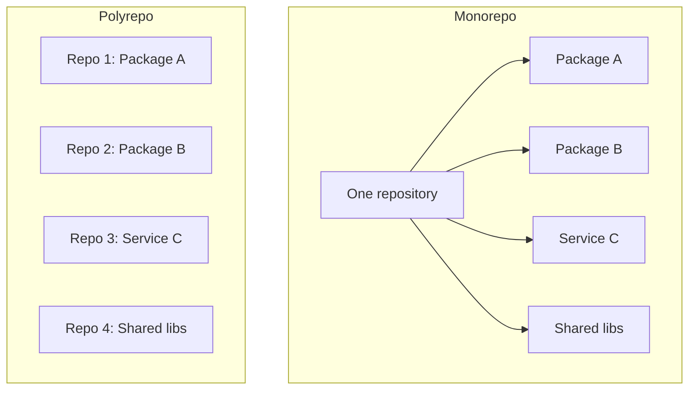

# 26. Monorepos

> **Tags:** #git #monorepo #architecture #workflow

A **monorepo** is a single Git repository that contains multiple projects, packages, or services. The alternative is a **polyrepo** (or multirepo) approach, where each project has its own repository. Both approaches are valid; the choice depends on team structure, project scale, and tooling.

---

## 26.1 Monorepo vs Polyrepo



| Aspect | Monorepo | Polyrepo |
| --- | --- | --- |
| **Visibility** | All code in one place; easy to find and refactor across projects | Each project is isolated; cross-repo changes require coordination |
| **Atomic commits** | A change spanning multiple packages is one commit | Cross-repo changes require multiple PRs and version bumps |
| **Tooling** | Requires specialized tooling (Nx, Turborepo, Bazel, Lerna) | Each repo has simple, independent tooling |
| **Access control** | Everyone sees everything (usually) | Per-repo permissions |
| **CI/CD** | Needs smart incremental builds | Each repo has its own simple CI |
| **Clone size** | Large; needs sparse checkout or partial clone | Small; each repo is lean |

---

## 26.2 When to Use a Monorepo

A monorepo shines when:

- **Multiple packages share code.** A UI component library used by several apps.
- **Teams need to make atomic changes across projects.** Updating an API and its consumers in one PR.
- **You want unified tooling.** One linting config, one test setup, one CI pipeline.
- **Code reuse is high.** Shared utilities, types, and patterns across projects.

A polyrepo is better when:

- **Projects are independent.** Different teams, different release cycles, no shared code.
- **Access must be restricted.** Different contractors or clients need isolated access.
- **The projects are in different languages** with incompatible toolchains.
- **The repository would be too large to clone.** (Though Git partial clone mitigates this.)

---

## 26.3 Monorepo Structure

A typical monorepo layout:

```text
my-monorepo/
  apps/
      web/          # frontend application
      api/          # backend API
      admin/        # admin dashboard
  packages/
      ui/           # shared UI components
      utils/        # shared utilities
      types/        # shared TypeScript types
      config/       # shared configuration (eslint, tsconfig, etc.)
  tools/
      scripts/      # build and deployment scripts
  package.json      # root workspace config
  turbo.json        # Turborepo config (or nx.json for Nx)
  .github/
      workflows/    # CI for the whole monorepo
```

---

## 26.4 Workspaces

Package managers support **workspaces** — a way to manage multiple packages in one repo with shared `node_modules`:

### npm workspaces (npm 7+)

```json
// root package.json
{
  "name": "my-monorepo",
  "workspaces": ["apps/*", "packages/*"]
}
```

```bash
npm install         # installs all workspace dependencies
npm run build -w @my/ui  # run script in a specific workspace
npm run build --workspaces  # run in all workspaces
```

### pnpm workspaces

```yaml
# pnpm-workspace.yaml
packages:
  - 'apps/*'
  - 'packages/*'
```

pnpm is popular for monorepos because it is fast, disk-efficient (hard links), and has strict dependency resolution.

### Yarn workspaces

```json
{
  "private": true,
  "workspaces": ["apps/*", "packages/*"]
}
```

---

## 26.5 Build Orchestration Tools

Managing builds across many packages requires orchestration to avoid rebuilding unchanged packages.

### Turborepo

```json
// turbo.json
{
  "pipeline": {
    "build": {
      "dependsOn": ["^build"],  // build dependencies first
      "outputs": ["dist/**"]
    },
    "test": {
      "dependsOn": ["build"],
      "outputs": []
    },
    "lint": {}
  }
}
```

Turborepo:

- Runs tasks in parallel.
- Caches task output (locally and remotely).
- Only runs tasks for packages that changed.
- Supports remote caching via Vercel.

### Nx

Nx is more feature-rich than Turborepo:

- Dependency graph visualization.
- Affected command (run tasks only for affected packages).
- Code generators (scaffolding).
- Plugin ecosystem for frameworks (React, Angular, Node, etc.).

```bash
npx nx graph           # visualize the dependency graph
npx nx affected:build  # build only affected packages
npx nx affected:test   # test only affected packages
```

### Bazel

Bazel (by Google) is the heavyweight option for very large monorepos (Google, Uber, others). It supports multiple languages, hermetic builds, and massive scale, but has a steep learning curve.

---

## 26.6 Cross-Package Dependencies

In a monorepo, packages depend on each other by name:

```json
// packages/ui/package.json
{
  "name": "@my/ui",
  "dependencies": {
    "@my/utils": "workspace:*"  // or "^1.0.0" with changesets
  }
}
```

The `workspace:*` protocol (pnpm, Yarn) resolves to the local workspace package during development. When publishing, it is replaced with the real version.

---

## 26.7 Versioning and Publishing

### Fixed/Locked Versioning

All packages share one version number. When any package changes, all packages are bumped and published. Simple but heavy.

### Independent Versioning

Each package has its own version. Only changed packages are bumped and published. More flexible but more complex.

### Changesets

`changesets` is a popular tool for managing versions and changelogs in monorepos:

```bash
npx changeset          # describe a change (which package, major/minor/patch, summary)
npx changeset version  # apply changesets, bump versions, update changelogs
npx changeset publish  # publish to npm
```

Each changeset is a markdown file in `.changeset/` describing what changed and how to version it.

---

## 26.8 CI for Monorepos

The challenge: avoid running every test on every push. Solutions:

### Path filters

```yaml
# .github/workflows/api.yml
on:
  push:
    paths:
      - 'apps/api/**'
      - 'packages/**'
      - '.github/workflows/api.yml'
```

### Affected detection (Nx)

```yaml
jobs:
  test:
    runs-on: ubuntu-latest
    steps:
      - uses: actions/checkout@v4
        with:
          fetch-depth: 0  # need full history for affected detection
      - run: npx nx affected:test --base=${{ github.event.before }} --head=HEAD
```

### Turborepo caching

```yaml
- run: npx turbo test --remote-cache-token=${{ secrets.TURBO_TOKEN }}
```

With remote caching, if the same task has run before (on any machine), the cached result is reused.

---

## 26.9 Common Mistakes

- **No build orchestration.** Without Nx or Turborepo, builds are slow and redundant.
- **Circular dependencies.** Package A depends on B, B depends on A. Use `nx graph` or `madge` to detect.
- **Publishing everything on every change.** Use changesets or affected detection to publish only what changed.
- **No shared configuration.** Each package has its own tsconfig, eslint config — drift is inevitable. Centralize in `packages/config`.
- **Giant root package.json.** Keep root minimal; put dependencies in the packages that need them.
- **Not using workspaces.** Manual `npm install` in each package directory is error-prone. Use workspaces.

---

## 26.10 Key Takeaways

- A monorepo holds multiple projects in one repository.
- Use it when projects share code, need atomic changes, or benefit from unified tooling.
- Structure: `apps/`, `packages/`, `tools/`, with a root workspace config.
- Use package manager workspaces (npm, pnpm, Yarn) for dependency management.
- Use Turborepo, Nx, or Bazel for build orchestration and caching.
- Use changesets for independent versioning and publishing.
- In CI, use path filters or affected detection to run only relevant tasks.

---

**Previous:** [[25. GitHub Actions and CI CD]]
**Next chapter:** [[1. Password Authentication Not Supported]] (Chapter 2)
