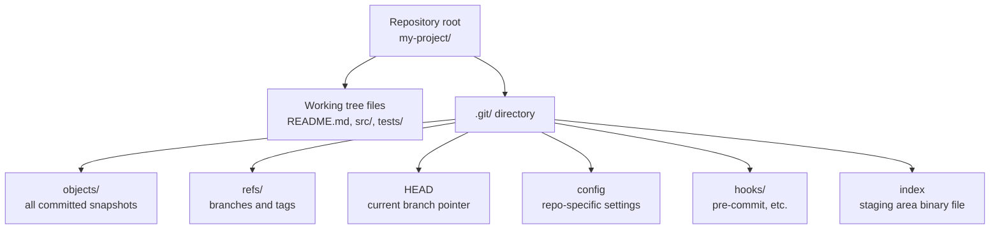
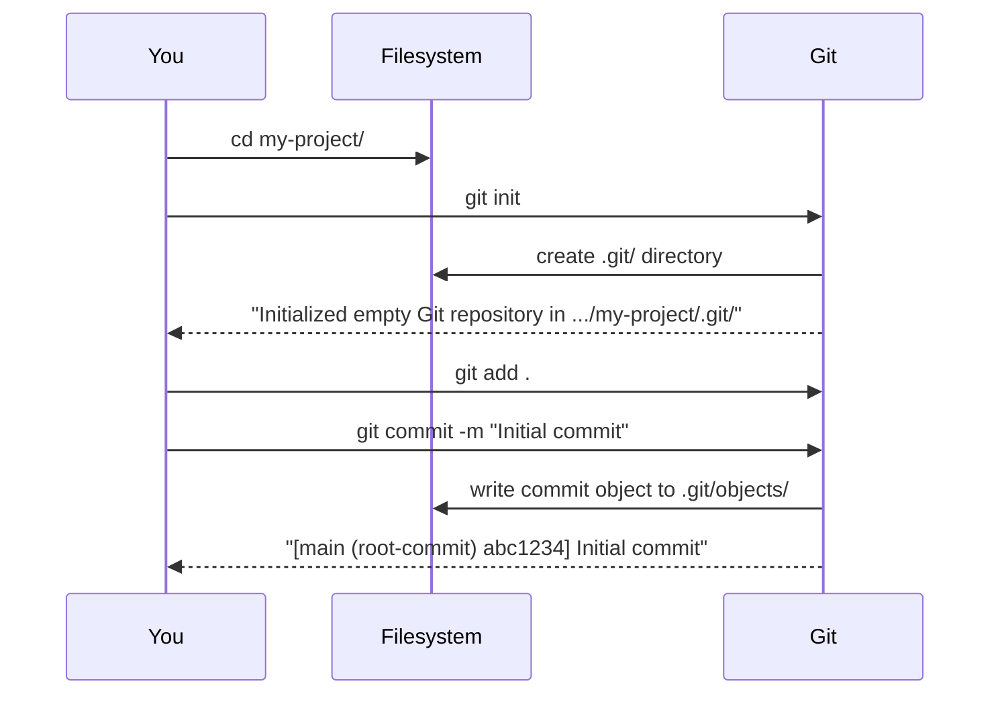

# 3. What is a Repository

> **Tags:** #git #foundations #repository

A **repository** (almost always shortened to **repo**) is the fundamental data structure of Git. Everything Git does — every commit, branch, tag, and remote — lives inside a repository. This note explains what a repository is, what it contains, how to create one, and how to inspect it.

---

## 3.1 Definition

A repository is a directory on disk that Git is tracking. Concretely, it consists of:

1. A **working tree** — the actual files and subdirectories you see and edit.
2. A **`.git` directory** — a hidden folder at the root of the working tree that contains all of Git's internal data: commits, branches, tags, configuration, hooks, and the staging area.

If a directory contains a `.git` subdirectory, it is a Git repository. If it does not, it is not.



---

## 3.2 The .git Directory in Detail

Most users never look inside `.git`, but understanding its structure takes the mystery out of Git.

| Path | Contents |
| --- | --- |
| `.git/HEAD` | A single line naming the current branch (e.g., `ref: refs/heads/main`). |
| `.git/config` | Repository-specific configuration: remotes, user name/email, etc. |
| `.git/objects/` | Every commit, tree, and blob ever stored, addressed by SHA-1 hash. |
| `.git/refs/heads/` | One file per local branch; each file contains the commit hash the branch points to. |
| `.git/refs/remotes/` | One file per remote-tracking branch (e.g., `origin/main`). |
| `.git/refs/tags/` | One file per tag. |
| `.git/index` | A binary file representing the staging area. |
| `.git/hooks/` | Sample scripts that fire on specific Git events. |
| `.git/logs/` | Reflog data — a record of where HEAD and branches have been. |

If you ever accidentally delete `.git`, the repository is gone — but the working tree files remain. This is why the `.git` directory is sometimes described as "the only thing that makes your folder a Git repo."

---

## 3.3 Local vs Remote Repositories

A repository can exist in two places, and the same project usually has both:


- **Local repository** lives on your machine. You commit to it directly. It is private until you push.
- **Remote repository** lives on a server. It is the synchronization point between collaborators.

A single local repository can have **multiple remotes** — for example, `origin` pointing to your fork on GitHub and `upstream` pointing to the original project you forked from. See [[13. What is a Remote]] for details.

---

## 3.4 Creating a Repository

There are two fundamentally different ways to start working with a repository, and they correspond to two different starting situations.

### Method 1: Initialize a New Repository

Use this when you have an existing folder of files (or an empty folder) on your local machine and you want to start tracking it with Git.

```bash
cd my-project/
git init
```

`git init` creates a `.git` directory inside `my-project/`. The files themselves are not yet tracked — they are untracked until you `git add` and `git commit` them.



### Method 2: Clone an Existing Repository

Use this when a repository already exists on a remote server and you want a local copy.

```bash
git clone https://github.com/username/repo.git
```

`git clone` does four things in one shot:

1. Creates a new directory named after the repo (`repo/` in this example).
2. Initializes a `.git` directory inside it.
3. Downloads all commits, branches, and tags from the remote.
4. Checks out the default branch into the working tree.

After cloning, you have a fully functional local repository that knows about its origin remote.

---

## 3.5 Inspecting a Repository

Three commands tell you almost everything you need to know about a repository's state:

| Command | What it tells you |
| --- | --- |
| `git status` | Which files are modified, staged, or untracked; which branch you are on; whether you are ahead of or behind the remote. |
| `git log --oneline --graph` | A compact visual history of commits and branches. |
| `git remote -v` | The list of remotes and their URLs. |

See [[10. Git Status Explained]] for a deep dive on `git status`.

---

## 3.6 What a Repository Is Not

- A repository is **not** a backup system by itself. Pushing to a remote is what creates the backup; an unpushed local repository can be lost if the disk dies.
- A repository is **not** a folder sync tool. Git tracks *file content*, not file metadata like permissions or creation timestamps (it tracks only the executable bit).
- A repository is **not** only for code. Any folder of text files — book drafts, research notes, configuration files — can benefit from version control. Binary files (images, videos, Office documents) work but do not diff usefully.

---

## 3.7 Common Beginner Mistakes

- **Nesting repositories.** Putting one repository inside another (e.g., initializing a Git repo inside an existing Git repo's subdirectory) leads to confusing behavior. Use submodules or separate repositories instead.
- **Committing the `.git` directory of an inner repo.** If you have a nested `.git`, the parent repository will treat the inner folder as a "gitlink" rather than tracking its files. This is almost never what you want.
- **Deleting `.git` to "start over."** This destroys all history. If you want to undo your last commit, use `git reset`; do not delete `.git`.

---

## 3.8 Key Takeaways

- A repository is a working tree **plus** a `.git` directory.
- The `.git` directory contains all of Git's internal data — commits, branches, tags, config.
- You create repositories with either `git init` (start fresh) or `git clone` (copy existing).
- Local repositories synchronize with remote repositories via `git push` and `git pull`.

---

**Previous:** [[2. CLI vs Terminal]]
**Next:** [[4. Open Source Software]]
