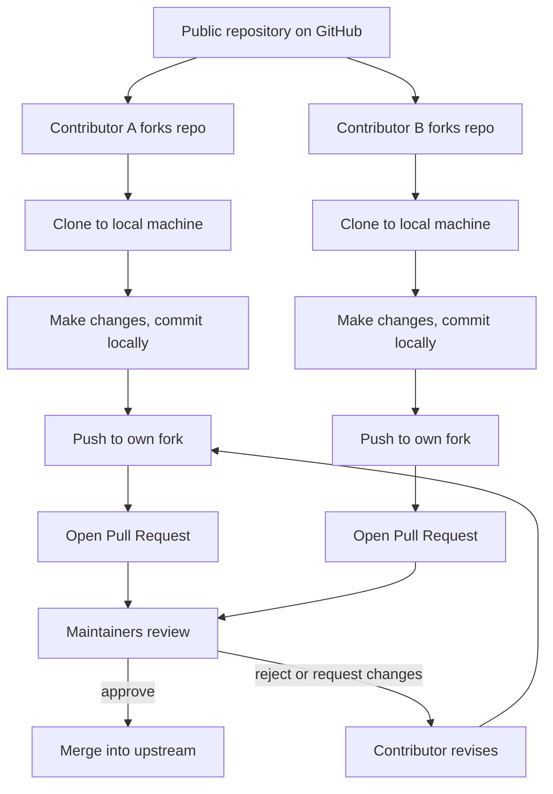

# 4. Open Source Software

> **Tags:** #git #github #open-source #foundations

"Open source" is one of the most important ideas in modern software development, and GitHub is the platform where most open source work happens. This note explains what open source means, how it works in practice, what licenses are involved, and how you can participate.

---

## 4.1 Definition

**Open source software** is software whose source code is made available to the public under a license that grants anyone the right to view, use, modify, and redistribute the code. The "open" in open source refers specifically to the source code being open — that is, accessible — not just to the software being free of charge.

The two terms **"open source"** and **"free software"** overlap heavily but emphasize different values:

- **Free software** (Richard Stallman / FSF tradition) emphasizes **freedom** — the ethical right of users to control the software they run. "Free" here means liberty, not price (think "free speech," not "free beer").
- **Open source** (Open Source Initiative tradition) emphasizes a **development methodology** — the practical observation that opening the source produces better, more secure software through public review.

In day-to-day practice, the two camps produce functionally similar licenses and collaborate on the same projects.

---

## 4.2 The Open Source Development Model



The model is built around four primitives:

1. **Fork** — a personal server-side copy of someone else's repository.
2. **Branch** — a line of development within a repository, used to isolate a specific change.
3. **Pull request (PR)** — a request to merge your branch (or fork) into the upstream repository.
4. **Merge** — the act of accepting a PR and integrating its commits into the target branch.

Anyone can fork any public repository on GitHub. You do not need permission. You only need permission to **merge** your changes back into the original — that permission is granted by the project's maintainers when they accept your PR.

---

## 4.3 Why Open Source Works

Open source works because of three structural advantages:

1. **Many eyes on the code.** Public code gets reviewed by more people than closed code. Bugs and security issues are more likely to be found. This is sometimes called **Linus's Law**: "Given enough eyeballs, all bugs are shallow."
2. **Distributed contribution.** Anyone, anywhere, can contribute. Projects are not bottlenecked by a single company's hiring budget.
3. **Forkability.** If maintainers abandon a project or make unpopular decisions, the community can fork the code and continue under new leadership. This keeps maintainers accountable.

---

## 4.4 Open Source Licenses

The license is what makes open source legally open. Without a license, code on GitHub is "all rights reserved" by default — others are not legally permitted to use or modify it, even if it is publicly visible.

The major license families:

| License | Type | Key Restriction | Typical Use |
| --- | --- | --- | --- |
| **MIT** | Permissive | None — preserve copyright notice | Most popular; great default for libraries |
| **Apache 2.0** | Permissive | Preserve notices; state changes; explicit patent grant | Large corporate projects (Kubernetes, Android) |
| **BSD (2-clause / 3-clause)** | Permissive | Preserve notices | PostgreSQL, Nginx |
| **MPL 2.0** | Weak copyleft | Modifications to MPL-licensed files must be re-published under MPL | Firefox, MongoDB (older) |
| **LGPL** | Weak copyleft | Modifications to the library must be re-published; apps using the library are not affected | Many GNU libraries |
| **GPL v2 / v3** | Strong copyleft | Any derivative work must be re-published under GPL | Linux kernel, Git itself, Bash |
| **AGPL v3** | Network copyleft | Users interacting over a network are entitled to the source | Mastodon, Nextcloud |

**Permissive** licenses let anyone do almost anything with the code, including closing it up in a proprietary product. **Copyleft** licenses require that derivative works be published under the same license, which keeps the code open forever. There is no universally "best" license — the choice depends on your goals.

---

## 4.5 How to Contribute to Open Source

A typical first-time contribution workflow:

1. **Find a project** you use and care about. Read its `CONTRIBUTING.md` file.
2. **Look for issues tagged `good first issue`** — these are curated for newcomers.
3. **Fork the repository** on GitHub.
4. **Clone your fork** locally:
   ```bash
   git clone https://github.com/YOUR-USERNAME/project.git
   ```
5. **Add the original as an `upstream` remote** so you can sync with the latest changes:
   ```bash
   git remote add upstream https://github.com/ORIGINAL-OWNER/project.git
   ```
6. **Create a feature branch** named after the issue:
   ```bash
   git checkout -b fix-typo-in-readme
   ```
7. **Make your changes**, commit them with a clear message.
8. **Push your branch** to your fork:
   ```bash
   git push -u origin fix-typo-in-readme
   ```
9. **Open a pull request** on GitHub, from your fork's branch to the original project's main branch.
10. **Respond to review feedback.** If changes are requested, push more commits to the same branch; the PR updates automatically.
11. **Celebrate** when your PR is merged.

---

## 4.6 Common Misconceptions

- **"Open source means free of charge."** It usually is, but the freedom referred to by "open source" is the freedom to inspect and modify, not the absence of price. Red Hat Enterprise Linux is open source and costs money.
- **"I can use any code I find on GitHub."** No. If no license file is present, the code is "all rights reserved" and you have no legal right to use it.
- **"Open source maintainers owe me a response."** No. Most open source is maintained by volunteers in their free time. Be patient, be respectful, and provide complete bug reports.
- **"I have to be an expert to contribute."** No. Documentation fixes, typo corrections, and reproducing bug reports are all valuable contributions.

---

## 4.7 Why This Matters for Git Learners

Git was literally built to enable the open source development of the Linux kernel. The branch/merge/PR model baked into Git is the same model that powers every open source project on GitHub. Learning Git is learning the workflow of open source collaboration, whether or not you ever publish your own project.

---

**Previous:** [[3. What is a Repository]]
**Next:** [[5. README Files]]
