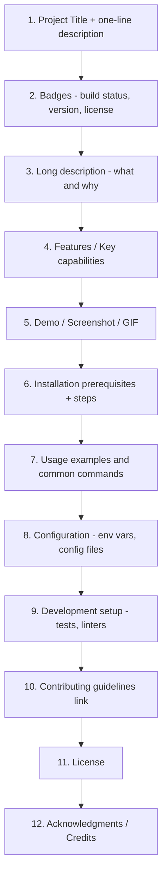

# 5. README Files

> **Tags:** #git #github #documentation #foundations

The README is the first thing a visitor sees when they land on your repository. A good README answers "what is this, why should I care, and how do I use it?" in under a minute. A bad README — or no README — drives visitors away.

---

## 5.1 Purpose of a README

A README serves three audiences simultaneously:

1. **Future you.** Six months from now, you will not remember why this repository exists or how to run it. The README is your note to your future self.
2. **Collaborators.** Anyone joining the project needs to know how to set up their environment and where to find things.
3. **Users and the public.** On GitHub, the README is rendered automatically on the repository's home page. It is your project's storefront.

GitHub renders the `README.md` file at the root of a repository (and any `README.md` inside a subdirectory when browsing that subdirectory) directly below the file listing. This makes the README the project's de-facto landing page.

---

## 5.2 Standard README Sections

A complete README typically contains the following sections, in roughly this order. Not every project needs every section, but every section that exists should be considered.



| Section | Purpose |
| --- | --- |
| **Project title** | Name and one-line description. |
| **Badges** | Build status, coverage, version, license — visual quality signals. |
| **Long description** | What the project does and why it exists. |
| **Features** | Bullet list of key capabilities. |
| **Demo / Screenshot** | A picture is worth a thousand words; a GIF is worth ten thousand. |
| **Installation** | Prerequisites and exact commands to install. |
| **Usage** | Code examples showing how to use the project. |
| **Configuration** | Environment variables, config file format, defaults. |
| **Development** | How to run tests, linters, and build locally. |
| **Contributing** | Link to `CONTRIBUTING.md` or inline rules. |
| **License** | Which license the project uses, with link to `LICENSE` file. |
| **Acknowledgments** | Libraries used, inspiration, contributors. |

---

## 5.3 Markdown Primer

README files are written in **Markdown**, a lightweight markup language. Markdown is designed to be readable as plain text and to render cleanly to HTML. The syntax you will use most often:

| Markdown | Renders as |
| --- | --- |
| `# Heading 1` | Largest heading |
| `## Heading 2` | Section heading |
| `**bold**` | **bold** |
| `*italic*` | *italic* |
| `` `code` `` | `inline code` |
| ```` ```python ```` ... ```` ``` ```` | Fenced code block with syntax highlighting |
| `- item` | Bullet list item |
| `1. item` | Numbered list item |
| `[text](url)` | Hyperlink |
| `` | Image |
| `\| table \| header \|` | Table |

GitHub extends standard Markdown with **GitHub Flavored Markdown (GFM)**, which adds task lists (`- [ ]` and `- [x]`), tables, strikethrough, auto-linking of URLs, and `@mentions` of users.

---

## 5.4 A Minimal README Template

Below is a minimal but complete README you can adapt. It hits all the essential sections in roughly twenty lines.

````markdown
# Project Name

> One-sentence description of what this project does.

[](https://github.com/you/project/actions)
[](LICENSE)

## Features

- Feature one
- Feature two
- Feature three

## Installation

```bash
git clone https://github.com/you/project.git
cd project
npm install
```

## Usage

```javascript
const project = require('project');
project.doTheThing();
```

## Configuration

| Variable | Default | Description |
| --- | --- | --- |
| `PORT` | `3000` | Port the server listens on. |
| `LOG_LEVEL` | `info` | One of `debug`, `info`, `warn`, `error`. |

## Development

```bash
npm test        # run tests
npm run lint    # run linter
```

## Contributing

See [CONTRIBUTING.md](CONTRIBUTING.md). Pull requests welcome.

## License

MIT — see [LICENSE](LICENSE).
````

---

## 5.5 README Quality Checklist

Before publishing or sharing a repository, run through this checklist:

- [ ] Project name is clear and the one-line description is meaningful.
- [ ] Installation steps assume a clean machine and work end-to-end.
- [ ] At least one usage example is shown.
- [ ] License is named and a `LICENSE` file exists at the root.
- [ ] No broken internal links.
- [ ] Code blocks have language tags so syntax highlighting works.
- [ ] Screenshots or diagrams are included if the project has a UI.
- [ ] Badges reflect the current state (do not show a green "passing" badge if the build is broken).

---

## 5.6 Common Mistakes

- **No README at all.** The repository is a black box.
- **README is just the project name.** Worse than no README because it looks like you tried.
- **Installation steps assume the reader knows your stack.** Spell out prerequisites (`Requires Node 18+`).
- **Out-of-date examples.** Code blocks that no longer work are worse than no code blocks.
- **Treats the README as a changelog.** Use `CHANGELOG.md` for that; keep the README about how to use the project *now*.

---

**Previous:** [[4. Open Source Software]]
**Next:** [[6. The gitignore File]]
