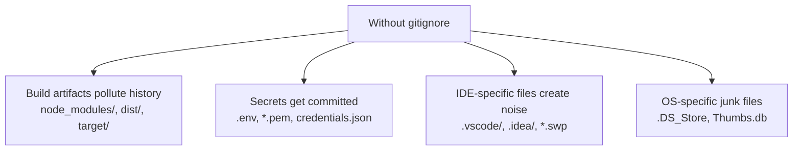

# 6. The gitignore File

> **Tags:** #git #foundations #gitignore

The `.gitignore` file tells Git which files and directories to **ignore** — that is, to leave untracked even when they appear in the working tree. A well-maintained `.gitignore` keeps your repository clean, your diffs focused, and your secrets safe.

---

## 6.1 What `.gitignore` Does

When Git walks your working tree to determine which files to track, it consults every `.gitignore` file it finds — at the repository root and in any subdirectory. Any file matching a pattern in a `.gitignore` is treated as if it did not exist for tracking purposes.

Specifically, `.gitignore` affects **untracked files only**. If a file is already tracked by Git, adding it to `.gitignore` does **not** stop Git from tracking changes to it. You must first untrack the file (see section 6.5).

---

## 6.2 Why You Need It

A `.gitignore` solves three classes of problem:



Without a `.gitignore`, every `git status` shows dozens of irrelevant files, and every `git add .` risks sweeping in a temporary artifact or, worse, a secret.

---

## 6.3 Pattern Syntax

The `.gitignore` syntax is glob-like. The most important patterns:

| Pattern | Matches |
| --- | --- |
| `filename.txt` | Any file or directory named `filename.txt` at any depth. |
| `/filename.txt` | Only at the repository root. |
| `directory/` | Any directory named `directory` and everything under it. |
| `*.log` | Any file ending in `.log`. |
| `*.log` then `!important.log` | Ignore all `.log` files **except** `important.log`. |
| `node_modules/` | The `node_modules` directory anywhere in the tree. |
| `/build/` | Only the `build` directory at the root. |
| `**/logs` | A `logs` directory at any depth. |
| `logs/**/debug` | A `debug` directory anywhere under any `logs` directory. |
| `# comment` | A comment line. |
| Blank line | Ignored; useful for spacing. |

Lines starting with `!` **negate** a previous pattern. Be aware that you cannot re-include a file if its **parent directory** has been excluded — Git will not descend into the excluded directory at all.

---

## 6.4 A Typical `.gitignore`

Here is a representative `.gitignore` for a JavaScript/Node.js project:

```gitignore
# Dependencies
node_modules/
package-lock.json
yarn.lock

# Build output
dist/
build/
*.tsbuildinfo

# Logs
logs/
*.log
npm-debug.log*
yarn-debug.log*

# Environment variables
.env
.env.local
.env.*.local

# Editor / IDE
.vscode/
.idea/
*.swp
*.swo
*~

# OS
.DS_Store
Thumbs.db

# Test coverage
coverage/

# Misc
.cache/
```

GitHub maintains a collection of starter `.gitignore` templates for hundreds of languages and stacks at <https://github.com/github/gitignore>. When in doubt, start from there.

---

## 6.5 Ignoring a File That Is Already Tracked

This is the most common `.gitignore` mistake. The fix is to untrack the file **without deleting it** from your working tree:

```bash
git rm --cached path/to/file
git commit -m "Stop tracking path/to/file"
echo "path/to/file" >> .gitignore
git add .gitignore
git commit -m "Add path/to/file to .gitignore"
```

The `--cached` flag tells Git to remove the file from the index but leave it on disk. Without `--cached`, `git rm` deletes the file from your working tree too.

For a directory:

```bash
git rm --cached -r path/to/directory/
```

---

## 6.6 Multiple `.gitignore` Files

You can have a `.gitignore` in any subdirectory. Patterns in a subdirectory's `.gitignore` apply **only to that subdirectory and below**. This is useful when different parts of a monorepo have different ignore requirements.

There is also a **global** `.gitignore` for files you want to ignore across all repositories on your machine (typically OS junk like `.DS_Store`):

```bash
git config --global core.excludesfile ~/.gitignore_global
```

Edit `~/.gitignore_global` to list patterns you want applied everywhere.

---

## 6.7 Inspecting Ignored Files

To see what Git is currently ignoring in your repository:

```bash
git status --ignored
```

To check whether a specific path is being ignored, and by which rule:

```bash
git check-ignore -v path/to/file
```

The output names the `.gitignore` file and line number responsible for the ignore. This is invaluable when a file is being ignored and you cannot figure out why.

---

## 6.8 Common Mistakes

- **Forgetting to commit the `.gitignore` itself.** It is a tracked file like any other; `git add .gitignore` and commit it.
- **Adding secrets to `.gitignore` *after* committing them.** The secret is already in history. You must rotate the secret, not just untrack the file. See [[1. Password Authentication Not Supported]] in Chapter 2 for related concerns about leaked credentials.
- **Excluding a parent directory then trying to re-include a child.** Git will not descend into an excluded directory, so negation patterns inside it have no effect.
- **Treating `.gitignore` as a place to hide files.** It is not security — anyone with access to your repository can still see ignored files in your working tree if they have filesystem access. Use proper secret management (vault, KMS, password manager) for actual secrets.

---

**Previous:** [[5. README Files]]
**Next:** [[7. Git Commands Overview]]
