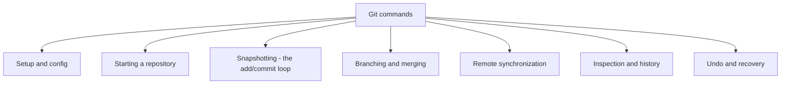

# 7. Git Commands Overview

> **Tags:** #git #foundations #commands

This note is a catalog of the Git commands you will use every day, grouped by purpose. It is not exhaustive — Git has over 150 subcommands — but it covers the 20% that you will use 95% of the time.

---

## 7.1 Command Groups



---

## 7.2 Setup and Configuration

| Command | What it does |
| --- | --- |
| `git config --global user.name "Your Name"` | Set your name for all commits on this machine. |
| `git config --global user.email "you@example.com"` | Set your email for all commits. |
| `git config --global init.defaultBranch main` | Set the default branch name to `main` for new repos. |
| `git config --global core.editor "code --wait"` | Set the editor Git opens for commit messages. |
| `git config --list` | Show all current configuration values. |

Configuration is read from four levels, in order of precedence (later overrides earlier):

1. System: `/etc/gitconfig`
2. Global: `~/.gitconfig`
3. Repository: `.git/config`
4. Command-line: `git -c key=value ...`

---

## 7.3 Starting a Repository

| Command | What it does |
| --- | --- |
| `git init` | Initialize a new Git repository in the current directory. |
| `git clone <url>` | Clone a remote repository to a new local directory. |
| `git clone <url> --depth 1` | Shallow clone — only the latest commit, much smaller download. |

---

## 7.4 Snapshotting — The add/commit Loop

These are the commands you will use dozens of times per day.

| Command | What it does |
| --- | --- |
| `git status` | Show working tree status — what is modified, staged, untracked. |
| `git add <file>` | Stage a specific file. |
| `git add .` | Stage all changes in the current directory (recursive). |
| `git add -A` | Stage all changes anywhere in the repository. |
| `git add -p` | Stage changes interactively, hunk by hunk. |
| `git commit -m "message"` | Commit staged changes with a one-line message. |
| `git commit` | Open your editor for a multi-line commit message. |
| `git commit -am "message"` | Stage **already-tracked** modified files and commit in one step. Does not add untracked files. |
| `git diff` | Show unstaged changes (working tree vs index). |
| `git diff --staged` | Show staged changes (index vs HEAD). |
| `git restore <file>` | Discard unstaged changes in a file. |
| `git restore --staged <file>` | Unstage a file (keep its contents in the working tree). |

See [[9. Staged Changes and the Index]] for the conceptual model behind staging.

---

## 7.5 Branching and Merging

| Command | What it does |
| --- | --- |
| `git branch` | List local branches. |
| `git branch -a` | List all branches, including remote-tracking branches. |
| `git branch <name>` | Create a new branch (do not switch to it). |
| `git branch -d <name>` | Delete a branch (refuses if not merged). |
| `git branch -D <name>` | Force-delete a branch. |
| `git switch <name>` | Switch to an existing branch. |
| `git switch -c <name>` | Create a new branch and switch to it. |
| `git checkout <name>` | Older form of `git switch`; still widely used. |
| `git checkout -b <name>` | Older form of `git switch -c`. |
| `git merge <branch>` | Merge `<branch>` into the current branch. |
| `git merge --abort` | Abort a merge in progress (e.g., after a conflict you want to back out of). |
| `git rebase <branch>` | Rebase the current branch onto `<branch>`. |
| `git rebase --abort` | Abort an in-progress rebase. |

The modern `git switch` and `git restore` were added in Git 2.23 to split the overloaded `git checkout` into focused commands. Both forms still work.

---

## 7.6 Remote Synchronization

| Command | What it does |
| --- | --- |
| `git remote -v` | List remotes and their URLs. |
| `git remote add <name> <url>` | Add a new remote. |
| `git remote remove <name>` | Remove a remote. |
| `git remote set-url <name> <url>` | Change a remote's URL. |
| `git fetch <remote>` | Download objects and refs from a remote without modifying working tree. |
| `git fetch --all --prune` | Fetch from all remotes and delete local refs that no longer exist on the remote. |
| `git pull` | `git fetch` followed by `git merge` (by default). |
| `git pull --rebase` | `git fetch` followed by `git rebase` instead of merge. |
| `git push` | Push current branch to its upstream. |
| `git push -u origin <branch>` | Push and set upstream in one step. |
| `git push --force-with-lease` | Safer force push; refuses if remote has new commits you have not fetched. |
| `git push --force` | Destructive force push; overwrites remote history. Use only when you understand the consequences. |

---

## 7.7 Inspection and History

| Command | What it does |
| --- | --- |
| `git log` | Show commit history. |
| `git log --oneline` | Compact one-line-per-commit view. |
| `git log --oneline --graph --all` | Visual graph of all branches. |
| `git log --stat` | Show files changed in each commit. |
| `git log -p` | Show full diff of each commit. |
| `git log --author="name"` | Filter by author. |
| `git log --since="2 weeks ago"` | Filter by date. |
| `git show <commit>` | Show details of a specific commit. |
| `git blame <file>` | Show which commit last modified each line of a file. |
| `git diff <commit1> <commit2>` | Show the diff between two commits. |
| `git diff <branch1>..<branch2>` | Show what changed between two branches. |

---

## 7.8 Undo and Recovery

| Command | What it does |
| --- | --- |
| `git restore <file>` | Discard unstaged changes in `<file>`. |
| `git restore --staged <file>` | Unstage a file. |
| `git reset <file>` | Older form of `git restore --staged <file>`. |
| `git reset --hard` | Discard **all** uncommitted changes (working tree and index). Destructive. |
| `git reset --soft HEAD~1` | Undo the last commit but keep changes staged. |
| `git reset --mixed HEAD~1` | Undo the last commit and unstage changes (default). |
| `git reset --hard HEAD~1` | Undo the last commit and discard changes. Destructive. |
| `git revert <commit>` | Create a new commit that undoes `<commit>`. Safe for shared branches. |
| `git reflog` | Show a log of where HEAD has been — your safety net for `reset --hard` mistakes. |

The difference between `reset` and `revert` is fundamental:

- `reset` **rewrites** history by moving a branch pointer backward. Safe for local branches; dangerous for shared branches.
- `revert` **adds** a new commit that undoes an earlier commit. Safe for shared branches because history is preserved.

---

## 7.9 The Daily Workflow

A typical day of work looks like this:

```mermaid
sequenceDiagram
    participant You
    participant Local as Local repo
    participant Remote as Remote repo
    You->>Remote: git pull (start of day)
    Remote-->>Local: fetch + merge latest
    You->>Local: git switch -c feature/add-login
    You->>Local: (edit files)
    You->>Local: git add .
    You->>Local: git commit -m "add login form"
    You->>Local: (repeat edit/add/commit several times)
    You->>Remote: git push -u origin feature/add-login
    You->>Remote: (open pull request on GitHub)
    You->>Remote: (review feedback)
    You->>Local: (more edits)
    You->>Local: git add . ; git commit --amend or new commit
    You->>Remote: git push (force-with-lease if amending)
    You->>Remote: (PR merged)
    You->>Local: git switch main ; git pull
```

---

## 7.10 Tips and Gotchas

- **Always run `git status` before destructive commands.** Knowing what you are about to lose prevents tears.
- **Use `git push --force-with-lease` instead of `git push --force`.** It checks that the remote has not moved under you.
- **Set `init.defaultBranch main`.** Old Git defaulted to `master`; the modern default is `main`.
- **Set `pull.rebase true` if your team prefers rebase over merge.** Avoids noisy merge commits.
- **Use `git config --global alias.co checkout`** to create short aliases like `git co`.
- **`git commit --amend`** updates the most recent commit. If you have already pushed, you will need a force push — only do this on branches you own.

---

**Previous:** [[6. The gitignore File]]
**Next:** [[8. Commits and Commit Messages]]
